```markdown
# From Zero to Hero: Mastering Data Structures

## 1. Introduction

Data structures are the foundation of efficient software. They decide how data is stored, accessed, and manipulated—turning slow, memory-hogging code into lightning-fast, scalable systems. If algorithms are the logic, data structures are the canvas they operate on.

**Why these concepts matter in real software engineering**  
Every application you use on a daily basis relies on them:
*   **Google** uses Hash Tables and Graphs for search ranking and PageRank.
*   **Netflix & YouTube** use Heaps (Priority Queues) to serve you the most relevant recommendations instantly.
*   **Databases (PostgreSQL, MongoDB, MySQL)** use B-Trees and AVL/Red-Black Trees for lightning-fast indexing and queries.
*   **VS Code & IDEs** use Tries for fast, prefix-based autocomplete.
*   **Spotify & TikTok** use Bloom Filters to perform massive data deduplication (so you don't see the same content twice) without using excessive memory.
*   **Redis** uses Skip Lists to power its blazing-fast sorted sets.

Poor choices here cause production crashes, unacceptably slow page loads, or systems that cannot scale. Mastering them equals confident system design, blazing through technical interviews, and achieving real engineering impact.

**How they build on each other (learning roadmap)**  
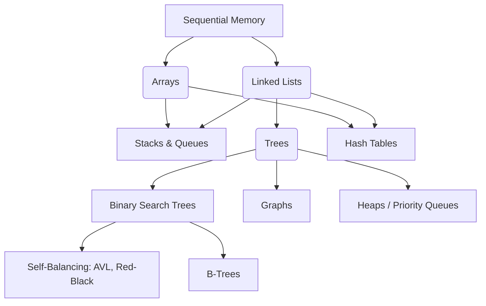

1.  **Linear basics** (Arrays → Linked Lists → Stacks/Queues) – master sequential and chained storage.
2.  **Hierarchical** (Binary Trees → AVL → Red-Black → B-Trees) – learn self-balancing mechanisms for guaranteed speed.
3.  **Relationship & priority** (Graphs, Heaps, Hash Tables) – handle complex entity connections and \(O(1)\) fast lookups.
4.  **Specialized optimization** (Tries, Bloom Filters, Skip Lists) – solve niche, high-scale memory/time problems elegantly.

Each level reuses the previous (e.g., Heaps are built on arrays, Graphs are often built using lists or trees, Hash Tables use arrays and linked lists to handle collisions).

**Prerequisites**  
Basic Python (loops, functions, classes). Optional: JavaScript basics. We teach everything else here—no prior DS knowledge is needed. If you are rusty on recursion or Big-O notation, we cover it inline.

Let’s go from zero to hero—practical, interview-ready, and deeply understood.

---

## 2. Core Concepts

### Arrays
**Theory explanation (from zero to deep)**  
An array is a contiguous block of memory with fixed-size slots. Because memory addresses are sequential, calculating the physical memory address for any index mathematically takes \(O(1)\) time: `address = base_address + (index * element_size)`.

**Memory Layout Visualization:**
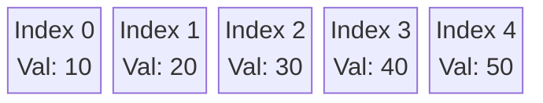

Python `list` and JavaScript `Array` are **dynamic arrays**. When they run out of capacity, they automatically allocate a completely new, larger block of memory (usually 1.5x or 2x the size), copy all old elements over, and then append the new element. This expensive resizing cost is "amortized" across many \(O(1)\) appends, making it *amortized* \(O(1)\).
Multi-dimensional arrays (like matrices) are essentially arrays of arrays, mapped to a flat 1D memory layout under the hood.

**Real-world analogies and examples**  
*   **Analogy:** A numbered egg carton. If you want the 4th egg, you go exactly to slot #4 instantly.
*   **Real World:** Image pixels (a 2D array of RGB values), NumPy tensors in Machine Learning, game boards (Chess/Tic-Tac-Toe), and standard text strings (arrays of characters).

**Code implementation examples**  

**Python**  
```python
arr = [10, 20, 30]
print(arr[1])          # O(1) → 20; instant access!
arr.append(40)         # amortized O(1); might trigger a resize!
arr.insert(0, 5)       # O(n); forces every other element to shift right!
```

**JavaScript** (native dynamic array)  
```javascript
const arr = [10, 20, 30];
console.log(arr[1]);   // O(1) -> 20
arr.push(40);          // O(1) amortized
arr.unshift(5);        // O(n) - shifts everything
```

**Common pitfalls and how to avoid them**  
- **Off-by-one errors:** Always remember indexing is 0-based. The last element is at `len(arr)-1`.
- **Mutating during iteration:** Modifying an array (adding/removing) while looping through it skips elements or causes `IndexError`. **Fix:** Loop backward or loop over a copy (`for x in arr[:]`).
- **Assuming fixed size:** Python/JS arrays resize silently, so you don't face capacity errors, but be aware of the performance hits of massive `append` operations.
- **Accidental references:** `arr2 = arr1` does not copy the array; it copies the pointer. Use `arr2 = arr1.copy()` instead.

**Time & Space complexity**  
*   **Access (Read/Update):** \(O(1)\)
*   **Search (Unsorted):** \(O(n)\) (requires a linear scan)
*   **Insert/Delete middle:** \(O(n)\) (requires shifting all subsequent elements)
*   **Insert/Delete End:** \(O(1)\) amortized. 
*   **Space:** \(O(n)\).

**Practice exercises**  

**Easy: Reverse array in-place**  
*Problem:* Reverse `[1,2,3,4]` → `[4,3,2,1]` without using extra space.  
*Hints:* Use the Two Pointers technique.  

**Two Pointers Visualization:**
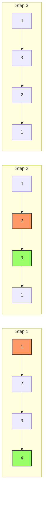

*Full solution + explanation*  
```python
def reverse_array(arr):
    left, right = 0, len(arr) - 1
    while left < right:
        # Swap values at the left and right pointers
        arr[left], arr[right] = arr[right], arr[left]
        left += 1
        right -= 1
    return arr
# Two-pointer swap: O(n) time, O(1) space. We only iterate roughly n/2 times.
```
*Tests:* `[1,2,3,4] → [4,3,2,1]`, `[] → []`.

**Medium: Two Sum**  
*Problem:* Find the indices of two numbers in an array that sum up to a specific target.  
*Hints:* Use a Hash Map (Dictionary) to store the complement (`target - current_number`) as you iterate.  
*Full solution + explanation*  
```python
def two_sum(nums, target):
    seen = {} # Val : Index
    for i, n in enumerate(nums):
        complement = target - n
        if complement in seen:
            return [seen[complement], i]
        seen[n] = i
    return []
# One-pass hash: O(n) time (we only loop once), O(n) space (to store the dictionary).
```
*Tests:* `[2,7,11,15], target=9 → [0,1]`.

**Hard: Median of Two Sorted Arrays**  
*Problem:* Find the median of two sorted arrays in \(O(\log (m+n))\) time.  
*Hints:* Use Binary Search to find the correct partition point between both arrays.  
*Full solution + explanation*  
```python
def find_median_sorted_arrays(nums1, nums2):
    # Always perform binary search on the smaller array for efficiency
    if len(nums1) > len(nums2): 
        nums1, nums2 = nums2, nums1
        
    m, n = len(nums1), len(nums2)
    left, right = 0, m
    
    while left <= right:
        partition1 = (left + right) // 2
        partition2 = (m + n + 1) // 2 - partition1
        
        # Determine boundary values, using infinity for edge cases
        maxLeft1 = float('-inf') if partition1 == 0 else nums1[partition1-1]
        minRight1 = float('inf') if partition1 == m else nums1[partition1]
        
        maxLeft2 = float('-inf') if partition2 == 0 else nums2[partition2-1]
        minRight2 = float('inf') if partition2 == n else nums2[partition2]
        
        # Check if we have found the correct partition
        if maxLeft1 <= minRight2 and maxLeft2 <= minRight1:
            # Odd combined length
            if (m + n) % 2:
                return max(maxLeft1, maxLeft2)
            # Even combined length
            return (max(maxLeft1, maxLeft2) + min(minRight1, minRight2)) / 2
        elif maxLeft1 > minRight2:
            # We are too far right on nums1, move left
            right = partition1 - 1
        else:
            # We are too far left on nums1, move right
            left = partition1 + 1
            
    raise ValueError("Input arrays are not sorted or invalid")
# Binary search on partitions: classic hard interview solution.
```
*Tests:* `[1,3], [2] → 2`, `[1,2], [3,4] → 2.5`.

### Linked Lists
**Theory explanation (from zero to deep)**  
A Linked List is a linear collection of data elements where, unlike arrays, physical placement in memory is not contiguous. Each element (called a **Node**) points to the next one, forming a chain. This means adding or removing nodes only requires rerouting pointers, allowing dynamic resizing with zero memory reallocation overhead.

*   **Singly Linked List:** Nodes point only to the *next* node.
*   **Doubly Linked List:** Nodes maintain pointers to both *next* and *previous* nodes, allowing backward traversal at the cost of slight extra memory per node.
*   **Circular Linked List:** The last node points back to the first node instead of `null`.

**Visualizing Node Connections:**
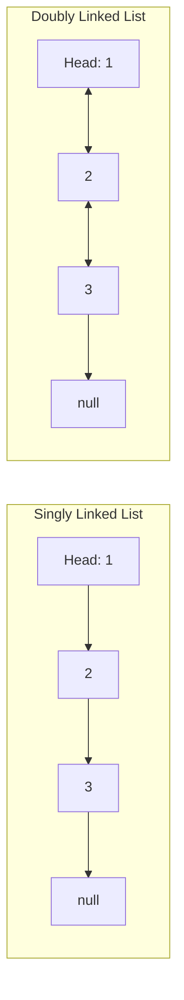

**Deeper Dive:** To simplify edge cases (especially insertion/deletion at the head), we often use a **Dummy Node** at the beginning. To detect cycles, we use **Floyd’s Cycle-Finding Algorithm** (the "Tortoise and Hare" trick).

**Real-world analogies and examples**  
*   **Analogy:** A treasure hunt. Each clue doesn't sit right next to the previous one; instead, clue #1 tells you exactly where to find clue #2, regardless of how far apart they are.
*   **Real World:** 
    *   **Browser History:** Going "Back" and "Forward" acts like navigating a Doubly Linked List.
    *   **Music Playlists:** "Next Song" tracks are handled gracefully using Linked Lists.
    *   **LRU (Least Recently Used) Caches:** A combination of a Hash Map and a Doubly Linked List is used for \(O(1)\) read/write cache eviction strategies.

**Code implementation examples**  

**Python**  
```python
class ListNode:
    def __init__(self, val=0, next=None):
        self.val = val
        self.next = next

# Creating 1 -> 2 -> null
head = ListNode(1, ListNode(2))
```

**JavaScript**  
```javascript
class ListNode {
    constructor(val = 0, next = null) { 
        this.val = val; 
        this.next = next; 
    }
}
```

**Common pitfalls and how to avoid them**  
- **Losing the head reference:** Once you move your `head` pointer forward, you lose access to the start of the list. **Fix:** Always keep a separate pointer (e.g., `temp_head = head`) to iterate, or use a `dummy` node.
- **Null dereference (`NoneType` error):** Always check `while curr and curr.next:` before attempting to access `.next.next`.
- **Accidental cycles:** Accidentally pointing a node backward. Use Floyd’s algorithm to detect if your list spins infinitely.
- **Memory Leaks:** In languages without garbage collection (like C/C++), not freeing removed nodes causes severe memory leaks. (Python/JS handle this for you).

**Time & Space complexity**  
*   **Access (Indexing):** \(O(n)\) (You must start at the head and traverse node by node; no instant lookup).
*   **Search for a value:** \(O(n)\)
*   **Insert/Delete (if you already have the pointer to the node):** \(O(1)\)
*   **Space:** \(O(n)\) (but takes up more bytes per element than arrays because of the pointer references).

**Practice exercises**  

**Easy: Reverse Linked List**  
*Problem:* Reverse `1→2→3` → `3→2→1`.  
*Hints:* You need three pointers: `prev`, `curr`, and `nxt` to keep track of the remaining list before you sever the connection.  

**Reverse Process Visualization:**
```mermaid
graph LR
    subgraph Original
    A[1] --> B[2] --> C[3] --> D[null]
    end
    subgraph Reversing
    A1[null] <-- B1[1] -.-> C1[2] -.-> D1[3]
    end
    subgraph Reversed
    A2[null] <-- B2[1] <-- C2[2] <-- D2[3]
    end
```

*Full solution + explanation*  
```python
def reverse_list(head):
    prev = None
    curr = head
    while curr:
        # 1. Save the next node before breaking the link
        nxt = curr.next
        # 2. Reverse the link
        curr.next = prev
        # 3. Slide the pointers forward
        prev = curr
        curr = nxt
    return prev # prev becomes the new head
# Iterative in-place: O(n) time, O(1) space.
```
*Tests:* `1→2 → 2→1`.

**Medium: Detect Cycle**  
*Problem:* Return true if the linked list has a cycle in it.  
*Hints:* Use Tortoise (starts at head, moves 1 step) & Hare (starts at head, moves 2 steps). If they ever meet, a cycle exists!  

**Cycle Visualization:**
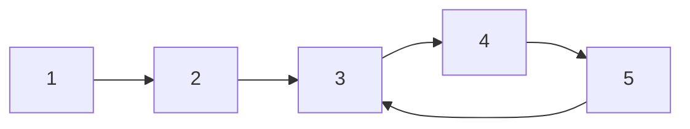

*Full solution + explanation*  
```python
def has_cycle(head):
    slow = fast = head
    while fast and fast.next: # Ensure fast can jump twice
        slow = slow.next          # 1 step
        fast = fast.next.next     # 2 steps
        if slow == fast: 
            return True # Tortoise caught the hare!
    return False
# Floyd’s Tortoise and Hare: O(n) time, O(1) extra space.
```

**Hard: Merge k Sorted Lists**  
*Problem:* Merge `k` independently sorted linked lists into one giant sorted list.  
*Hints:* Use a Min-Heap. Initialize the heap with the heads of all `k` lists. Pop the minimum, append it, and push its `.next` into the heap.  
*Full solution + explanation*  
```python
import heapq

def merge_k_lists(lists):
    heap = []
    # Note: Python's heapq needs a tiebreaker if node values are equal.
    # We use the list index 'i' as the tiebreaker.
    for i, node in enumerate(lists):
        if node:
            heapq.heappush(heap, (node.val, i, node))
            
    dummy = ListNode()
    curr = dummy
    
    while heap:
        val, i, node = heapq.heappop(heap)
        curr.next = node
        curr = curr.next
        
        if node.next:
            heapq.heappush(heap, (node.next.val, i, node.next))
            
    return dummy.next
# Priority queue approach: O(N log k) time, where N is the total nodes and k is number of lists.
```

---

### Stacks
**Theory explanation (from zero to deep)**  
A Stack is a conceptual structure functioning on a **LIFO (Last-In, First-Out)** principle. You can only insert (Push) and remove (Pop) from the *top* of the stack. They can be implemented under the hood using an Array (faster, cache-friendly) or a Linked List (never resizes).

**Deeper Dive:** Monotonic stacks are an advanced technique where the elements strictly increase or decrease, perfect for solving "next greater element" problems efficiently.

**Visualizing LIFO (Push & Pop):**
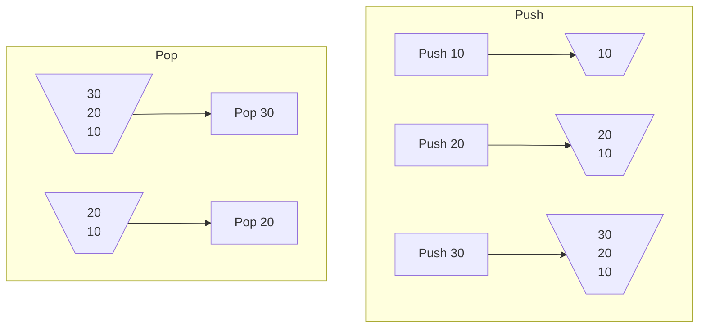

**Real-world analogies and examples**  
*   **Analogy:** A spring-loaded stack of plates at a buffet. You only ever interact with the top plate.
*   **Real World:** 
    *   **Undo feature** in text editors (Ctrl+Z pops the last action).
    *   **Call Stack** in programming languages (keeping track of nested function calls).
    *   **Expression Evaluation** (parsing `2 + (3 * 4)` or checking if HTML tags are balanced).

**Code implementation examples**  

**Python** (uses list natively)  
```python
stack = []
stack.append(5)  # push onto top (end of list)
stack.pop()      # pop from top (end of list)
```

**JavaScript** (uses array natively)  
```javascript
const stack = [];
stack.push(5);
stack.pop();
```

**Common pitfalls and how to avoid them**  
- **Using a list as a queue:** Using `list.pop(0)` in Python to remove from the bottom of the stack takes \(O(n)\) time, completely ruining performance.
- **Stack Overflow:** In recursive functions (which use the call stack), having no base case or too deep of a recursion will crash the program.
- **Empty pops:** Attempting to `pop()` from a stack with length 0 safely throws an error. Always check `if stack:` first.

**Time & Space complexity**  
*   **Push:** \(O(1)\) (Amortized if array-based, strict \(O(1)\) if Linked List).
*   **Pop:** \(O(1)\)
*   **Peek (check top without removing):** \(O(1)\)
*   **Space:** \(O(n)\).

**Practice exercises**  

**Easy: Valid Parentheses**  
*Problem:* Given a string containing just `()[]{}` brackets, determine if the string is valid (brackets close in the correct order).  
*Hints:* Use a stack to track open brackets. If you encounter a closing bracket, pop the stack and check if it matches!  
*Full solution + explanation*  
```python
def is_valid(s):
    stack = []
    pairs = {')': '(', ']': '[', '}': '{'}
    
    for char in s:
        if char in pairs:
            # Check if stack is empty or the top element doesn't match the required open bracket
            if not stack or stack.pop() != pairs[char]: 
                return False
        else: 
            # It's an open bracket, push it to stack
            stack.append(char)
            
    # Valid only if the stack is completely empty at the end
    return not stack
# O(n) time, O(n) space.
```
*Tests:* `"()"` → True, `"(]"` → False, `"([{}])"` → True.

**Medium: Next Greater Element**  
*Problem:* For each element in an array, find the next larger element to its right (imagine the array is circular).  
*Hints:* Use a Monotonic Decreasing Stack. Store the indices. If the current element is larger than the element at the index sitting on the top of the stack, you found its "next greater element"!  
*Full solution + explanation*  
```python
def next_greater_elements(nums):
    n = len(nums)
    res = [-1] * n
    stack = [] # Stores indices, not the actual values
    
    # Loop twice to simulate circular behavior (2*n)
    for i in range(2 * n):
        idx = i % n
        # While current element is greater than the element at stack top's index
        while stack and nums[stack[-1]] < nums[idx]:
            # We found the strictly larger element for the index at stack top!
            popped_idx = stack.pop()
            res[popped_idx] = nums[idx]
            
        # Only push during the first pass
        if i < n: 
            stack.append(i)
            
    return res
# Monotonic stack ensures each element is pushed/popped at most once: O(n) time.
```

**Hard: Largest Rectangle in Histogram**  
*Problem:* Given an array of heights forming a histogram, find the largest rectangular area that can be drawn entirely within the histogram blocks.  
*Hints:* Use a Monotonic Increasing stack to calculate heights and widths efficiently.  
*Full solution + explanation*  
```python
def largest_rectangle_area(heights):
    # -1 index acts as a dummy width boundary
    stack = [-1]
    max_area = 0
    # Append a 0 height to force everything out of the stack at the very end
    heights.append(0)
    
    for i in range(len(heights)):
        # If current height breaks the increasing sequence, pop and calculate
        while stack[-1] != -1 and heights[stack[-1]] > heights[i]:
            h = heights[stack.pop()]
            # Width is current index minus the NEW index sitting at the top, minus 1
            w = i - stack[-1] - 1
            max_area = max(max_area, h * w)
        stack.append(i)
        
    # Revert the appended 0 if the input array needs to remain preserved organically
    heights.pop()
    return max_area
# O(n) time using monotonic stack. Each bar is pushed and popped exactly once.
```

### Queues
**Theory explanation (from zero to deep)**  
A Queue operates on the **FIFO (First-In, First-Out)** principle. Elements are inserted at the back (Enqueue) and removed from the front (Dequeue). 

Because removing from the front of an array requires shifting all remaining elements (\(O(n)\) time), queues shouldn't be implemented with standard dynamic arrays if performance matters. We use a **Deque (Double-Ended Queue)** or a Linked List under the hood to achieve \(O(1)\) time for both operations.

**Deeper Dive:** 
*   **Priority Queues:** Elements aren't removed entirely based on arrival; instead, they are removed based on a priority ranking (usually implemented using a Heap).
*   **Circular Buffers:** A fixed-size array where the front and back indices wrap around. Essential for hardware streaming or low-level memory constrained queues.

**Visualizing FIFO (Enqueue & Dequeue):**
```mermaid
graph LR
    subgraph Enqueue (Enter Back)
    A[Value: 50] --> B(Queue: 40, 30, 20, 10)
    end
    subgraph Dequeue (Exit Front)
    C(Queue: 40, 30, 20) --> D[Value: 10]
    end
```

**Real-world analogies and examples**  
*   **Analogy:** A line at a coffee shop. The person who arrives first gets their coffee first.
*   **Real World:** 
    *   **Task Scheduling:** Background worker queues (like Celery, RabbitMQ, AWS SQS) executing jobs in the order they were triggered.
    *   **Breadth-First Search (BFS):** Queues are the backbone algorithm for finding the shortest path in unweighted graphs.
    *   **Printer Spoolers:** Printing documents in the order they were requested.

**Code implementation examples**  

**Python** (`collections.deque` is heavily optimized in C under the hood)  
```python
from collections import deque
q = deque()
q.append(1)      # enqueue: O(1)
q.append(2)
q.popleft()      # dequeue: O(1) -> returns 1
```

**JavaScript** (native array is simple but slow for queues)  
```javascript
const q = [];
q.push(1);       // Enqueue: O(1) amortized
q.shift();       // Dequeue: O(n) — Very slow! For large scale, implement a Linked List queue.
```

**Common pitfalls and how to avoid them**  
- **Python list `pop(0)`:** This forces the entire list to shift. Always import and use `collections.deque`.  
- **In JS:** Using `.shift()` on large arrays causes extreme performance drops. If building algorithm-heavy JS, implement a custom Queue class using two stacks or a Linked List.

**Time & Space complexity**  
*   **Enqueue/Dequeue:** \(O(1)\). 
*   **Space:** \(O(n)\).

**Practice exercises**  

**Easy: Implement Queue using Stacks**  
*Problem:* Implement a FIFO Queue using only two LIFO Stacks.  
*Hints:* Use an `in_stack` for pushes. When you need to pop/peek, dump the entire `in_stack` into the `out_stack` (which reverses the order perfectly to FIFO!). Only do the dump when `out_stack` is empty.  
*Full solution + explanation*  
```python
class MyQueue:
    def __init__(self):
        self.in_stack = []
        self.out_stack = []
        
    def push(self, x):
        self.in_stack.append(x)
        
    def pop(self):
        self._move()
        return self.out_stack.pop()
        
    def peek(self):
        self._move()
        return self.out_stack[-1] # Peek the top element of out_stack
        
    def _move(self):
        # Only transfer elements if the out_stack is fully depleted
        if not self.out_stack:
            while self.in_stack:
                self.out_stack.append(self.in_stack.pop())
# Amortized O(1) per operation. Elements are moved exactly twice total.
```

**Medium: Sliding Window Maximum**  
*Problem:* Given an array and a sliding window of size `k`, find the max value in every window.  
*Hints:* Use a Monotonic Deque. Store indices. Remove smaller elements from the back as you iterate, and drop indices from the front if they fall outside the current window.  
*Full solution + explanation*  
```python
from collections import deque

def max_sliding_window(nums, k):
    dq = deque() # strictly decreasing values
    res = []
    
    for i, n in enumerate(nums):
        # 1. Maintain monotonicity: pop smaller numbers from the back
        while dq and nums[dq[-1]] < n: 
            dq.pop()
        dq.append(i)
        
        # 2. Window management: remove element from front if it's out of bounds
        if dq[0] == i - k: 
            dq.popleft()
            
        # 3. Add max (which is always at the front) to results once window hits size k
        if i >= k - 1: 
            res.append(nums[dq[0]])
            
    return res
# O(n) time using deque. Every element is pushed/popped at most once.
```

**Hard: LRU Cache** (Preview of Hash + Linked List)  
*Problem:* Design a Data Structure for Least Recently Used (LRU) Cache (get/put in \(O(1)\)).  
*Hints:* Needs a Hash Map (for \(O(1)\) lookups) pointing directly into nodes of a Doubly Linked List (for \(O(1)\) removals/additions at the ends). When cache is full, evict the tail. Every read/write moves the node to the head.  
*(Implementation is extensive, often ~30 lines. Standard LeetCode 146).*

---

### Trees (Binary, AVL, Red-Black, B-Trees)

Unlike Lists or Queues, Trees are a **hierarchical** data structure. A tree consists of nodes with a strict parent-child relationship.

**Binary Trees & Binary Search Trees (BST)**  
**Theory explanation**  
A Binary Tree restricts a parent to having at most two children (`left` and `right`).
A **Binary Search Tree (BST)** adds a crucial constraint for sorting logic: 
*   **Left child** must be *less than* the parent.
*   **Right child** must be *greater than* the parent.

**Visualizing a BST:**
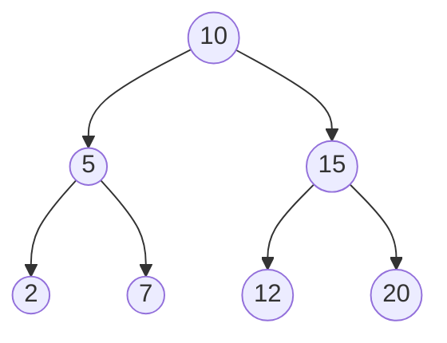

**Real-world analogies and examples**  
*   **Analogy:** A computer's file system directory structure.
*   **Real World:** The Document Object Model (DOM) rendered by the browser is a massive tree. Decision Trees in Machine Learning evaluate conditions sequentially.

**Code Implementation**  
```python
class TreeNode:
    def __init__(self, val=0, left=None, right=None):
        self.val = val
        self.left = left
        self.right = right
```

**Pitfalls:** 
*   **Unbalanced / Skewed Trees:** Inserting sorted data (e.g., `1, 2, 3, 4, 5`) into a basic BST turns it into a glorified Linked List, degrading search times from \(O(\log n)\) to \(O(n)\).
*   **Recursion Overflow:** Deep skewed trees cause `RecursionError` on large data due to call stack limits. Switch to iterative approaches using an explicit `stack`.

**Complexity:** 
*   Balanced: \(O(\log n)\) for search/insert/delete.
*   Worst case (Skewed): \(O(n)\).

**Exercises:**  
**Easy:** Max depth calculation (DFS).  
**Medium:** Validate if a generic tree is a valid BST (pass min/max boundaries recursively).  
**Hard:** Serialize and Deserialize a binary tree (using preorder traversal and a queue).

---

**Self-Balancing Trees: AVL Trees**  
**Theory explanation**  
To fix the "Skewed tree" problem, an AVL Tree strictly enforces balance. Every node checks a rule: `abs(height(left_child) - height(right_child)) <= 1`.
If this rule breaks after an insertion, the tree immediately fixes itself using rigid **Rotations** (Left-Left, Right-Right, Left-Right, Right-Left cases).

**Analogy:** A perfectly balanced mobile hanging over a baby's crib. If you add heavy weight to one side, you must adjust the whole structure immediately.  
**Complexity:** Strictly guaranteed \(O(\log n)\) for all operations.  
**Tradeoff:** Since the balance condition is strict, it requires more rotation operations during insertions/deletions, which incurs a slight overhead. Perfect for read-heavy systems.

---

**Self-Balancing Trees: Red-Black Trees**  
**Theory explanation**  
A slightly more relaxed alternative to AVL Trees. Instead of strict height numbers, nodes are colored Red or Black. The tree balances itself through coloring rules (e.g., no two reds can touch sequentially, paths from root to leaves must have equivalent black nodes).

**Analogy:** Traffic lights. They offer "good enough" balance to guarantee fast processing without micro-managing every single imbalance instantly.  
**Complexity:** Guaranteed \(O(\log n)\).  
**Real-World Usage:** Used extensively inside built-in libraries because it handles insertions slightly faster than AVL. C++ `std::map`, Python's internal sets (sometimes), and Java's `TreeMap` run on Red-Black Trees.

---

**B-Trees (The Database Engine)**  
**Theory explanation**  
Strict Binary trees (AVL/Red-Black) are great for RAM but *terrible* for hard drives. Because disk I/O operations (fetching from a hard drive sector) are extremely slow, we want a tree that minimizes height. 
A **B-Tree** is a "fat" multi-way tree. A single node can hold dozens or hundreds of sorted keys and have hundreds of children, significantly reducing the tree's height to 3 or 4 levels even with millions of records.

**Visualizing B-Tree Node Density:**
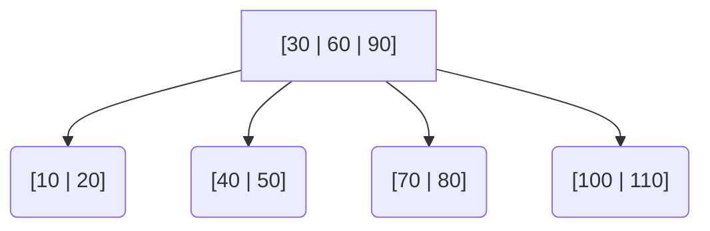

**Real-world Application:** 
*   If you've ever typed `CREATE INDEX` in PostgreSQL or MySQL, you just commanded the database to build a B-Tree. When a database node fills up, it "splits" its keys to maintain balance.
*   This ensures retrieving a user record out of a 10-million row database only takes 3 disk reads (height=3), completely saving system performance. 

**Complexity:** \(O(\log n)\) scale, but with massive constants tailored specifically to match disk block sizes.

### Graphs
**Theory explanation (from zero to deep)**  
A Graph is a set of **Nodes (Vertices)** connected by **Edges**. Unlike trees, graphs can have cycles, multiple disconnected components, and edges that flow in specific directions or carry "weight" (cost).

*   **Directed vs Undirected:** Does the connection go one way (Twitter follower) or both ways (Facebook friend)?
*   **Weighted vs Unweighted:** Does the edge have a cost? (E.g., miles between two cities vs just knowing a road exists).

**Common Representations:**
1.  **Adjacency Matrix:** A 2D array \(V \times V\). `matrix[i][j] = 1` if an edge exists. Lightning fast \(O(1)\) to check if an edge exists, but terrible for memory \(O(V^2)\) if the graph is "sparse" (has few edges relative to nodes).
2.  **Adjacency List:** An array/dictionary of lists. `graph['A'] = ['B', 'C']`. Extremely space efficient \(O(V + E)\). **This is the industry standard for 95% of software problems.**

**Visualizing a Directed, Weighted Graph:**
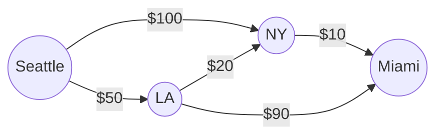

**Deeper Dive (Graph Algorithms):** 
*   **DFS (Depth-First Search):** Explore as far as possible along each branch before backtracking. Great for solving mazes, topological sorting, and finding connected components.
*   **BFS (Breadth-First Search):** Explore all neighbors at the present depth before moving deeper. Great for finding the *shortest path* in unweighted graphs.
*   **Dijkstra's Algorithm:** Finds the shortest path in *weighted* graphs. 
*   **Union-Find (Disjoint Set):** An incredibly efficient data structure to check if two nodes are in the same network or to detect cycles.

**Real-world analogies and examples**  
*   **Analogy:** A subway system map. Stations are nodes, tracks are edges.
*   **Real World:** 
    *   **Google Maps:** Calculating the fastest route from home to work (Dijkstra/A* algorithms).
    *   **Social Networks:** Connecting friends and generating "People You May Know" recommendations.
    *   **The Internet itself:** Web pages are nodes, hyperlinks are directed edges (PageRank algorithm).

**Code implementation examples**  

**Python** (Adjacency List)  
```python
# A simple unweighted, directed graph
graph = {
    'A': ['B', 'C'],
    'B': ['D'],
    'C': ['D'],
    'D': []
}
```

**JavaScript**  
```javascript
const graph = {
    'A': ['B', 'C'],
    'B': ['D'],
    'C': ['D'],
    'D': []
};
```

**Common pitfalls and how to avoid them**  
- **Infinite Traversal Loops:** Because graphs can have cycles, DFS/BFS will run infinitely if you visit the same node twice. **Fix:** Always maintain a `visited = set()` and check it before processing a node.
- **Incorrect representation:** Trying to use an Adjacency Matrix for a graph with 1 million users and 5 million friendships will require a 1 Trillion element matrix and instantly crash your server due to Out of Memory errors. Always default to Adjacency Lists.

**Time & Space complexity**  
*   **Traversal (DFS/BFS):** \(O(V + E)\) where V is vertices, E is edges.
*   **Space:** \(O(V + E)\) for Adjacency List.

**Practice exercises**  

**Easy: Number of Islands (DFS/BFS)**  
*Problem:* Given a 2D grid of '1's (land) and '0's (water), count the number of disconnected islands.  
*Hints:* Iterate through the grid. When you find a '1', increment island count, then launch a DFS/BFS to turn all connecting '1's into '0's to mark them as visited!  

**Medium: Shortest Path in Unweighted Graph**  
*Problem:* Find the fewest number of edges between node A and node B.  
*Hints:* Standard BFS. Use a Queue. Enqueue the starting node and a `distance = 0`. Pop, check neighbors, if it's the target, return `distance + 1`.  

**Hard: Dijkstra's Algorithm**  
*Problem:* Find the shortest path from start to target where edges have different weight costs.  
*Hints:* Use a Priority Queue (Min-Heap). Always pop the path with the current lowest total cost. Update neighbors with their new total costs if they are lower than previously recorded.

---

### Heaps (Priority Queues)
**Theory explanation**  
A Heap is a specialized Tree-based data structure that satisfies the **Heap Property**:
*   **Min-Heap:** The parent is always *less than or equal to* its children. The absolute minimum element is always at the root.
*   **Max-Heap:** The parent is always *greater than or equal to* its children. The maximum element is always at the root.

Even though it's conceptually a complete binary tree, Heaps are almost always implemented under the hood as a flat **Array** to save memory (no node objects or pointers needed!). The relationships are purely mathematical:
The left child of index `i` is at `2i + 1`. The right child is at `2i + 2`. The parent is at `(i - 1) // 2`.

**Visualizing a Min-Heap Array mapping:**
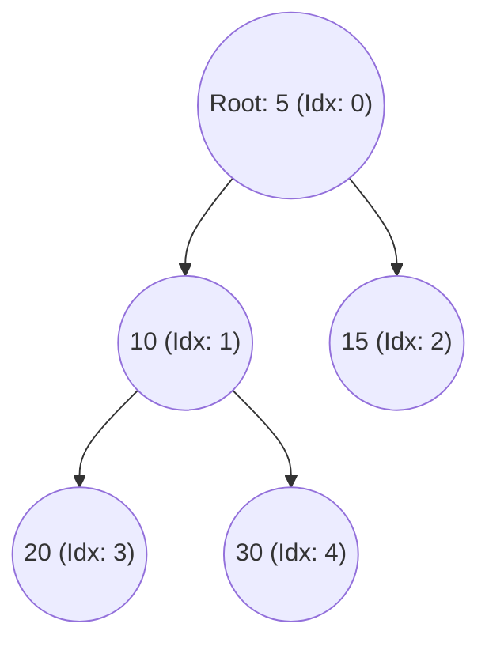

**Real-world analogies and examples**  
*   **Analogy:** An Emergency Room triage system. If a patient comes in with a paper cut, they go to the back. If someone comes in with a heart attack, they immediately jump to the front of the queue.
*   **Real World:** 
    *   **Operating Systems:** Process scheduling (giving CPU time to the most critical processes first).
    *   **Data streams:** Finding the top 10 trending tweets out of millions flowing in real-time.
    *   **Graph algorithms:** Powering Dijkstra's Shortest Path and Prim's Minimum Spanning Tree.

**Code implementation examples**  

**Python** (`heapq` module implements a Min-Heap based on a standard list)  
```python
import heapq

min_heap = []
heapq.heappush(min_heap, 10)
heapq.heappush(min_heap, 5)
heapq.heappush(min_heap, 20)

print(min_heap[0])         # Peek the minimum element (O(1)): 5
print(heapq.heappop(min_heap)) # Extract the minimum (O(log n)): 5
```

**JavaScript**  
JS has no built-in priority queue! You must build one manually using an array + custom `bubbleUp` and `sinkDown` functions, or use an npm package like `datastructures-js/priority-queue`.

**Common pitfalls and how to avoid them**  
- **Direct list mutation:** If you manually append or sort a heap list in Python without using `heappush`, you break the mathematical heap invariant. Only use the provided heap functions.
- **Object comparison:** If pushing tuples like `(priority, object)`, make sure the priority is the first element so it sorts correctly. It will crash if priorities tie and the objects themselves aren't comparable. Use `(priority, counter, object)` as a tie-breaker.

**Time & Space complexity**  
*   **Insert (Push):** \(O(\log n)\).
*   **Extract Min/Max (Pop):** \(O(\log n)\).
*   **Peek Min/Max:** \(O(1)\).
*   **Space:** \(O(n)\).

**Practice exercises**  

**Easy: Kth Largest Element**  
*Problem:* Find the \(K\)th largest element in an unsorted array.  
*Hints:* Maintain a Min-Heap of size K. Iterate the array; push elements. If heap size > K, pop. The root of the heap is the answer! Time: \(O(n \log k)\).  

**Medium: Merge k Sorted Lists**  
*(See Linked List Hard section for the solution)*.  

**Hard: Task Scheduler**  
*Problem:* Given a list of tasks and a cooldown period `n` for identical tasks, find the minimum time needed to finish all tasks.  
*Hints:* Use a Max-Heap to always schedule the most frequent available task first, and a Queue to keep track of tasks currently on cooldown until they "unlock" at a specific timestamp.

### Hash Tables
**Theory explanation (from zero to deep)**  
A Hash Table (Hash Map, Dictionary) calculates a mathematical **Hash Function** on a given Key (like a string `"apple"`). This function spits out a consistent integer code, which is then mapped directly to an array index (a "bucket"), allowing us to instantly store or retrieve the associated Value.

*What happens if two different keys output the same array index?* This is called a **Collision**.
*   **Chaining:** The bucket holds a Linked List instead of a single value. If a collision happens, you append the new value to the list.
*   **Open Addressing:** The bucket holds a single value. If a collision happens, you mathematically probe for the *next* available empty slot and put it there. (Python uses this, specifically a variation called Open Addressing with Robin Hood/perturbation).

**Visualizing Hash Collisions (Chaining Strategy):**
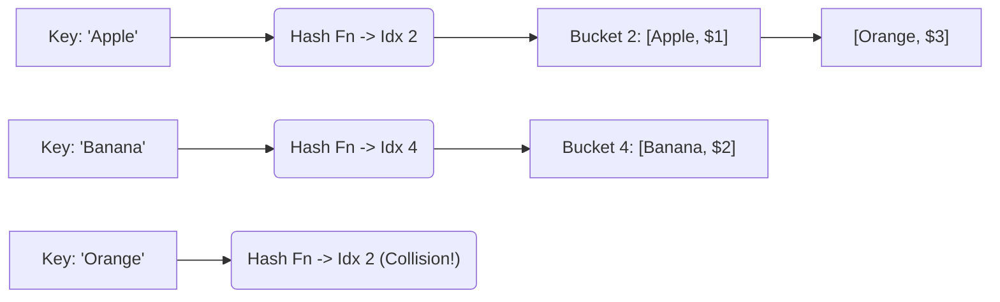

**Real-world analogies and examples**  
*   **Analogy:** A library index system. You don't search shelf by shelf for a book; you look up the code, and it tells you exactly which aisle, shelf, and position the book is in.
*   **Real World:** 
    *   **Caching Systems:** Memcached and Redis are essentially giant Hash Tables storing data in RAM.
    *   **Database Indexing:** Used for exact-match lookups (e.g., `SELECT * WHERE id = 5`).
    *   **Counting Frequencies:** Analyzing word counts in a document.

**Code implementation examples**  

**Python** (`dict` is heavily optimized)  
```python
hash_map = {'apple': 1.00, 'banana': 0.50}
hash_map['orange'] = 0.75  # O(1) Insert
print(hash_map['apple'])   # O(1) Lookup
```

**JavaScript** (`Map` or `Object`)  
```javascript
const map = new Map();
map.set('apple', 1.00);
console.log(map.get('apple'));
```

**Common pitfalls and how to avoid them**  
- **Hash Collisions destroying performance:** In the worst-case scenario (where a malicious user provides thousands of keys that all intentionally collide to the same bucket), a Hash Table degrades into a massive Linked List, plunging lookup times from \(O(1)\) to \(O(n)\). Python and modern languages randomize their hash seeds per session to prevent these DDoS attacks.

**Time & Space complexity**  
*   **Insert/Delete/Access:** Average \(O(1)\), worst-case \(O(n)\) (during resizing or massive collisions).
*   **Space:** \(O(n)\).

**Practice exercises**  

**Easy: Contains Duplicate**  
*Problem:* Given an array of integers, return `True` if any value appears at least twice.  
*Hints:* Create a Hash Set. Loop through the array. If the number is already in the set, return `True`. Otherwise, add it.

**Medium: LRU Cache**  
*(See Queues / Doubly Linked List section for the combination approach).*

**Hard: Design Twitter**  
*Problem:* Design a simplified Twitter with `postTweet`, `getNewsFeed`, `follow`, and `unfollow` operations.  
*Hints:* Use a Hash Map for `user_id -> set(following_ids)`. Use another Hash Map for `user_id -> list(tweets)`. To get the news feed, grab the tweet lists of everyone the user follows, and use a Max-Heap to efficiently sort and extract the 10 most recent ones!

---

### Advanced: Tries (Prefix Trees)
**Theory explanation**  
A Trie (pronounced "try") is a specialized tree used exclusively for strings. Instead of a single node storing an entire string, every node represents a single character. Paths down the tree spell out words. A boolean flag `is_end_of_word` marks valid entries.

**Analogy:** A phone's predictive text or a dictionary. Once you type "A-P-P", you only have a few branches left to explore (like "L-E" or "E-A-R").

**Visualizing a Trie:**
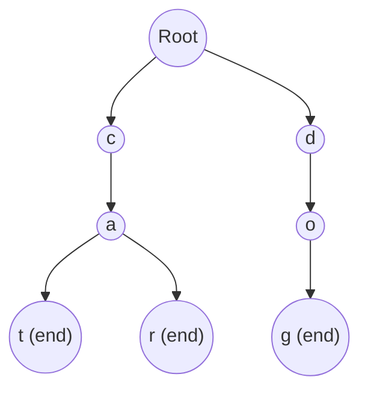

**Complexity**  
*   **Insert/Search:** \(O(m)\), where \(m\) is the length of the string! It does not matter if there are 10 words or 10 billion words in the Trie; searching for a 4-letter word always takes exactly 4 steps. Absolutely blazing fast.
*   **Space:** High. Every character branch requires memory.

**Practice exercises**  
**Easy:** Implement Trie (Insert, Search, StartsWith).  
**Medium:** Word Search II (using a Trie + DFS to find words on a Boggle board).  
**Hard:** Design an Autocomplete System.

---

### Bloom Filters
**Theory explanation**  
A Bloom Filter is an incredibly space-efficient **probabilistic** data structure. It uses a massive array of individual bits (`0` or `1`) and multiple different Hash Functions. 
When you add an item, you run it through 3 different hash functions, which give 3 different indices. You flip those 3 indices to `1`.
When you check if an item exists, you hash it 3 times and check if all those bits are `1`.

*   **Rule 1:** It can confidently say "This item is DEFINITELY NOT in the set" (if any of the bits are `0`).
*   **Rule 2:** It can only say "This item is PROBABLY in the set" (because the `1`s might have been flipped by previous, entirely different items overlapping—a **False Positive**).
*   **Rule 3:** You cannot delete items (because flipping a `1` back to `0` might accidentally delete another overlapping item).

**Real-world usage:**
*   **Medium/Spotify/TikTok:** Before making an expensive database query to see if you've already read an article or watched a video, the system asks the Bloom Filter. If the Bloom Filter says "Definitely Not", it streams the video instantly. If it says "Maybe", *only then* does it make the slow database query to verify.

**Code** (Python with bit manipulation):  
```python
import hashlib

class BloomFilter:
    def __init__(self, size, hash_count):
        self.size = size
        self.hash_count = hash_count
        self.bit_array = [False] * size # Simulating a bit array
        
    def add(self, item):
        for i in range(self.hash_count):
            h = int(hashlib.md5((str(item) + str(i)).encode()).hexdigest(), 16) % self.size
            self.bit_array[h] = True
            
    def contains(self, item):
        for i in range(self.hash_count):
            h = int(hashlib.md5((str(item) + str(i)).encode()).hexdigest(), 16) % self.size
            if not self.bit_array[h]: 
                return False # Definitely not here
        return True # Probably here
```

**Complexity**  
*   **Insert/Query:** \(O(k)\) where \(k\) is the number of hash functions.
*   **Space:** Tiny. Can store representations of billions of items in a few megabytes.

**Practice exercises**  
**Easy:** Build a basic Bloom Filter (above).  
**Medium:** Write a mathematical script to optimize the bit array size and number of hash functions to achieve exactly a `1%` false-positive rate.  
**Hard:** Design a server caching layer using a Bloom Filter interceptor.

---

### Skip Lists
**Theory explanation**  
A Skip List is a Linked List stacked on top of itself in layers. The bottom layer is a standard sorted linked list. The layers above act as "express lanes" containing random subsets of the nodes below. To search, you ride the highest express lane until you overshoot your target, drop down a layer, and repeat.

**Analogy:** Taking the Express Train to get close to your destination, then switching to the Local Train for the final stop. 

**Visualizing a Skip List:**
```mermaid
graph LR
    subgraph Level 3 (Fastest)
    A3[1] ---------> D3[30] ---------> F3[null]
    end
    subgraph Level 2
    A2[1] ----> C2[15] ----> D2[30] ----> F2[null]
    end
    subgraph Level 1 (Slowest / Complete)
    A1[1] --> B1[5] --> C1[15] --> D1[30] --> E1[45] --> F1[null]
    end
```

**Why use this?** It provides the exact same \(O(\log n)\) search speed as a balanced AVL/Red-Black tree, but is exponentially easier to implement because it relies on simple coin-toss probability to assign node heights rather than complex multi-node rotations.
**Real World:** The engine behind **Redis** Sorted Sets.

**Complexity**  
*   **Search/Insert/Delete:** \(O(\log n)\) *expected average*.
*   **Space:** \(O(n \log n)\).

**Practice exercises**  
**Easy:** Basic Skip List insertion algorithms.  
**Medium:** Search implementation using level-dropping.  
**Hard:** Deletion with proper level maintenance and unlinking.

## 3. Summary & Mastery Section

**Key takeaways and Industry Best Practices**  
- **Arrays**: Need instant index access but don't plan to change the size often? Use Arrays.
- **Linked Lists**: Need to constantly insert/delete elements in the middle of a dataset without shifting millions of other items? Use Linked Lists.
- **Stacks (LIFO)**: Building undo features, parsing syntax (parentheses), or managing history? Use Stacks.
- **Queues (FIFO)**: Managing background tasks, scheduling, or exploring graphs level-by-level (BFS)? Use Queues.
- **Binary Trees**: Need to maintain a naturally ordered dataset where you can easily find the min or max? Use Trees.
- **AVL & Red-Black Trees**: Building a system where guaranteed \(O(\log n)\) search speed is unconditionally required (like a language's standard library map or set)? Use Self-Balancing Trees.
- **B-Trees**: Writing data to a slow hard drive or building a database like PostgreSQL? Use B-Trees to minimize disk reads.
- **Graphs**: Modeling anything that looks like a network (cities, friends, routers, websites)? Use Graphs (specifically Adjacency Lists).
- **Heaps / Priority Queues**: Need to constantly know the "top 10" or "most critical" item in a massive, constantly updating stream of data? Use Heaps.
- **Hash Tables**: Need \(O(1)\) lightning-fast lookups using a unique key? Use Hash Tables. (They are the MVP of algorithmic interviews).
- **Tries**: Building a search bar with predictive text/autocomplete? Use Tries.
- **Bloom Filters**: Need to perform deduplication on billions of items without using gigabytes of RAM? Use Bloom Filters.
- **Skip Lists**: Need a sorted map that's highly concurrent and easy to implement (like Redis)? Use Skip Lists.

**Mastery Comparison Table**

| Structure | Best Real-World Use Case | Search/Read Avg | Insert/Del Avg | Space | Why Choose This? |
| :--- | :--- | :--- | :--- | :--- | :--- |
| **Array** | Random access lookup | \(O(1)\) (idx) / \(O(n)\) | \(O(n)\) | \(O(n)\) | Indices matter |
| **Linked List** | Dynamic memory allocation | \(O(n)\) | \(O(1)\)* | \(O(n)\) | Frequent add/remove |
| **Stack** | Undo/History/Call Stack | \(O(n)\) | \(O(1)\) (Top) | \(O(n)\) | Last-In First-Out logic |
| **Queue** | Background Job Scheduling | \(O(n)\) | \(O(1)\) (Ends)| \(O(n)\) | First-In First-Out logic |
| **BST** | Ordered hierarchical data | \(O(\log n)\) | \(O(\log n)\) | \(O(n)\) | Sorted data manipulation |
| **AVL / RB Tree** | Memory-based `Set`/`Map` lib | \(O(\log n)\) | \(O(\log n)\) | \(O(n)\) | Strict time guarantees |
| **B-Tree** | SQL/NoSQL Database Engines | \(O(\log n)\) | \(O(\log n)\) | \(O(n)\) | Minimizing hard-disk reads |
| **Graph** | Pathfinding / Social Networks | \(O(V+E)\) | \(O(1)\) | \(O(V+E)\)| Modeling relationships |
| **Heap** | Real-time Top-K / Triage | \(O(n)\) | \(O(\log n)\) | \(O(n)\) | Constant access to min/max |
| **Hash Table** | Caching engines (Redis) | \(O(1)\) | \(O(1)\) | \(O(n)\) | The absolute fastest lookups |
| **Trie** | Dictionary autocomplete | \(O(m)\)** | \(O(m)\)** | \(O(C)\)***| Prefix matching logic |
| **Bloom Filter** | Massive Deduplication | \(O(k)\) hashes | \(O(k)\) | Tiny | When memory is strictly limited |
| **Skip List** | Concurrent Sorted Sets | \(O(\log n)\) | \(O(\log n)\) | \(O(n \log n)\) | Lock-free, randomized balance |

*\* = Assuming you already have the pointer to the node.*  
*\** = Where `m` is the length of the string.*  
*\*\** = Where `C` is total characters across all words.*

---

**Recommended next steps / advanced topics**  
- **Interview Prep:** Solve the "NeetCode 150" list on LeetCode. 
- **Algorithms:** Learn Sorting algorithms (Merge Sort, Quick Sort), Dynamic Programming (DP), and advanced Graph algorithms (Dijkstra, Bellman-Ford, Union-Find).
- **System Design:** Understand how these structures power complex architectures like URL shorteners, Twitter timelines, or Netflix recommendation engines.
- **Books:** Read standard texts like *Introduction to Algorithms* (CLRS) or *Designing Data-Intensive Applications* (DDIA) for database internals.
- **Projects:** Build an in-memory Redis-like cache using Hash Tables and Doubly Linked Lists, or a mini-database engine utilizing B-Trees.

---

**Self-assessment quiz**  
Try to answer these without looking back at the text!

1.  *Which tree structure gives strictly guaranteed \(O(\log n)\) balance by checking height differences?*
    <details><summary>Reveal Answer</summary>**AVL Trees** and **Red-Black Trees** (though AVL is stricter).</details>
2.  *Why should you use a `collections.deque` instead of a standard `list` for queues in Python?*
    <details><summary>Reveal Answer</summary>Because popping from the front of a list takes \(O(n)\) time, while `deque` allows \(O(1)\) `popleft()` operations.</details>
3.  *Can a Bloom Filter confidently tell you if an item is definitely NOT in a dataset?*
    <details><summary>Reveal Answer</summary>**Yes.** It can have false positives ("maybe it's here"), but it never has false negatives ("definitely not here").</details>
4.  *Which data structure is the backbone of Breadth-First Search (BFS)?*
    <details><summary>Reveal Answer</summary>A **Queue**.</details>
5.  *Why do standard libraries often prefer Red-Black trees over AVL trees?*
    <details><summary>Reveal Answer</summary>Because Red-Black trees are slightly less strict about perfect balance, meaning they require fewer rotation operations when inserting/deleting, making them generally faster on average.</details>
6.  *In a Trie, what does each node typically represent?*
    <details><summary>Reveal Answer</summary>A single character of a string (and usually a dictionary of pointers to its children).</details>
7.  *What defines a Min-Heap property?*
    <details><summary>Reveal Answer</summary>Every parent node must be less than or equal to its children.</details>
8.  *If your graph is very sparse (few edges per node), what is the best way to represent it in memory?*
    <details><summary>Reveal Answer</summary>An **Adjacency List**.</details>
9.  *What is the main advantage of a Skip List over a balanced Search Tree?*
    <details><summary>Reveal Answer</summary>It offers the same \(O(\log n)\) speed but is vastly simpler to implement because it uses random probabilities instead of complex rotation logic. It is also easier to make thread-safe.</details>
10. *What is the time complexity of inserting a new element deeply into the middle of an array?*
    <details><summary>Reveal Answer</summary>**\(O(n)\)**, because you have to shift every subsequent element to the right to make room.</details>

**Score 8+? Hero status achieved.** 
You must move beyond pure theory to truly master data structures. Code every single one of these from scratch without looking at a tutorial, solve 50+ LeetCode problems heavily utilizing them, and build a project that relies on them. You now own the foundation—go build the next big thing!
```