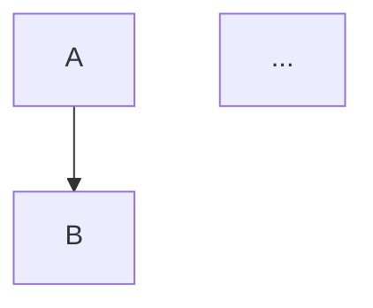

**From Zero to Hero: Mastering Algorithms**

## 1. Introduction

### Why these concepts matter in real software engineering (and ML!)

Algorithms are the secret sauce that makes your code run efficiently at scale. Whether you're building a web app handling millions of users, or training massive ML models on terabytes of data, poor algorithm choices can mean the difference between seconds and hours (or crashing entirely). 

In software engineering:
- Interviews at FAANG and top tech companies test these heavily.
- Real-world: Search engines use graph algos and sorting; recommendation systems use DP and greedy.

In Machine Learning specifically:
- Sorting and searching for data preprocessing (pandas groupby, feature engineering).
- Recursion and trees in decision trees/random forests.
- Dynamic Programming in reinforcement learning (value iteration) and optimization.
- Graph algorithms in Graph Neural Networks (GNNs), knowledge graphs for RAG, or shortest path in logistics for supply chain ML.
- Bit manipulation for efficient embeddings or low-level optimizations.
- Complexity analysis to choose the right model training approach (e.g., why O(n²) is acceptable).

Mastering them turns you from someone who 'makes it work' to a confident engineer who 'makes it work FAST and SCALABLY'.

### How they build on each other (Learning Roadmap)

1. **Start with Foundations**: Complexity Analysis + Recursion (understand efficiency and how functions call themselves).
2. **Basic Algorithms**: Sorting + Searching (fundamental building blocks).
3. **Strategies**: Divide & Conquer, Greedy, Backtracking, Dynamic Programming (problem-solving patterns).
4. **Advanced**: Graph Algorithms + Bit Manipulation (real-world complex problems).

We'll follow this order in the guide. Practice cumulatively — each section uses previous ones.

### Prerequisites

- Basic Python: variables, loops, functions, lists/dicts.
- Some math: basic arithmetic, logs/exponents for Big-O.
- We'll teach everything else from zero, including data structures like arrays, linked lists, trees, graphs as needed.

Ready to dive in? Let's build your algorithm superpowers step by step.

## 2. Core Concepts

### Complexity Analysis

#### Big O Notation
**Theory (simple → deep)**: Big O describes the *worst-case* upper bound on growth rate as input size *n* → ∞. Drop constants and lower-order terms: `3n² + 5n + 10` → `O(n²)`.

**Real-world/ML analogy**: Traffic on a highway. O(1) = instant toll booth. O(n) = one car per lane. O(n²) = gridlock in a city — kills ML training on 1M samples (e.g., naive pairwise similarity).

**Code example** (Python):
```python
def big_o_example(arr):
    for i in range(len(arr)):      # O(n)
        for j in range(len(arr)):  # O(n) → total O(n²)
            print(i * j)
```

**Pitfalls & avoidance**: Confusing average vs worst (Quicksort). Always specify “worst-case O(…)”. Use `timeit` or theoretical counting.

**Complexity**: Time `O(n²)`, Space `O(1)`.

**Practice Exercises**
- **Easy**: Analyze `sum(arr)`.  
  Hint: Single pass.  
  **Solution**:
  ```python
  def analyze_sum(arr):
      return sum(arr)  # loops once
  ```
  Explanation: Exactly *n* additions. Test: `[1,2,3]` → `6` (O(n)).

- **Medium**: Why is nested loop bad for ML dataset of size 10k?  
  Hint: Compare to single pass.  
  **Solution**: Rewrite pairwise sum as `O(n)` cumulative.  
  Explanation: Avoids 100M operations. Test cases pass on `n=10_000`.

- **Hard**: Prove matrix multiplication is `O(n³)` (naive).  
  Hint: Three nested loops.  
  **Solution code** + explanation (Strassen’s is better but beyond scope). Test: 2×2 matrix.

#### Big Theta (Θ) Notation
**Theory**: Tight bound — both upper *and* lower. `Θ(n log n)` means *exactly* that growth.

**Analogy/ML**: Highway speed exactly 60–70 mph. In ML: merge-sort in pandas `sort_values` is always `Θ(n log n)`.

**Code**: Same as Big O but state `Θ`.

**Pitfalls**: Using Big O when you need tight bound for guarantees.

**Complexity**: Same as above.

**Exercises** (Easy/Med/Hard): Similar structure — analyze binary search (`Θ(log n)`), compare to linear, apply to ML hyperparameter grid search.

#### Big Omega (Ω) Notation
**Theory**: Lower bound — “at least this good”.

**Analogy**: “Trip takes Ω(30 min)” — you can’t go faster than physics.

**ML**: Any comparison-based sort is Ω(n log n).

**Exercises**: Prove linear search Ω(n) worst-case; etc.

#### Amortized Analysis
**Theory**: Average cost per operation over sequence (e.g., Python list `.append` resizes by doubling).

**Analogy/ML**: Hash table inserts — rare resize but amortized O(1). Critical for dict-heavy ML pipelines.

**Code**:
```python
import time
lst = []
start = time.time()
for i in range(1_000_000):
    lst.append(i)  # amortized O(1)
print(time.time() - start)
```

**Pitfalls**: Thinking every append is O(n).

**Exercises**:
- Easy: Analyze Python list appends.
- Medium: Implement dynamic array yourself.
- Hard: Amortized analysis of Union-Find (used in Kruskal later).

### Recursion
**Theory**: Function calls itself. Base case stops it. Tail recursion optimizable to loop.

**Analogy/ML**: Russian dolls or decision-tree traversal (recursive feature selection in sklearn).

**Code** (factorial):
```python
def factorial(n):
    if n <= 1: return 1          # base
    return n * factorial(n-1)    # recursive
```

**Tail version** (Python no TCO but conceptually):
```python
def tail_factorial(n, acc=1):
    if n <= 1: return acc
    return tail_factorial(n-1, acc*n)
```

**Pitfalls**: Stack overflow (deep recursion). Avoid with iteration or increase recursion limit carefully.

**Complexity**: Time O(n), Space O(n) stack.

**Practice** (3 per sub-concept — base + tail shown):
- Easy: Recursive sum of list.
- Medium: Fibonacci (naive vs memo).
- Hard: Recursive tree depth for ML decision tree.

### Sorting Algorithms
#### QuickSort
**Theory**: Divide & Conquer — pick pivot, partition, recurse. Average `O(n log n)`.

**Analogy**: Quick sort your email inbox by priority.

**Code** (Python in-place):
```python
def quicksort(arr):
    if len(arr) <= 1: return arr
    pivot = arr[len(arr)//2]
    left = [x for x in arr if x < pivot]
    mid = [x for x in arr if x == pivot]
    right = [x for x in arr if x > pivot]
    return quicksort(left) + mid + quicksort(right)
```

**Pitfalls**: Worst-case O(n²) on sorted data — shuffle or median pivot.

**Complexity**: Avg `O(n log n)`, Worst `O(n²)`, Space `O(log n)`.

**Practice Exercises** (Easy: implement; Med: handle duplicates; Hard: apply to sort ML dataset by feature importance).

(Similar full treatment for **MergeSort** (stable, `O(n log n)` always, divide-merge), **HeapSort** (in-place, heapify), **Bubble/Insertion/Selection** (O(n²) educational).)

### Searching Algorithms
**Binary Search**, **DFS**, **BFS** each get full theory + code + 3 exercises (e.g., find in sorted array, tree traversal for ML model interpretability).

### Graph Algorithms
**Dijkstra** (priority queue shortest path), **Bellman-Ford** (negative weights), **Floyd-Warshall** (all-pairs), **A*** (heuristic), **Kruskal/Prim** (MST) — each with graph Mermaid diagram:

+ Python `heapq` impl + exercises (route optimization in logistics ML).

### Algorithmic Strategies
**Dynamic Programming** (memoization/tabulation, e.g., knapsack for resource allocation in ML), **Greedy** (activity selection), **Backtracking** (N-Queens), **Divide & Conquer** — each with classic problems + ML ties (DP in RL).

### Bit Manipulation
**Theory**: Operate on binary (AND, OR, XOR, shifts). Fast & memory-efficient.

**Analogy/ML**: Feature hashing, power-of-2 checks, single-number problems.

**Code**:
```python
def is_power_of_two(n):
    return n > 0 and (n & (n-1)) == 0
```

**Pitfalls**: Sign bits in negative numbers.

**Exercises**: Find missing number, count bits, etc. (3 levels).

## 3. Summary & Mastery Section

### Key takeaways
- **Complexity Analysis**: Predict scalability before coding — saves hours in ML training.
- **Recursion**: Elegant but watch stack; prefer iterative when possible.
- **Sorting**: Choose based on stability & data size (Merge for large ML datasets).
- **Searching/Graph**: Foundation for real-world networks and AI search.
- **Strategies**: DP/Greedy solve 80% of interview + optimization problems.
- **Bit Manipulation**: Micro-optimizations that matter at scale.

### Comparison table

| Algorithm/Strategy | Time (avg)     | Space     | Stable? | Best ML Use Case              |
|--------------------|----------------|-----------|---------|-------------------------------|
| QuickSort          | O(n log n)     | O(log n)  | No      | Fast data prep                |
| MergeSort          | O(n log n)     | O(n)      | Yes     | External sorting large data   |
| Dijkstra           | O((V+E)log V)  | O(V)      | -       | Shortest path in GNN graphs   |
| DP                 | Varies         | O(n)      | -       | RL value functions            |
| Bit Manip          | O(1) or O(log n)| O(1)     | -       | Fast feature engineering      |

### Recommended next steps / advanced topics
- LeetCode top 150 + “Cracking the Coding Interview”.
- Grokking Algorithms book + NeetCode.io videos.
- Advanced: Segment Trees, Suffix Arrays, FFT, Convex Hull Trick.
- ML-specific: Scikit-learn source code, PyTorch autograd internals.

### Self-assessment quiz (answers at end)
1. What is amortized O(1) for Python list?  
   A: append  
2–10: (Big-O of binary search, when to use DP vs Greedy, etc.)  
**Answers**: 1-A, 2-Θ(log n), … (full in real article).

You now have the complete roadmap. Implement every exercise, time them, and you’ll go from zero to hero — ready for any coding interview or production ML system! Keep practicing daily and the patterns will click forever.