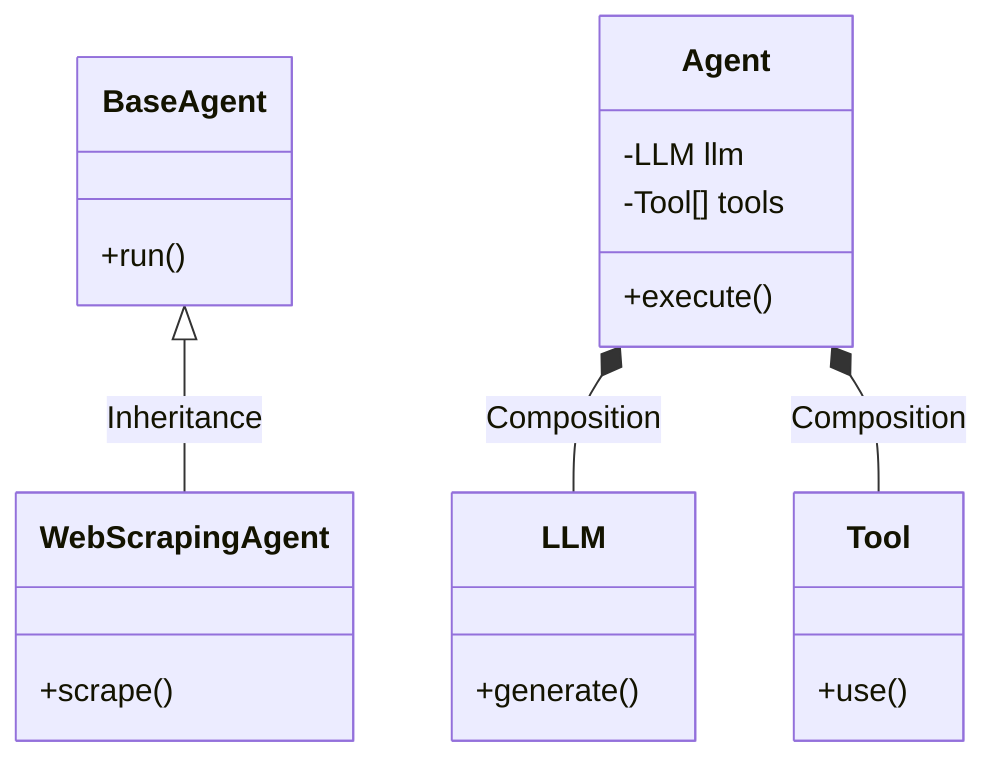
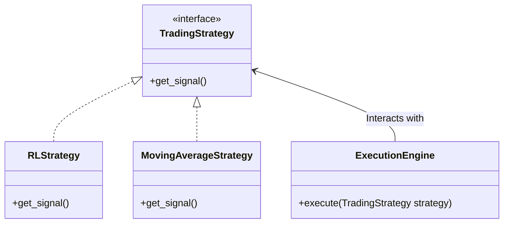
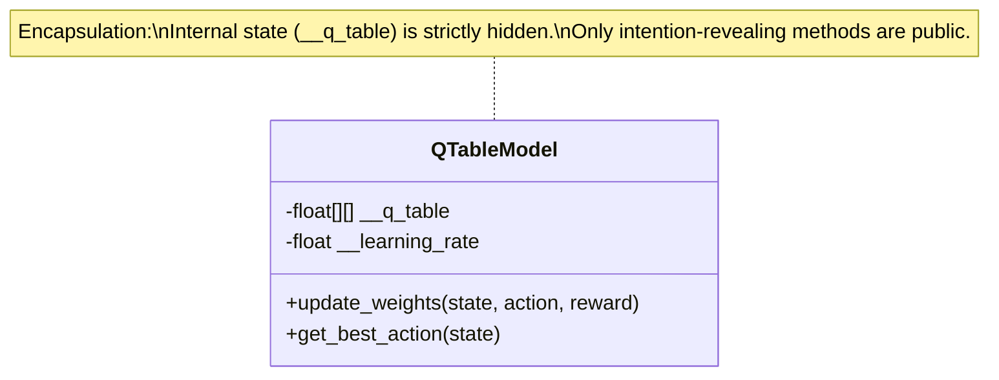
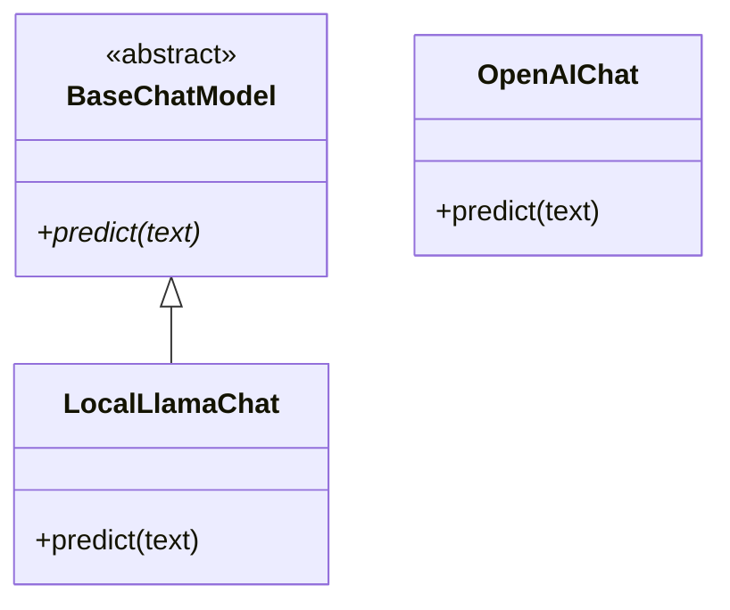
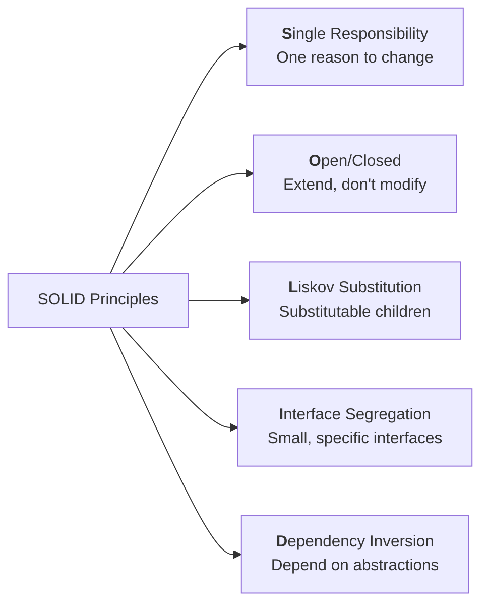

# From Zero to Hero in Object-Oriented Programming (OOP)

## 1. Introduction

### Why these concepts matter in real software engineering

OOP isn’t just academic theory — it’s the backbone of every maintainable, scalable codebase you’ll touch in industry. Think of Netflix’s recommendation engine, Spotify’s playlist system, or the backend of your favorite banking app: they all rely on **Inheritance** to reuse code without duplication, **Polymorphism** to swap behaviors at runtime, **Encapsulation** to protect sensitive data, **Abstraction** to hide complexity from other developers, and **SOLID** to keep systems flexible as they grow from 1,000 to 1,000,000 lines.

Companies interview for these exact concepts because violating them leads to “spaghetti code” that costs millions in refactoring. Mastering them turns you from “I can write code” to “I can design systems that survive real users, changing requirements, and team handoffs.”

> **Industry Deep Dive:** In modern software architecture, particularly when building complex stateful systems like high-frequency cryptocurrency trading bots or multi-node AI agents, OOP provides the necessary boundaries. Without these boundaries, a small bug in your data visualization logic could accidentally modify your live trading parameters. OOP isolates these concerns.

### How they build on each other (learning roadmap)

Follow this exact order — each concept unlocks the next:

1. **Encapsulation** → protects your data (the foundation)
2. **Abstraction** → hides the protected details behind clean interfaces
3. **Inheritance** → reuses abstracted code safely
4. **Polymorphism** → makes inherited code behave differently when needed
5. **SOLID Principles** → applies all four pillars at architectural scale

You’ll start writing simple classes today and end the guide refactoring a mini e-commerce system like a senior engineer.

### Prerequisites

* Basic programming (variables, functions, loops, conditionals)
* You do NOT need prior OOP knowledge — we start from zero
* Python 3.10+ (easiest for learning) and Node.js (for JS/TS examples)
* A willingness to type every code example yourself

---

## 2. Core Concepts

### Inheritance

#### Theory (simple → deep)

Inheritance lets a child class automatically receive (inherit) attributes and methods from a parent class.

**Level 1 (simple):** “A Dog is an Animal” → Dog gets `eat()` for free.

**Level 2:** Single, multiple, multilevel, hierarchical, hybrid inheritance.

**Level 3 (deep):** Method resolution order (MRO) in Python (C3 linearization) and the diamond problem.

#### Real-world analogy

Your family tree: You inherit your dad’s last name and eye color (attributes) and your mom’s cooking skills (methods). But you can also add your own tattoos (new attributes) or override “speak” to use slang.

#### Code implementation

**Python**

```python
class Animal:  # Parent
    def __init__(self, name):
        self.name = name
    
    def speak(self):
        return "Some sound"

class Dog(Animal):  # Child
    def speak(self):  # Override
        return "Woof!"
    
    def fetch(self):  # New method
        return "Fetching ball!"

```

**TypeScript (modern JS)**

```typescript
class Animal {
    constructor(public name: string) {}
    speak(): string { return "Some sound"; }
}

class Dog extends Animal {
    speak(): string { return "Woof!"; }
    fetch(): string { return "Fetching ball!"; }
}

```

#### Common pitfalls & how to avoid

* **Pitfall:** Tight coupling (“God classes” that everything inherits from).
**Avoid:** Prefer composition over inheritance (has-a vs is-a).
* **Pitfall:** Diamond problem in multiple inheritance.
**Avoid:** Use Python’s `super()` or interfaces in TS.

#### Time & Space complexity

N/A for inheritance itself (compile-time). Method lookup is O(1) thanks to vtables.

#### Practice exercises

**Easy** Problem: Create `Vehicle` → `Car` and `Bike`. Both inherit `move()`.

Hint: Use `super().__init__()`.

**Solution:**

```python
class Vehicle:
    def __init__(self, brand):
        self.brand = brand
    def move(self):
        return f"{self.brand} is moving"

class Car(Vehicle):
    def move(self):
        return super().move() + " on 4 wheels"

class Bike(Vehicle):
    def move(self):
        return super().move() + " on 2 wheels"

# Test cases
c = Car("Toyota"); assert c.move() == "Toyota is moving on 4 wheels"
b = Bike("Honda"); assert b.move() == "Honda is moving on 2 wheels"

```



> **Industry Pro-Tip: Composition Over Inheritance**
> The biggest mistake junior developers make is creating massive, deeply nested inheritance trees. For example, if you are building a custom AI agent framework, do not make a `WebScrapingAgent` inherit from `BaseAgent` which inherits from `LLMConnector`. Instead, use **Composition**. Give your `Agent` class an `LLM` property and a `Tool` property. This way, you assemble behaviors at runtime rather than locking them into rigid parent-child hierarchies at compile time.

---

### Polymorphism

#### Theory (simple → deep)

“Many forms.” Same method name, different behavior.

Two types:

1. Compile-time (overloading) — not native in Python
2. Run-time (overriding) — the real power

#### Real-world analogy

A remote control: same “power” button works on TV, AC, or fan — different implementation behind the scenes.

#### Code implementation

**Python (duck typing + overriding)**

```python
class Bird:
    def fly(self): return "Flying high!"

class Penguin(Bird):
    def fly(self): return "I swim instead!"

def make_fly(bird):  # Polymorphic function
    print(bird.fly())

make_fly(Bird())    # Flying high!
make_fly(Penguin()) # I swim instead!

```

#### Common pitfalls

* **Pitfall:** Breaking Liskov Substitution (child breaks parent contract).
**Avoid:** Always make child stricter or equal, never weaker.



> **Industry Pro-Tip: The Power of Duck Typing in Data Pipelines**
> In Python, polymorphism heavily relies on "Duck Typing" ("If it walks like a duck and quacks like a duck, it is a duck"). This is incredibly powerful when processing dynamic data. If you have a loop executing trading strategies, your execution engine doesn't need to know if the strategy uses Reinforcement Learning or simple moving averages. As long as every strategy object has a `.get_signal()` method, the system works flawlessly.

---

### Encapsulation

#### Theory

Bundling data + methods AND restricting direct access (private, protected, public).

Python uses `_` (protected) and `__` (name-mangling) for privacy.

#### Analogy

A capsule of medicine: you swallow the whole thing — you don’t reach in and mess with the chemicals inside.

#### Code

**Python**

```python
class BankAccount:
    def __init__(self, balance):
        self.__balance = balance  # private
    
    def deposit(self, amount):
        if amount > 0:
            self.__balance += amount

```



> **Industry Pro-Tip: Immutability and State Management**
> Encapsulation isn't just about hiding variables; it's about controlling state transitions. In environments where precision is critical (like tracking API keys for a SaaS backend or maintaining the Q-table in an RL model), directly modifying variables from outside the class causes untraceable bugs. Expose only intention-revealing methods like `update_weights()` rather than generic setters like `set_weights()`.

---

### Abstraction

#### Theory

Hiding implementation details, exposing only what’s necessary.

Achieved via abstract classes (ABC in Python) and interfaces (TS).

#### Analogy

You drive a car without knowing how the engine works — that’s abstraction.

#### Code

**Python**

```python
from abc import ABC, abstractmethod

class Shape(ABC):
    @abstractmethod
    def area(self): pass

class Circle(Shape):
    def __init__(self, r): self.r = r
    def area(self): return 3.14 * self.r ** 2

```



> **Industry Pro-Tip: Designing Clear API Contracts**
> Abstraction is the secret to scaling developer teams. By defining an abstract base class, you create an unbreakable contract. For example, if you are building an integration using LangChain, the `BaseChatModel` abstract class defines exactly how an LLM should behave. You can build your entire application against that abstraction without caring whether the underlying model is from Google, OpenAI, or a local open-source instance.

---

### SOLID Principles



#### S — Single Responsibility Principle

“A class should have only one reason to change.”

Analogy: One remote control per device, not a universal remote with 500 buttons.

> **Industry Trick:** If your class names contain "And" (e.g., `DataFetcherAndChartRenderer`), you are likely violating SRP. Separate the data fetching logic from the visual rendering tools into two distinct classes.

#### O — Open-Closed Principle

“Open for extension, closed for modification.”

Analogy: USB ports — you plug new devices without changing your laptop.

> **Industry Trick:** Use the Strategy Pattern. If you need to add a new indicator to a financial algorithm, you shouldn't have to touch the core execution loop. You simply create a new class that implements the `Indicator` interface and inject it.

#### L — Liskov Substitution Principle

“Child must be substitutable for parent without breaking code.”

> **Industry Trick:** If a subclass has to throw a `NotImplementedError` for a method it inherited from its parent, your inheritance tree is flawed and violates LSP.

#### I — Interface Segregation Principle

“Clients shouldn’t depend on interfaces they don’t use.”

> **Industry Trick:** When building toolsets for autonomous agents, keep interfaces atomic. An agent that only needs to read a database shouldn't be forced to implement an interface that also requires write and delete permissions.

#### D — Dependency Inversion Principle

“Depend on abstractions, not concretions.”

> **Industry Trick:** Dependency Inversion is what makes unit testing possible. By depending on an abstraction, you can easily inject a mock database or a mock exchange API during testing, ensuring you don't accidentally execute real commands while running your test suite.

---

## 3. Summary & Mastery Section

### Key takeaways

* **Inheritance:** Reuse without duplication, but prefer composition.
* **Polymorphism:** Write code that works with future unknown types.
* **Encapsulation:** Protect your data like a vault.
* **Abstraction:** Hide complexity so others can use your code easily.
* **SOLID:** The checklist that separates junior from senior engineers.

### Comparison table

| Concept | Purpose | Key Keyword | Risk if ignored | Best used with |
| --- | --- | --- | --- | --- |
| Inheritance | Code reuse | "is-a" | Fragile base class | Polymorphism |
| Polymorphism | Flexible behavior | "many forms" | Rigid if-else chains | Abstraction |
| Encapsulation | Data protection | private | Data corruption | All others |
| Abstraction | Hide complexity | interface/ABC | Leaky abstractions | SOLID D & I |
| SOLID | Architectural sanity | principles | Unmaintainable monoliths | All four pillars |

---

Would you like me to generate a fully coded example of the **"God Object" refactoring challenge** incorporating these principles, so you can practice tracing through the newly diagrammed structures?