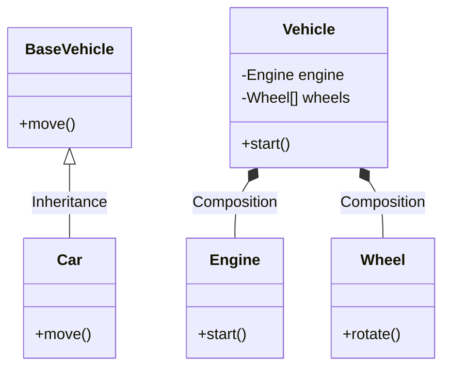
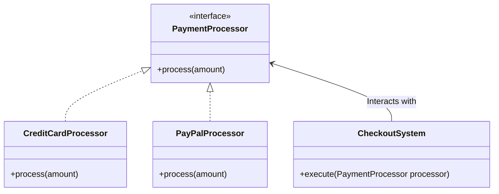
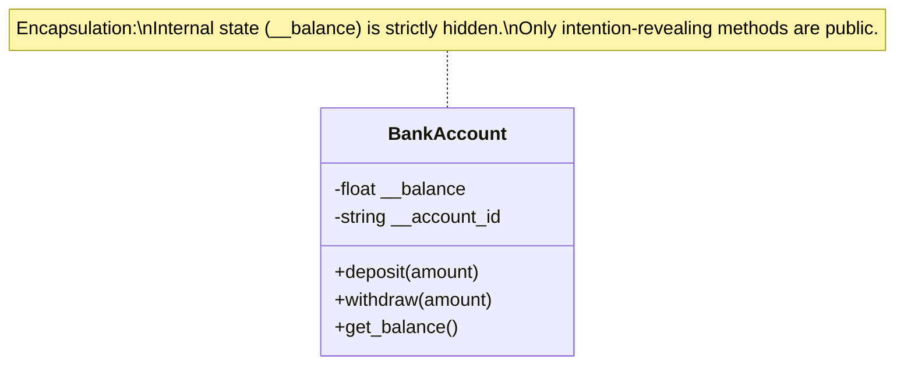
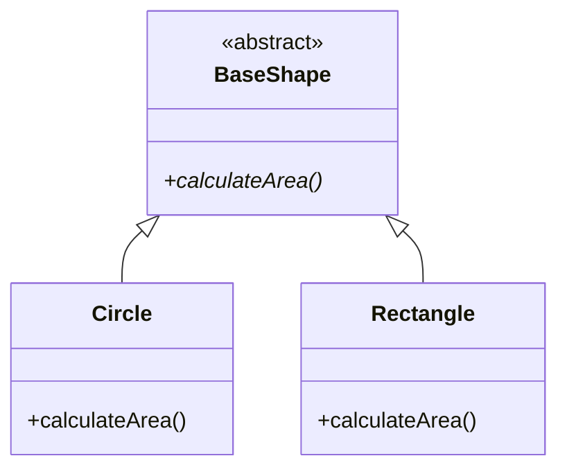
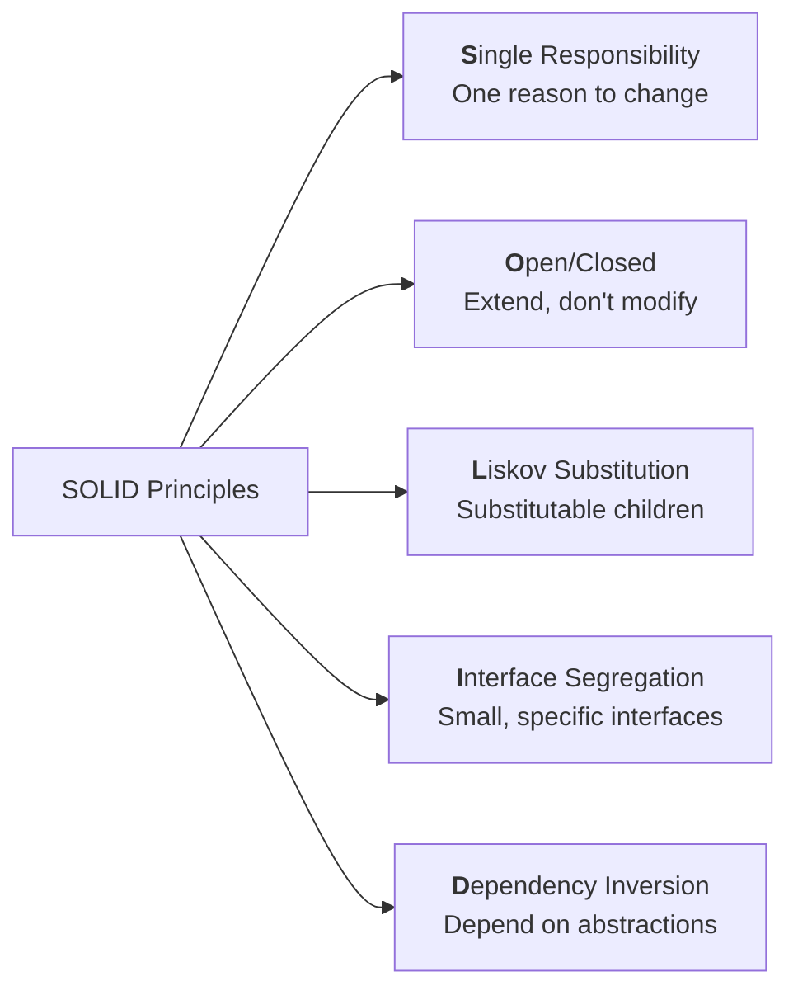

# From Zero to Hero in Object-Oriented Programming (OOP)

## 1. Introduction

### Why these concepts matter in real software engineering

OOP isn’t just academic theory — it’s the backbone of every maintainable, scalable codebase you’ll touch in industry. Think of Netflix’s recommendation engine, Spotify’s playlist system, or the backend of your favorite banking app: they all rely on **Inheritance** to reuse code without duplication, **Polymorphism** to swap behaviors at runtime, **Encapsulation** to protect sensitive data, **Abstraction** to hide complexity from other developers, and **SOLID** to keep systems flexible as they grow from 1,000 to 1,000,000 lines.

Companies interview for these exact concepts because violating them leads to “spaghetti code” that costs millions in refactoring. Mastering them turns you from “I can write code” to “I can design systems that survive real users, changing requirements, and team handoffs.”

> **Industry Deep Dive:** In modern software architecture, particularly when building complex stateful systems like e-commerce platforms, enterprise resource planning (ERP) tools, or multi-user collaboration apps, OOP provides the necessary boundaries. Without these boundaries, a small bug in your reporting logic could accidentally corrupt live user balances or order data. OOP isolates these concerns.

### How they build on each other (learning roadmap)

Follow this exact order — each concept unlocks the next:

1. **Encapsulation** → protects your data (the foundation)
2. **Abstraction** → hides the protected details behind clean interfaces
3. **Inheritance** → reuses abstracted code safely
4. **Polymorphism** → makes inherited code behave differently when needed
5. **SOLID Principles** → applies all four pillars at architectural scale

You’ll start writing simple classes today and end the guide refactoring a mini e-commerce system like a senior engineer.

### Prerequisites

* Basic programming (variables, functions, loops, conditionals)
* You do NOT need prior OOP knowledge — we start from zero
* Python 3.10+ (easiest for learning) and Node.js (for JS/TS examples)
* A willingness to type every code example yourself

---
**2. Core Concepts**

### Inheritance

Inheritance is one of the four foundational pillars of object-oriented programming (OOP). It allows a **child class** (also called a derived or subclass) to automatically acquire attributes and methods from a **parent class** (also called a base or superclass). This creates an “is-a” relationship, promotes **code reuse**, reduces duplication, and lets you model real-world hierarchies naturally.

#### Theory (Simple → Deep)

**Level 1 (Simple): “A Dog is an Animal” – The Foundation**

At its simplest, inheritance means the child class gets everything the parent has **for free**. You define common behavior once in the parent and extend or specialize it in the child.

- The `Dog` class inherits `eat()` from `Animal`.
- It can **override** existing methods (change behavior) or **add** completely new ones.

```python
class Animal:                    # Parent (base) class
    def __init__(self, name):
        self.name = name
    
    def eat(self):
        return f"{self.name} is eating."

class Dog(Animal):               # Child (derived) class
    def speak(self):             # Override (specialize)
        return f"{self.name} says: Woof!"
    
    def fetch(self):             # New method (extend)
        return f"{self.name} is fetching the ball!"
```

**Usage:**
```python
buddy = Dog("Buddy")
print(buddy.eat())     # Inherited → "Buddy is eating."
print(buddy.speak())   # Overridden → "Buddy says: Woof!"
print(buddy.fetch())   # New        → "Buddy is fetching the ball!"
```

**Level 2: Types of Inheritance in Python**

Python supports five main forms of inheritance. Each solves a different modeling need.

| Type                  | Description                                      | Real-world Example          | Code Pattern |
|-----------------------|--------------------------------------------------|-----------------------------|--------------|
| **Single**            | One parent → one child                           | Dog inherits from Animal    | `class Dog(Animal):` |
| **Multiple**          | One child inherits from two+ parents             | Duck inherits Fly + Swim    | `class Duck(Flyer, Swimmer):` |
| **Multilevel**        | Chain: Grandparent → Parent → Child              | Animal → Mammal → Dog       | `class Dog(Mammal):` |
| **Hierarchical**      | One parent → many children                       | Animal → Dog, Cat, Bird     | `class Dog(Animal):`, `class Cat(Animal):` |
| **Hybrid**            | Combination of the above                         | Complex enterprise models   | Mix of the above |

**Multiple Inheritance Example** (combining behaviors):
```python
class Flyer:
    def fly(self):
        return "Soaring through the sky!"

class Swimmer:
    def swim(self):
        return "Gliding through water!"

class Duck(Flyer, Swimmer):      # Multiple inheritance
    def quack(self):
        return "Quack quack!"

donald = Duck()
print(donald.fly())   # "Soaring through the sky!"
print(donald.swim())  # "Gliding through water!"
```

**Multilevel Example**:
```python
class Animal:
    def breathe(self): return "Breathing oxygen..."

class Mammal(Animal):
    def walk(self): return "Walking on four legs."

class Dog(Mammal):               # Multilevel chain
    def bark(self): return "Woof!"

maxi = Dog()
print(maxi.breathe())  # Inherited from Animal
print(maxi.walk())     # Inherited from Mammal
print(maxi.bark())     # New method
```
**Level 3 (Deep): Method Resolution Order (MRO) & the Diamond Problem – Going Deeper**

When inheritance gets complex—especially with multiple parents—Python must decide which method to call when the same name exists in several places. It uses the **C3 linearization algorithm** (the same algorithm used by Perl, Dylan, and others) to create a strict, predictable **Method Resolution Order (MRO)**.

### The Classic Diamond Problem Example

```python
class Grandparent:
    def greet(self):
        return "Hello from the Grandparent"

class Parent1(Grandparent):
    def greet(self):
        return "Hello from Parent1"

class Parent2(Grandparent):
    def greet(self):
        return "Hello from Parent2"

class Child(Parent1, Parent2):   # Creates the diamond shape
    pass
```

```python
kid = Child()
print(kid.greet())               # → "Hello from Parent1"
print(Child.__mro__)
# (<class '__main__.Child'>, <class '__main__.Parent1'>, 
#  <class '__main__.Parent2'>, <class '__main__.Grandparent'>, <class 'object'>)
```

### Why Does It Always Pick Parent1?

Python builds the MRO **left-to-right** based on the order you wrote in the class definition:  
`class Child(Parent1, Parent2)`

It searches `Parent1` first → finds `greet()` → stops immediately.  
`Parent2`’s version is **never reached** unless `Parent1` didn’t define the method.

This is by design: MRO guarantees a **single, linear path** with no ambiguity.

---

### What If You Actually Want Parent2’s (or Grandparent’s) Version?

Here are the **practical ways** to reach any specific ancestor’s implementation:

#### 1. Explicit Class Call (Simplest & Most Common Solution)

Bypass the MRO entirely by calling the method directly on the class you want and passing the instance manually:

```python
print(Parent2.greet(kid))       # → "Hello from Parent2"
print(Grandparent.greet(kid))   # → "Hello from the Grandparent"
print(Parent1.greet(kid))       # → "Hello from Parent1" (same as default)
```

**When to use this**:  
- Quick debugging  
- One-off needs  
- When you intentionally want to skip the normal lookup order

#### 2. Start the MRO Search from a Specific Point with `super()`

You can tell `super()` exactly where to begin the search:

```python
print(super(Parent1, kid).greet())   # Starts search *after* Parent1 → finds Parent2
# → "Hello from Parent2"

print(super(Parent2, kid).greet())   # Starts after Parent2 → finds Grandparent
# → "Hello from the Grandparent"
```

#### 3. Cooperative Multiple Inheritance (The Pythonic, Maintainable Way)

If you want the whole hierarchy to work together nicely (each level can contribute), refactor the classes to use `super()`:

```python
class Grandparent:
    def greet(self):
        return "Hello from the Grandparent"

class Parent1(Grandparent):
    def greet(self):
        return super().greet() + " → and Parent1"

class Parent2(Grandparent):
    def greet(self):
        return super().greet() + " → and Parent2"

class Child(Parent1, Parent2):
    def greet(self):
        return super().greet() + " → and Child"

kid = Child()
print(kid.greet())
# Output: "Hello from the Grandparent → and Parent2 → and Parent1 → and Child"
```

Notice the order follows the MRO: **Child → Parent1 → Parent2 → Grandparent**

With this pattern, a single `super().greet()` call automatically traverses the entire chain.

---

### Quick Reference: How to Get Any Version

| Goal                              | Code                                      | Output                        |
|-----------------------------------|-------------------------------------------|-------------------------------|
| Default (MRO)                     | `kid.greet()`                             | Hello from Parent1            |
| Force Parent2                     | `Parent2.greet(kid)`                      | Hello from Parent2            |
| Force Grandparent                 | `Grandparent.greet(kid)`                  | Hello from the Grandparent    |
| Start after Parent1               | `super(Parent1, kid).greet()`             | Hello from Parent2            |
| Cooperative chain (recommended)   | Refactor with `super()` + `kid.greet()`   | Full chain traversal          |

### Key Takeaways for Level 3

- Always inspect the MRO with:
  ```python
  print(Child.__mro__)
  # or
  import inspect
  print(inspect.getmro(Child))
  ```
- **Explicit class calls** (`Parent2.greet(kid)`) are the fastest way to reach a specific parent when you need it.
- **Cooperative `super()`** is the recommended long-term pattern for complex hierarchies — it keeps your code flexible and maintainable.
- Hard-coding parent names inside methods reduces flexibility (the hierarchy might change later), so use them only when truly necessary.
- Python’s MRO + `super()` gives you **full control** while eliminating the classic diamond ambiguity that plagues other languages.

This deeper dive shows you’re not stuck with whatever MRO decides — you have precise tools to reach **exactly** the method you want while still writing clean, Pythonic code.


#### Real-world Analogy

Think of your own family tree. You inherit your father’s last name and eye color (**attributes**) and your mother’s legendary cooking skills (**methods**). But you are not a perfect clone—you add your own tattoos (**new attributes**), override the “speak” method to use modern slang instead of formal speech, and maybe even combine skills from both sides (multiple inheritance). Inheritance in code works exactly the same way: it gives you a powerful foundation while letting you customize and extend freely.

### Putting It All Together – A Practical Example (Python)

Here’s a small but realistic **vehicle management system** that demonstrates single, multilevel, and multiple inheritance in one cohesive codebase. This example uses clear “is-a” relationships that make logical sense.

```python
# ==================== BASE CLASS ====================
class Vehicle:
    def __init__(self, brand, year):
        self.brand = brand
        self.year = year
    
    def start(self):
        return f"{self.brand} vehicle is starting."


# ==================== MULTILEVEL INHERITANCE ====================
class LandVehicle(Vehicle):           # Inherits from Vehicle
    def drive(self):
        return f"{self.brand} is driving on the road."


# ==================== SINGLE INHERITANCE + OVERRIDE + NEW METHOD ====================
class Car(LandVehicle):               # Single inheritance from LandVehicle
    def __init__(self, brand, year, doors):
        super().__init__(brand, year)
        self.doors = doors
    
    def drive(self):                  # Override
        return f"{self.brand} car is driving smoothly with {self.doors} doors."
    
    def honk(self):                   # New method
        return f"{self.brand} says: Beep beep!"


# ==================== MULTIPLE INHERITANCE ====================
class WaterVehicle(Vehicle):
    def sail(self):
        return f"{self.brand} is sailing on water."


class AmphibiousVehicle(LandVehicle, WaterVehicle):   # Multiple inheritance (hybrid)
    def transform(self):
        return f"{self.brand} is switching between land and water mode."


# ==================== USAGE ====================
# Single inheritance example
my_car = Car("Toyota", 2024, 4)
print(my_car.start())     # Inherited from Vehicle
print(my_car.drive())     # Overridden in Car
print(my_car.honk())      # New method in Car

print()

# Multiple inheritance example
hovercraft = AmphibiousVehicle("HoverX", 2023)
print(hovercraft.start())      # Inherited from Vehicle
print(hovercraft.drive())      # Inherited from LandVehicle
print(hovercraft.sail())       # Inherited from WaterVehicle
print(hovercraft.transform())  # New method in AmphibiousVehicle
```

### What This Example Demonstrates

| Inheritance Type     | Classes Involved                          | Purpose |
|----------------------|-------------------------------------------|---------|
| **Single**           | `Car` → `LandVehicle` → `Vehicle`         | Basic extension + overriding |
| **Multilevel**       | `LandVehicle` → `Vehicle`                 | Chain of inheritance |
| **Multiple**         | `AmphibiousVehicle` → `LandVehicle` + `WaterVehicle` | Combining behaviors from two parents |
| **Hybrid**           | Combination of above                      | Real-world complex design |


**Best Practice Tip**: Use `super()` when overriding methods so child classes remain cooperative with their parents:
**Here’s the exact same example converted to TypeScript** (the recommended choice for modern JavaScript projects).

### Putting It All Together – A Practical Example (TypeScript)

```typescript
// ==================== BASE CLASS ====================
class Vehicle {
    brand: string;
    year: number;

    constructor(brand: string, year: number) {
        this.brand = brand;
        this.year = year;
    }

    start(): string {
        return `${this.brand} vehicle is starting.`;
    }
}

// ==================== MULTILEVEL INHERITANCE ====================
class LandVehicle extends Vehicle {
    drive(): string {
        return `${this.brand} is driving on the road.`;
    }
}

// ==================== SINGLE INHERITANCE + OVERRIDE + NEW METHOD ====================
class Car extends LandVehicle {
    doors: number;

    constructor(brand: string, year: number, doors: number) {
        super(brand, year);
        this.doors = doors;
    }

    drive(): string {                    // Override
        return `${this.brand} car is driving smoothly with ${this.doors} doors.`;
    }

    honk(): string {                     // New method
        return `${this.brand} says: Beep beep!`;
    }
}

// ==================== MULTIPLE INHERITANCE (using Interface + Composition) ====================
interface WaterCapable {
    sail(): string;
}

class WaterVehicle extends Vehicle implements WaterCapable {
    sail(): string {
        return `${this.brand} is sailing on water.`;
    }
}

class AmphibiousVehicle extends LandVehicle implements WaterCapable {
    private waterVehicle: WaterVehicle;

    constructor(brand: string, year: number) {
        super(brand, year);
        this.waterVehicle = new WaterVehicle(brand, year);
    }

    sail(): string {
        return this.waterVehicle.sail();   // Delegate to composed object
    }

    transform(): string {
        return `${this.brand} is switching between land and water mode.`;
    }
}

// ==================== USAGE ====================
// Single inheritance example
const myCar = new Car("Toyota", 2024, 4);
console.log(myCar.start());     // Inherited from Vehicle
console.log(myCar.drive());     // Overridden in Car
console.log(myCar.honk());      // New method in Car

console.log();

// Multiple inheritance example (via interface + composition)
const hovercraft = new AmphibiousVehicle("HoverX", 2023);
console.log(hovercraft.start());      // Inherited from Vehicle
console.log(hovercraft.drive());      // Inherited from LandVehicle
console.log(hovercraft.sail());       // From WaterCapable interface
console.log(hovercraft.transform());  // New method
```

### What This Example Demonstrates

| Inheritance Type     | Classes Involved                              | Purpose |
|----------------------|-----------------------------------------------|---------|
| **Single**           | `Car` → `LandVehicle` → `Vehicle`             | Basic extension + overriding |
| **Multilevel**       | `LandVehicle` → `Vehicle`                     | Chain of inheritance |
| **Multiple**         | `AmphibiousVehicle` implements `WaterCapable` + extends `LandVehicle` | Combining behaviors (using interface + composition) |
| **Hybrid**           | Combination of above                          | Real-world complex design |

### Important Note for JavaScript/TypeScript Developers

Unlike Python, **JavaScript and TypeScript do not support multiple inheritance** directly (you cannot do `class AmphibiousVehicle extends LandVehicle, WaterVehicle`).

The pattern shown above is the **modern, recommended approach** in TypeScript:
- Use `extends` for single/multilevel inheritance
- Use `interface` + **composition** (delegation) to achieve multiple behavior inheritance

This is actually considered **better practice** than Python’s multiple inheritance in most real-world applications because it avoids the complexity of MRO and the diamond problem.

**In TypeScript, a constructor is a special method inside a class** that runs automatically when you create a new instance of that class using the `new` keyword. Its job is to **initialize** the object — setting up its initial state, assigning values to properties, validating input, etc.

### Basic Example

```ts
class Point {
  x: number;
  y: number;

  constructor(x: number = 0, y: number = 0) {
    this.x = x;
    this.y = y;
  }
}

const p = new Point(10, 20);
console.log(p.x); // 10
```

If you don’t define a constructor, TypeScript (like JavaScript) provides a default empty one.

### Output (when you run the code)

```
Toyota vehicle is starting.
Toyota car is driving smoothly with 4 doors.
Toyota says: Beep beep!

HoverX vehicle is starting.
HoverX is driving on the road.
HoverX is sailing on water.
HoverX is switching between land and water mode.
```


#### Common pitfalls & how to avoid

* **Pitfall:** Tight coupling (“God classes” that everything inherits from).  
  **Avoid:** Prefer composition over inheritance (has-a vs is-a).
* **Pitfall:** Diamond problem in multiple inheritance.  
  **Avoid:** Use Python’s `super()` or interfaces in TS.

#### Time & Space complexity

N/A for inheritance itself (compile-time). Method lookup is O(1) thanks to vtables.

#### Practice exercises

**Easy** Problem: Create `Vehicle` → `Car` and `Bike`. Both inherit `move()`.

Hint: Use `super().__init__()`.

**Solution:**

```python
class Vehicle:
    def __init__(self, brand):
        self.brand = brand
    def move(self):
        return f"{self.brand} is moving"

class Car(Vehicle):
    def move(self):
        return super().move() + " on 4 wheels"

class Bike(Vehicle):
    def move(self):
        return super().move() + " on 2 wheels"

# Test cases
c = Car("Toyota"); assert c.move() == "Toyota is moving on 4 wheels"
b = Bike("Honda"); assert b.move() == "Honda is moving on 2 wheels"
```



> **Industry Pro-Tip: Composition Over Inheritance**  
> The biggest mistake junior developers make is creating massive, deeply nested inheritance trees. For example, if you are building a custom e-commerce checkout system, do not make a `PaymentProcessor` inherit from `BaseService` which inherits from `DatabaseConnector`. Instead, use **Composition**. Give your `Service` class a `Database` property and a `Logger` property. This way, you assemble behaviors at runtime rather than locking them into rigid parent-child hierarchies at compile time.

---

### Polymorphism

#### Theory (simple → deep)

“Many forms.” Same method name, different behavior.

Two types:

1. Compile-time (overloading) — not native in Python  
2. Run-time (overriding) — the real power

#### Real-world analogy

A remote control: same “power” button works on TV, AC, or fan — different implementation behind the scenes.

#### Code implementation

**Python (duck typing + overriding)**

```python
class Bird:
    def fly(self): return "Flying high!"

class Penguin(Bird):
    def fly(self): return "I swim instead!"

def make_fly(bird):  # Polymorphic function
    print(bird.fly())

make_fly(Bird())    # Flying high!
make_fly(Penguin()) # I swim instead!
```

#### Common pitfalls

* **Pitfall:** Breaking Liskov Substitution (child breaks parent contract).  
  **Avoid:** Always make child stricter or equal, never weaker.



> **Industry Pro-Tip: The Power of Duck Typing in E-commerce Systems**  
> In Python, polymorphism heavily relies on "Duck Typing" ("If it walks like a duck and quacks like a duck, it is a duck"). This is incredibly powerful when processing orders. If you have a loop executing payment processors, your checkout system doesn't need to know if the processor is a credit card or PayPal. As long as every processor object has a `.process(amount)` method, the system works flawlessly.

---

### Encapsulation

#### Theory

Bundling data + methods AND restricting direct access (private, protected, public).

Python uses `_` (protected) and `__` (name-mangling) for privacy.

#### Analogy

A capsule of medicine: you swallow the whole thing — you don’t reach in and mess with the chemicals inside.

#### Code

**Python**

```python
class BankAccount:
    def __init__(self, balance):
        self.__balance = balance  # private
    
    def deposit(self, amount):
        if amount > 0:
            self.__balance += amount

    def withdraw(self, amount):
        if amount > 0 and amount <= self.__balance:
            self.__balance -= amount

    def get_balance(self):
        return self.__balance
```



> **Industry Pro-Tip: Immutability and State Management**  
> Encapsulation isn't just about hiding variables; it's about controlling state transitions. In environments where precision is critical (like managing user balances in a banking app or inventory levels in an e-commerce system), directly modifying variables from outside the class causes untraceable bugs. Expose only intention-revealing methods like `deposit()` and `withdraw()` rather than generic setters.

---

### Abstraction

#### Theory

Hiding implementation details, exposing only what’s necessary.

Achieved via abstract classes (ABC in Python) and interfaces (TS).

#### Analogy

You drive a car without knowing how the engine works — that’s abstraction.

#### Code

**Python**

```python
from abc import ABC, abstractmethod

class Shape(ABC):
    @abstractmethod
    def area(self): pass

class Circle(Shape):
    def __init__(self, r): self.r = r
    def area(self): return 3.14 * self.r ** 2

class Rectangle(Shape):
    def __init__(self, w, h): self.w = w; self.h = h
    def area(self): return self.w * self.h
```



> **Industry Pro-Tip: Designing Clear API Contracts**  
> Abstraction is the secret to scaling developer teams. By defining an abstract base class, you create an unbreakable contract. For example, if you are building a graphics library or an e-commerce reporting dashboard, the `BaseShape` or `BaseReport` abstract class defines exactly how shapes or reports should behave. You can build your entire application against that abstraction without caring about the concrete implementation details.

---

### SOLID Principles



#### S — Single Responsibility Principle

“A class should have only one reason to change.”

Analogy: One remote control per device, not a universal remote with 500 buttons.

> **Industry Trick:** If your class names contain "And" (e.g., `DataFetcherAndChartRenderer`), you are likely violating SRP. Separate the data fetching logic from the visual rendering tools into two distinct classes.

**Code Example (Python):**
```python
# Bad Example:
class UserAndEmailManager:
    def create_user(self, data): ...
    def send_welcome_email(self): ... # Violates SRP: two reasons to change

# Good Example:
class UserCreator:
    def create_user(self, data): ...

class EmailService:
    def send_welcome_email(self): ...
```

#### O — Open-Closed Principle

“Open for extension, closed for modification.”

Analogy: USB ports — you plug new devices without changing your laptop.

> **Industry Trick:** Use the Strategy Pattern. If you need to add a new payment method to an e-commerce checkout, you shouldn't have to touch the core order processor. You simply create a new class that implements the `PaymentProcessor` interface and inject it.

**Code Example (Python):**
```python
# Bad Example:
class DiscountCalculator:
    def calculate(self, customer_type, amount):
        if customer_type == "student": return amount * 0.9
        elif customer_type == "senior": return amount * 0.8
        # Violates OCP: any new discount requires modifying this method!

# Good Example:
from abc import ABC, abstractmethod

class DiscountStrategy(ABC):
    @abstractmethod
    def calculate(self, amount): pass

class StudentDiscount(DiscountStrategy):
    def calculate(self, amount): return amount * 0.9

class SeniorDiscount(DiscountStrategy):
    def calculate(self, amount): return amount * 0.8
```

#### L — Liskov Substitution Principle

“Child must be substitutable for parent without breaking code.”

> **Industry Trick:** If a subclass has to throw a `NotImplementedError` for a method it inherited from its parent, your inheritance tree is flawed and violates LSP.

**Code Example (Python):**
```python
# Bad Example:
class Rectangle:
    def set_width(self, w): self.w = w
    def set_height(self, h): self.h = h

class Square(Rectangle):
    def set_width(self, w):
        self.w = w
        self.h = w  # Violates LSP: changes expected behavior of Rectangle

# Good Example:
class Shape(ABC):
    @abstractmethod
    def area(self): pass

class Rectangle(Shape):
    def __init__(self, w, h): self.w = w; self.h = h
    def area(self): return self.w * self.h

class Square(Shape):
    def __init__(self, side): self.side = side
    def area(self): return self.side ** 2
```

#### I — Interface Segregation Principle

“Clients shouldn’t depend on interfaces they don’t use.”

> **Industry Trick:** When building toolsets for a full-stack app, keep interfaces atomic. A reporting module that only needs to read data shouldn't be forced to implement an interface that also requires write and delete permissions.

**Code Example (Python):**
```python
# Bad Example:
class WorkerInterface(ABC):
    @abstractmethod
    def work(self): pass
    @abstractmethod
    def eat(self): pass

class Robot(WorkerInterface):
    def work(self): print("Working")
    def eat(self): raise NotImplementedError("Robots don't eat!") # Violates ISP

# Good Example:
class Workable(ABC):
    @abstractmethod
    def work(self): pass

class Eatable(ABC):
    @abstractmethod
    def eat(self): pass

class Robot(Workable):
    def work(self): print("Working")

class Human(Workable, Eatable):
    def work(self): print("Working")
    def eat(self): print("Eating")
```

#### D — Dependency Inversion Principle

“Depend on abstractions, not concretions.”

> **Industry Trick:** Dependency Inversion is what makes unit testing possible. By depending on an abstraction, you can easily inject a mock database or a mock payment gateway during testing, ensuring you don't accidentally execute real commands while running your test suite.

**Code Example (Python):**
```python
# Bad Example:
class MySQLDatabase:
    def insert(self, data): print("Inserting to MySQL")

class App:
    def __init__(self):
        self.db = MySQLDatabase() # Violates DIP: depending on a concrete class

# Good Example:
class DatabaseInterface(ABC):
    @abstractmethod
    def insert(self, data): pass

class MySQLDatabase(DatabaseInterface):
    def insert(self, data): print("Inserting to MySQL")

class App:
    def __init__(self, db: DatabaseInterface):
        self.db = db # Depends on abstraction, allows mocking and expanding.
```

---

## 2.5 Practical Application: Mini E-commerce System

To bring everything together and deliver on the promise from our introduction, here’s how we’d design the core of an e-commerce system utilizing all these OOP concepts. We use **Encapsulation** to protect order totals, **Abstraction** for external services, **Polymorphism** for dynamic execution, and all **SOLID principles** to keep it maintainable.

### The Code (Python)

```python
from abc import ABC, abstractmethod
from dataclasses import dataclass

# 1. ENCAPSULATION & SINGLE RESPONSIBILITY
@dataclass
class Item:
    name: str
    price: float

class Order:
    def __init__(self):
        self.__items: list[Item] = []  # Encapsulated data
        
    def add_item(self, item: Item):
        self.__items.append(item)
        
    def total_price(self) -> float:
        return sum(item.price for item in self.__items)

# 2. ABSTRACTION & DEPENDENCY INVERSION
class PaymentProcessor(ABC):
    @abstractmethod
    def pay(self, amount: float):
        pass

class NotificationService(ABC):
    @abstractmethod
    def notify(self, message: str):
        pass

# 3. POLYMORPHISM & OPEN/CLOSED
class StripePayment(PaymentProcessor):
    def pay(self, amount: float):
        print(f"Processing ${amount:.2f} via Stripe")

class PaypalPayment(PaymentProcessor):
    def pay(self, amount: float):
        print(f"Processing ${amount:.2f} via PayPal")

class SMSNotifier(NotificationService):
    def notify(self, message: str):
        print(f"SMS sent: {message}")

# 4. BRINGING IT ALL TOGETHER
class CheckoutSystem:
    # Depends on abstractions, extremely flexible!
    def __init__(self, processor: PaymentProcessor, notifier: NotificationService):
        self.processor = processor
        self.notifier = notifier
        
    def execute_checkout(self, order: Order):
        total = order.total_price()
        if total == 0:
            raise ValueError("Cannot checkout an empty order.")
            
        self.processor.pay(total)
        self.notifier.notify(f"Your order of ${total:.2f} was successful.")

# --- Execution ---
order = Order()
order.add_item(Item("Laptop", 1200.0))
order.add_item(Item("Mouse", 25.0))

# Easily swap out dependencies without touching CheckoutSystem!
checkout = CheckoutSystem(PaypalPayment(), SMSNotifier())
checkout.execute_checkout(order)
```

---

## 3. Summary & Mastery Section

### Key takeaways

* **Inheritance:** Reuse without duplication, but prefer composition.
* **Polymorphism:** Write code that works with future unknown types.
* **Encapsulation:** Protect your data like a vault.
* **Abstraction:** Hide complexity so others can use your code easily.
* **SOLID:** The checklist that separates junior from senior engineers.

### Comparison table

| Concept       | Purpose                  | Key Keyword      | Risk if ignored          | Best used with     |
|---------------|--------------------------|------------------|--------------------------|--------------------|
| Inheritance   | Code reuse               | "is-a"           | Fragile base class       | Polymorphism       |
| Polymorphism  | Flexible behavior        | "many forms"     | Rigid if-else chains     | Abstraction        |
| Encapsulation | Data protection          | private          | Data corruption          | All others         |
| Abstraction   | Hide complexity          | interface/ABC    | Leaky abstractions       | SOLID D & I        |
| SOLID         | Architectural sanity     | principles       | Unmaintainable monoliths | All four pillars   |

