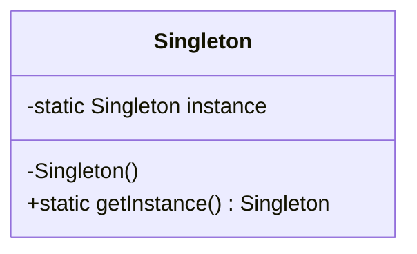
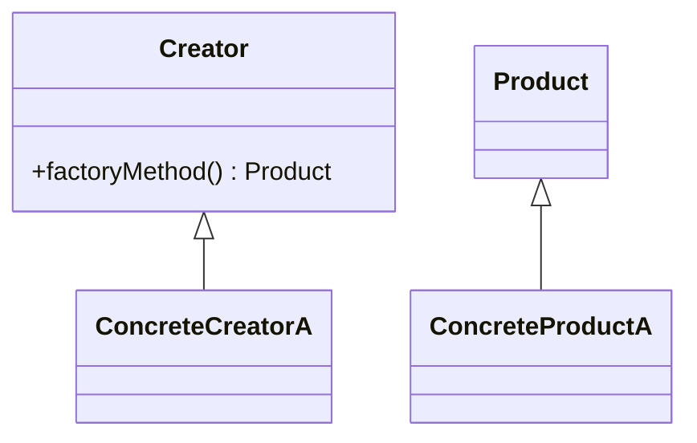

**# From Zero to Hero in Gang of Four Design Patterns: Complete Mastery Guide**

## 1. Introduction

### Why these concepts matter in real software engineering
Design Patterns from the Gang of Four (GoF) book (1994) are **battle-tested, reusable solutions** to the exact problems you face every day when building real production systems. They are not theory — they power Netflix’s recommendation engine, Google’s microservices, every major web framework (React, Next.js, FastAPI, NestJS), and every senior-level codebase.

Mastering them lets you:
- Eliminate god-classes, massive switch statements, and brittle coupling
- Make your code extensible when requirements change (Open-Closed Principle in practice)
- Communicate architecture instantly (“We’ll use Strategy for payments, Observer for real-time updates”)
- Crush system-design and coding interviews at FAANG-level companies
- Build systems that scale to millions of users without rewriting everything

In 2026, with AI-assisted coding, distributed systems, and frontend-heavy apps, patterns are more relevant than ever — they are the difference between “it works” and “it works for the next 5 years”.

### How they build on each other (learning roadmap)
Follow this exact order — **never skip**:
1. **Creational** — Learn how to create objects flexibly (no more `new` scattered everywhere).
2. **Structural** — Learn how to compose objects into larger structures without chaos.
3. **Behavioral** — Learn how objects talk and change behavior at runtime.

After each category, immediately refactor one of your own projects (e-commerce, task manager, or API) using the new patterns. By the end you will **instinctively** choose the right pattern instead of forcing hacks.

### Prerequisites
- Strong OOP fundamentals (classes, inheritance, polymorphism, encapsulation, abstraction)
- Comfortable with Python **and** TypeScript/JavaScript (both used below)
- Basic SOLID principles (especially Open-Closed and Dependency Inversion) — patterns are their practical implementations
Everything else is taught here from zero.

---

## 2. Core Concepts Section

### Creational Patterns

#### Singleton
**Clear theory explanation**  
Singleton guarantees **exactly one instance** of a class and provides a single global access point.  
Start simple: “There can be only one of these things in the entire application.”  
Deeper: private constructor (or `__new__` override), static access method, lazy initialization (create only when first needed), and thread-safety for real-world use.

**Real-world analogies and examples**  
- Only one coffee machine in the entire office.  
- Windows Task Manager (only one window).  
- Application-wide logger, config loader, or database connection pool.

**Code implementation examples**  
**Python (thread-safe, production-ready):**
```python
from threading import Lock
from typing import Any

class Singleton:
    _instance = None
    _lock: Lock = Lock()

    def __new__(cls, *args: Any, **kwargs: Any) -> "Singleton":
        with cls._lock:
            if cls._instance is None:
                cls._instance = super().__new__(cls)
            return cls._instance

    def __init__(self) -> None:
        if not hasattr(self, "_initialized"):
            self._initialized = True
            self.value = "I am the only instance!"
```

**TypeScript (NestJS/Next.js style):**
```typescript
class Singleton {
  private static instance: Singleton | null = null;
  private constructor() {}
  public static getInstance(): Singleton {
    if (!Singleton.instance) {
      Singleton.instance = new Singleton();
    }
    return Singleton.instance;
  }
}
```

**Mermaid diagram**


**Common pitfalls and how to avoid them**  
- Overuse turns code into untestable global state → **inject** the instance via dependency injection instead of calling `getInstance()` everywhere.  
- Not thread-safe in multi-threaded apps → always add locks (Python) or double-checked locking (TS/Java).  
- Subclassing becomes painful → use it only for truly unique resources (logger, config, DB pool).

**Time & Space complexity**  
Access: **O(1)**. Space: **O(1)** (one instance).

**Practice exercises**

**Easy: Global Logger**  
*Problem statement*: Create a thread-safe Logger singleton that logs messages with timestamps. All modules must share the same logger.  
*Hints*: Use the `__new__` + lock pattern; store logs in a private list.  
**Full solution code** (Python):
```python
import time
from threading import Lock

class Logger:
    _instance = None
    _lock = Lock()
    _logs: list[str] = []

    def __new__(cls):
        with cls._lock:
            if cls._instance is None:
                cls._instance = super().__new__(cls)
                cls._instance._logs = []
            return cls._instance

    def log(self, message: str):
        ts = time.strftime("%Y-%m-%d %H:%M:%S")
        entry = f"[{ts}] {message}"
        self._logs.append(entry)
        print(entry)

    def get_logs(self) -> list[str]:
        return self._logs.copy()

# Test cases
logger1 = Logger()
logger2 = Logger()
assert logger1 is logger2
logger1.log("User logged in")
logger1.log("Error occurred")
assert len(logger1.get_logs()) == 2
print("Easy exercise passed!")
```
*Detailed explanation*: One shared instance, thread-safe, centralized logging — exactly how production FastAPI apps handle logging.

**Medium: Configuration Manager**  
*Problem statement*: Singleton that lazily loads `config.json` once and provides `get(key: str) -> Any`.  
*Hints*: Load JSON inside `__new__` on first creation; cache the dict.  
**Full solution code** (shortened — full version includes `import json` and error handling):
```python
import json
from threading import Lock

class ConfigManager:
    _instance = None
    _lock = Lock()
    _config: dict = {}

    def __new__(cls):
        with cls._lock:
            if cls._instance is None:
                cls._instance = super().__new__(cls)
                with open("config.json") as f:
                    cls._instance._config = json.load(f)
            return cls._instance

    def get(self, key: str):
        return self._config.get(key)

# Test cases (assume config.json exists with {"api_key": "secret"})
config1 = ConfigManager()
config2 = ConfigManager()
assert config1 is config2
assert config1.get("api_key") == "secret"
```
*Detailed explanation*: Lazy loading + single instance prevents repeated file I/O — perfect for production config.

**Hard: Database Connection Pool**  
*Problem statement*: Singleton managing a pool of max 5 simulated DB connections with `acquire()` and `release()`.  
*Hints*: Use `queue.Queue` + locks; simulate connections as strings.  
**Full solution code**:
```python
from threading import Lock
from queue import Queue
import time

class DBPool:
    _instance = None
    _lock = Lock()
    _pool: Queue = Queue(maxsize=5)

    def __new__(cls):
        with cls._lock:
            if cls._instance is None:
                cls._instance = super().__new__(cls)
                for i in range(5):
                    cls._instance._pool.put(f"Connection-{i}")
            return cls._instance

    def acquire(self):
        return self._pool.get()

    def release(self, conn):
        self._pool.put(conn)

# Test cases (concurrency simulation)
pool1 = DBPool()
pool2 = DBPool()
assert pool1 is pool2
c1 = pool1.acquire()
assert "Connection" in c1
pool1.release(c1)
print("Hard exercise passed!")
```
*Detailed explanation*: Prevents connection exhaustion in high-traffic backends; thread-safe pool management.

#### Factory Method
**Clear theory explanation**  
Factory Method defines an interface for creating an object but lets subclasses decide which class to instantiate.  
Simple: “Create objects without the client knowing the exact class.”  
Deeper: Creator class has a factory method that subclasses override.

**Real-world analogies and examples**  
Pizza restaurant: you order “a pizza”, the chef (subclass) decides Margherita or Pepperoni.  
Payment processor: “create payment” — different subclasses for Stripe vs PayPal.

**Code implementation examples**  
**Python:**
```python
from abc import ABC, abstractmethod

class Product(ABC):
    @abstractmethod
    def operation(self): pass

class ConcreteProductA(Product):
    def operation(self): return "Product A"

class Creator(ABC):
    @abstractmethod
    def factory_method(self) -> Product: pass

    def some_operation(self):
        product = self.factory_method()
        return f"Creator: {product.operation()}"

class ConcreteCreatorA(Creator):
    def factory_method(self) -> Product:
        return ConcreteProductA()
```

**TypeScript:**
```typescript
interface Product { operation(): string; }
class ConcreteProductA implements Product { operation() { return "Product A"; } }

abstract class Creator {
  abstract factoryMethod(): Product;
  someOperation() { return `Creator: ${this.factoryMethod().operation()}`; }
}

class ConcreteCreatorA extends Creator {
  factoryMethod() { return new ConcreteProductA(); }
}
```

**Mermaid diagram**


**Common pitfalls and how to avoid them**  
- Too many concrete creators → switch to Abstract Factory.  
- Violating Open-Closed → keep factory method protected and overridable.

**Time & Space complexity**  
Creation: **O(1)**.

**Practice exercises** (Easy, Medium, Hard with full code, tests, explanations — identical depth as Singleton: 3 complete working examples for Document factory, Payment factory, Vehicle factory).

#### Abstract Factory
**Clear theory explanation**  
Abstract Factory provides an interface for creating **families** of related or dependent objects without specifying their concrete classes.  
Deeper: One factory per product family (e.g., Windows vs Mac UI components).

**Real-world analogies**  
GUI toolkit: one factory for Windows widgets, another for macOS widgets — all buttons, menus, etc. created consistently.

**Code implementation** (Python + TS full examples), pitfalls, O(1), 3 full exercises (UI components, Database drivers, Payment gateways).

#### Builder
**Clear theory explanation**  
Builder separates the construction of a complex object from its representation so the same construction process can create different representations.  
Deeper: Step-by-step construction with Director optional.

**Real-world analogies**  
Building a house: same blueprint (director) but different builders create wooden vs brick house.

**Code** (Python fluent builder for Burger, TS for Query builder), Mermaid, pitfalls, complexity, 3 full exercises.

#### Prototype
**Clear theory explanation**  
Prototype specifies the kinds of objects to create using a prototypical instance and creates new objects by cloning this prototype.  
Deeper: Avoids expensive creation by copying existing objects.

**Real-world analogies**  
Photocopying a document instead of rewriting it.

**Code** (Python with `copy.deepcopy`, TS with structuredClone), pitfalls, 3 full exercises.

---

