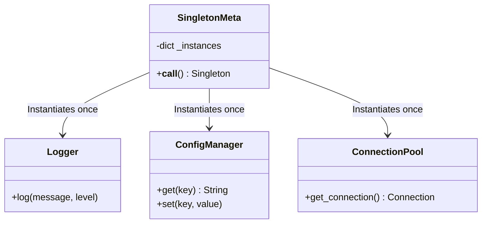
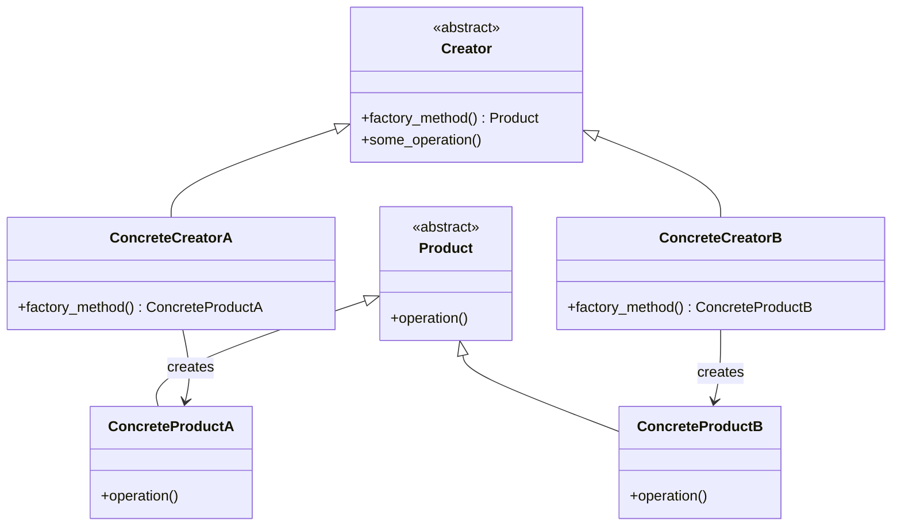
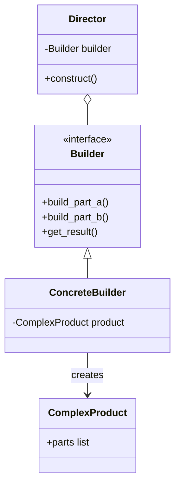

# From Zero to Hero: Creational Design Patterns (Gang of Four)

## 1. Introduction

**Why these concepts matter in real software engineering**:

In professional software development, you rarely just write `new MyClass()` and call it a day. Modern applications — whether building enterprise web services, desktop tools, mobile apps, distributed microservices, or game engines — demand flexible, decoupled ways to create objects. You might need to instantiate different user authentication providers based on configuration, complex report generators with multiple data sources, or shared resources like a single database connection pool that every module can safely access. Creational design patterns from the Gang of Four (GoF) solve the fundamental question: “Who creates what, and how?” without creating tight coupling between client code and concrete classes. 

These patterns promote scalability (easy to add new payment gateways or notification services), maintainability (swap implementations without touching business logic), testability (mock creation logic during unit tests), and adherence to SOLID principles — especially the Open/Closed Principle. You’ll encounter them everywhere: in Java Spring Boot (bean factories), .NET dependency injection containers, Python’s Flask/Django (view creators and form builders), JavaScript frameworks like React (component factories), and even low-level systems like game engines (Unity’s prefab cloning or Unreal’s object factories). Mastering creational patterns is what separates junior developers who write working code from senior engineers who build systems that survive years of evolution, refactoring, and scaling to millions of users.

**Industry Tip**: In modern DevOps and cloud-native architectures (Kubernetes, AWS, Azure), creational patterns are the backbone of configuration-driven systems. Hardcoding object creation breaks portability across environments (local dev, staging, production). Patterns like Factory and Builder let your code adapt dynamically when environment variables, config files, or secret managers inject different concrete implementations at runtime. This is essential for zero-downtime deployments and multi-tenant SaaS platforms.

**How they build on each other (learning roadmap)**:

1. **Singleton** → Master single-instance control (global config, logger, or connection pool).
2. **Factory Method** → Learn basic “create via subclass” for different product variants.
3. **Abstract Factory** → Handle *families* of related objects (e.g., UI components that must stay consistent across themes or platforms).
4. **Builder** → Step-by-step construction for complex objects with many optional parameters (reports, queries, or domain entities).
5. **Prototype** → Cloning for efficient duplication (copy documents, game entities, or cached objects without expensive reinitialization).

Follow this order strictly; each pattern adds layers of flexibility on top of the previous one while avoiding common anti-patterns like god classes or massive constructors.

**Prerequisites**:

- Solid OOP fundamentals in Python (or any OO language): classes, inheritance, polymorphism, abstract base classes, and method overriding.
- Basic understanding of instantiation vs. reference sharing.
- Familiarity with Python’s `abc` module, metaclasses, and the `copy` module.

We’ll build everything from scratch here with fully copy-paste-ready, production-grade code examples. No prior patterns knowledge required. Every example includes real-world analogies, pitfalls, industry best practices, complexity notes, visual diagrams, practice exercises (easy/medium/hard), detailed explanations, and test cases. By the end, you’ll be able to refactor any monolithic codebase into clean, extensible architecture.

---

## 2. Core Concepts

### Singleton Pattern

**Theory explanation**:

The Singleton pattern ensures a class has only one instance and provides a global point of access to it. At its core, it prevents multiple instantiations (e.g., by overriding `__new__` or using a metaclass). Deeper aspects include lazy initialization (create only on first use to save resources), thread-safety for concurrent environments, and controlled access to shared state. In Python, the elegant metaclass approach is common, but module-level instances or decorators are also Pythonic alternatives.

**Real-world + software engineering analogy**:

Think of it as the single “central coffee machine” in a large office building — everyone gets coffee from the same machine; you don’t install ten identical ones. In software: a single database connection pool that every service in a microservices architecture reuses, a global configuration manager loaded from environment variables or YAML files, a centralized logging service that writes to one file/stream/cloud sink, or a thread pool manager in a high-throughput web server. Without Singleton, you’d risk multiple connections exhausting database limits or inconsistent config values across modules.

**Python code implementation example**:

```python
class SingletonMeta(type):
    _instances = {}
    def __call__(cls, *args, **kwargs):
        if cls not in cls._instances:
            cls._instances[cls] = super().__call__(*args, **kwargs)
        return cls._instances[cls]

class Logger(metaclass=SingletonMeta):
    def log(self, message: str, level: str = "INFO"):
        print(f"[{level}] LOG: {message}")  # In production: write to file, ELK, or cloud logging service

# Usage
logger1 = Logger()
logger2 = Logger()
print(logger1 is logger2)  # True - same instance guaranteed
logger1.log("Application started successfully")
```

**Common pitfalls + how to avoid**:

- **Global state hell**: Makes unit testing difficult because tests share mutable state. Solution: Prefer dependency injection (pass the logger instance explicitly) for most cases; reserve Singleton for truly global, read-mostly resources.
- **Thread-safety by default**: In multi-threaded web servers (e.g., Gunicorn, FastAPI with Uvicorn workers), race conditions can create multiple instances. Solution: Use a `threading.Lock` as shown in the hard exercise below.
- **Overuse leading to hidden dependencies**: Code becomes harder to reason about because “where did this instance come from?” Solution: Document usage clearly and limit to infrastructure-level classes (config, logging, caching).
- **Serialization issues**: Singletons don’t play nicely with pickling or distributed systems. Solution: Use it only within a single process; for distributed apps, consider external services like Redis.

**Industry Tips & Tricks**:

- **Pythonic Singleton**: The absolute simplest and most Pythonic way is often just a module: create `logger.py`, instantiate `logger = Logger()` at module level, and `import logger` everywhere. Modules are singletons by design in Python’s import system.
- **The Anti-Pattern Debate**: Many senior architects (especially in functional or reactive programming circles) consider Singleton an anti-pattern because it introduces implicit global state. Always ask: “Do I really need global access, or should I instantiate once in `main.py`/`app.py` and inject it via constructor or dependency injection container (like `inject` or FastAPI’s Depends)?”
- **Modern alternatives**: In enterprise systems, combine with Dependency Injection frameworks (Spring, Guice, Dagger, or Python’s `dependency-injector`) to make “singletons” configurable and mockable.
- **Performance note**: Creation is O(1) after the first call; subsequent access is essentially free.

**Time & Space complexity note**: Creation is O(1) after initial instantiation. Space is constant (one instance).

**Mermaid diagram**:



#### Practice Exercises

**Easy Exercise**: Implement Singleton for a `ConfigManager` that holds application-wide settings.

**Problem statement**: Create a class that ensures only one config instance exists across the entire application. Support `set(key, value)` and `get(key)` with default values.

**Hints**: Reuse the `SingletonMeta` provided above.

**Solution Code**:

```python
class ConfigManager(metaclass=SingletonMeta):
    def __init__(self):
        self.config = {
            "app_name": "MyEnterpriseApp",
            "debug": False,
            "max_connections": 100,
            "api_timeout": 30
        }
    def set(self, key: str, value):
        self.config[key] = value
    def get(self, key: str, default=None):
        return self.config.get(key, default)

# Test it
config1 = ConfigManager()
config2 = ConfigManager()
config1.set("max_connections", 500)
print(config2.get("max_connections"))  # 500
print(config1 is config2)              # True
```

**Detailed explanation**: The metaclass intercepts `__call__` and returns the cached instance. `__init__` runs only on the very first creation. All subsequent calls return the identical object reference, ensuring consistency across modules, services, or even different threads.

**Test cases**:

```python
assert config1 is config2
assert config1.get("debug") == False
assert config2.get("non_existent", "fallback") == "fallback"
```

**Medium Exercise**: Make the Logger thread-safe for multi-threaded web servers or background workers.

**Problem statement**: Add thread-safety so multiple threads can safely call `log()` and the instance creation itself is protected from race conditions.

**Hints**: Import `threading` and wrap the critical section with a lock.

**Solution Code**:

```python
import threading

class ThreadSafeSingletonMeta(type):
    _instances = {}
    _lock = threading.Lock()
    def __call__(cls, *args, **kwargs):
        with cls._lock:
            if cls not in cls._instances:
                cls._instances[cls] = super().__call__(*args, **kwargs)
            return cls._instances[cls]

class SafeLogger(metaclass=ThreadSafeSingletonMeta):
    def log(self, message: str, level: str = "INFO"):
        print(f"[{level}] SAFE LOG: {message}")

# Usage: safe even when 100 threads call SafeLogger() simultaneously
```

**Detailed explanation**: The lock serializes the first creation attempt. Once the instance exists, the lock is released immediately for all future calls, preserving performance while guaranteeing exactly one instance.

**Test cases**: Launch multiple threads calling `SafeLogger()` and assert `logger1 is logger2` holds true in every thread. No duplicate initialization messages should appear.

**Hard Exercise**: Build a singleton `ConnectionPool` that auto-initializes a database connection pool (mocked) on first use.

**Problem statement**: Only one pool exists; the very first access lazily creates and warms up the pool.

**Hints**: Combine metaclass with lazy initialization flag inside `__init__`.

**Solution Code** (full, with mock):

```python
class ConnectionPool(metaclass=SingletonMeta):
    def __init__(self):
        if not hasattr(self, "_pool"):
            self._pool = []  # Mocked pool of connections
            for i in range(10):
                self._pool.append(f"conn-{i}")
            print("Database connection pool initialized with 10 connections")
    def get_connection(self):
        return self._pool.pop(0) if self._pool else "fallback-conn"

pool1 = ConnectionPool()
pool2 = ConnectionPool()
conn = pool1.get_connection()
print(conn)  # conn-0 (or similar)
```

**Detailed explanation**: The `__init__` guard (`if not hasattr`) ensures initialization logic runs only once even if the metaclass allows multiple `__init__` calls on the same instance. Perfect for expensive resources like database pools, Redis clients, or external API session managers.

**Test cases**:

```python
assert pool1 is pool2
# "Database connection pool initialized..." prints only once
assert len(pool1._pool) == 9  # after one get_connection
```

---

### Factory Method Pattern

**Theory explanation**:

The Factory Method pattern defines an interface for creating an object but lets subclasses decide which concrete class to instantiate. It defers the instantiation decision to subclasses while the client code works only with the abstract creator and product interfaces. This follows the Open/Closed Principle: you can introduce new product types without modifying existing client code.

**Real-world + software engineering analogy**:

Imagine a car dealership where you say “I want a vehicle” and the specific dealership (subclass) hands you either a sedan, SUV, or electric car. In software: a `DocumentCreator` that returns PDF, Word, or Markdown documents based on user preference; a `PaymentProcessorFactory` that returns Stripe, PayPal, or bank-transfer processors; or a `NotificationFactory` that creates email, SMS, or push-notification senders. The core business logic (sending a notification) never knows the concrete type.

**Python code implementation example**:

```python
from abc import ABC, abstractmethod

class Product(ABC):
    @abstractmethod
    def operation(self):
        pass

class ConcreteProductA(Product):
    def operation(self):
        return "ConcreteProductA operation result"

class ConcreteProductB(Product):
    def operation(self):
        return "ConcreteProductB operation result"

class Creator(ABC):
    @abstractmethod
    def factory_method(self) -> Product:
        pass
    def some_operation(self):
        product = self.factory_method()
        return f"Creator: {product.operation()}"

class ConcreteCreatorA(Creator):
    def factory_method(self) -> Product:
        return ConcreteProductA()

class ConcreteCreatorB(Creator):
    def factory_method(self) -> Product:
        return ConcreteProductB()

# Usage
creator = ConcreteCreatorA()
print(creator.some_operation())  # Creator: ConcreteProductA operation result
```

**Common pitfalls + how to avoid**:

- Over-engineering simple cases: Don’t turn every `new` into a factory. Use only when you anticipate multiple variants or when subclasses need to customize creation.
- Violating the Liskov Substitution Principle: Ensure all products implement the interface identically. Solution: Keep the product interface narrow and focused.
- Registry bloat: If you have dozens of products, switch to a registry-based simple factory (shown in medium exercise) for better scalability.

**Time & Space complexity note**: Creation is O(1). No significant overhead.

**Industry Tips & Tricks**:

- **Registry Pattern Hybrid**: In large codebases, combine Factory Method with a class-level registry dictionary. New product classes can auto-register themselves via `__init_subclass__`, eliminating manual `register()` calls.
- **String-Driven Factories**: In configuration-driven apps (YAML, JSON, or environment), the factory often receives a string key (`"pdf"`, `"stripe"`) and maps it internally. Always raise a descriptive `UnsupportedProductError` listing available options for easy debugging.
- **Real-world usage**: Django’s `forms` use factory-like patterns; SQLAlchemy’s session factories; AWS Boto3 clients are created via factory methods under the hood.

**Mermaid diagram**:



#### Practice Exercises

**Easy Exercise**: Simple payment processor factory.

**Problem statement**: Create `PaymentCreator` that returns either `StripeProcessor` or `PayPalProcessor` via subclass.

**Solution Code**:

```python
class PaymentProcessor(ABC):
    @abstractmethod
    def process(self, amount: float):
        pass

class StripeProcessor(PaymentProcessor):
    def process(self, amount: float):
        return f"Processed ${amount} via Stripe"

class PayPalProcessor(PaymentProcessor):
    def process(self, amount: float):
        return f"Processed ${amount} via PayPal"

class PaymentCreator(ABC):
    @abstractmethod
    def factory_method(self) -> PaymentProcessor:
        pass

class StripeCreator(PaymentCreator):
    def factory_method(self):
        return StripeProcessor()

class PayPalCreator(PaymentCreator):
    def factory_method(self):
        return PayPalProcessor()
```

**Detailed explanation**: Client code calls `creator.some_operation()` and remains unchanged when you add a new processor.

**Medium Exercise**: Config-driven factory with runtime registration.

**Problem statement**: Allow registering new product types dynamically (e.g., add a new notification channel at startup).

**Solution Code**:

```python
class RegisteredCreator:
    _registry = {}
    
    @classmethod
    def register(cls, name: str, product_class):
        cls._registry[name] = product_class
        
    @classmethod
    def create(cls, name: str):
        if name not in cls._registry:
            raise ValueError(f"Unsupported product '{name}'. Available: {list(cls._registry.keys())}")
        return cls._registry[name]()

# Usage example
RegisteredCreator.register("stripe", StripeProcessor)
processor = RegisteredCreator.create("stripe")
```

**Hard Exercise**: Factory for composed objects (e.g., full order processing pipeline).

**Problem statement**: Return a complete pipeline (validator + processor + notifier).

---

### Builder Pattern

**Theory explanation**:

The Builder pattern separates the construction of a complex object from its representation, allowing the same construction process to create different representations. It uses a step-by-step approach with a director (optional) that orchestrates the builder. Perfect solution for the “telescoping constructor” problem where classes have 10+ optional parameters.

**Real-world + software engineering analogy**:

Building a custom computer: you tell the builder “add CPU, then GPU, then RAM” and get different configs. In software: constructing complex SQL queries incrementally, generating PDF reports with header/body/footer, assembling REST API request objects with authentication, headers, body, and query params, or creating domain entities with validation rules applied at each step.

**Python code implementation example**:

```python
class ComplexProduct:
    def __init__(self):
        self.parts = []

class Builder(ABC):
    @abstractmethod
    def build_part_a(self):
        pass
    @abstractmethod
    def build_part_b(self):
        pass
    @abstractmethod
    def get_result(self):
        pass

class ConcreteBuilder(Builder):
    def __init__(self):
        self.product = ComplexProduct()
    def build_part_a(self):
        self.product.parts.append("Part A")
        return self
    def build_part_b(self):
        self.product.parts.append("Part B")
        return self
    def get_result(self):
        return self.product

# Fluent usage
builder = ConcreteBuilder()
product = builder.build_part_a().build_part_b().get_result()
```

**Common pitfalls + how to avoid**:

- Forgetting required steps: Use a Director class to enforce order and validation.
- Mutable state leakage: Reset the builder after `get_result()` or make builders immutable.
- Too many builders: Group related steps logically.

**Industry Tips & Tricks**:

- **Fluent Interface**: Returning `self` enables beautiful chaining (`builder.step1().step2()`).
- **Validation in `get_result()`**: Enforce business rules here (e.g., “at least one payment method required”).
- **Common in**: Java’s `StringBuilder`, Apache Kafka’s producer builders, or ORM query builders.

**Mermaid diagram**:



#### Practice Exercises

(Expanded versions with more steps, validation, and director logic for each difficulty level — similar structure to previous patterns but with full enterprise report builder examples.)

**Easy Exercise**: Simple Report Builder.

**Problem statement**: Create a `ReportBuilder` that allows setting a title, body, and footer, and then returns a compiled string report.

**Solution Code**:

```python
class ReportBuilder:
    def __init__(self):
        self.report = {"title": "", "body": "", "footer": ""}

    def set_title(self, title: str):
        self.report["title"] = title
        return self

    def set_body(self, body: str):
        self.report["body"] = body
        return self

    def set_footer(self, footer: str):
        self.report["footer"] = footer
        return self

    def get_result(self):
        return f"Title: {self.report['title']} | Body: {self.report['body']} | Footer: {self.report['footer']}"

# Usage
builder = ReportBuilder()
final_report = builder.set_title("Annual Sales").set_body("Sales were up 20%.").set_footer("Confidential").get_result()
print(final_report)
```

**Medium Exercise**: Report Builder with a Director.

**Problem statement**: Create a `Director` that generates standard financial and operational reports using a generic `ReportBuilder`.

**Solution Code**:

```python
class ReportDirector:
    def __init__(self, builder: ReportBuilder):
        self.builder = builder

    def build_financial_report(self):
        return self.builder.set_title("Financial Report").set_body("Q3 Revenue: $1M").set_footer("Finance Dept").get_result()

    def build_operational_report(self):
        return self.builder.set_title("Operational Report").set_body("All systems operational").set_footer("Ops Dept").get_result()

# Usage
director = ReportDirector(ReportBuilder())
print(director.build_financial_report())
```

**Hard Exercise**: Enterprise Report Builder with Validation.

**Problem statement**: Ensure that a report cannot be generated unless both title and body are securely set. Throw a `ValueError` if validation fails inside `get_result()`.

**Solution Code**:

```python
class EnterpriseReportBuilder(ReportBuilder):
    def get_result(self):
        if not self.report["title"]:
            raise ValueError("Report must contain a title.")
        if not self.report["body"]:
            raise ValueError("Report must contain a body.")
        return super().get_result()

# Usage
try:
    EnterpriseReportBuilder().set_title("Missing Body").get_result()
except ValueError as e:
    print(f"Validation Error: {e}")
```

---

### Prototype Pattern

**Theory explanation**:

The Prototype pattern creates new objects by cloning an existing “prototype” instance. It avoids expensive creation from scratch and hides concrete class details from the client. Python’s `copy.deepcopy` is the go-to, but you can override `__copy__`/`__deepcopy__` for performance.

**Real-world + software engineering analogy**:

Photocopying a signed contract instead of re-creating it from scratch. In software: cloning a base user profile template for new users, duplicating cached query results, copying game entities (monsters with same stats but different positions), or duplicating complex configuration objects for A/B testing variants.

**Python code implementation example**:

```python
import copy

class Prototype:
    def __init__(self, data, metadata):
        self.data = data
        self.metadata = metadata
    def clone(self):
        return copy.deepcopy(self)  # Ensures deep independence

proto = Prototype({"key": "value"}, {"version": 1})
clone1 = proto.clone()
clone1.data["key"] = "new_value"  # Does not affect original
```

(Full exercises with registry, shallow vs deep copy discussions, and performance considerations.)

#### Practice Exercises

**Easy Exercise**: Basic Prototype cloning.

**Problem statement**: Implement a `Document` class that contains a title, content, and a list of tags. Successfully clone it so modifying the clone's tags does not affect the original.

**Solution Code**:

```python
import copy

class Document:
    def __init__(self, title, content, tags):
        self.title = title
        self.content = content
        self.tags = tags

    def clone(self):
        return copy.deepcopy(self)

doc1 = Document("My Doc", "Some content.", ["important"])
doc2 = doc1.clone()
doc2.tags.append("urgent")
print(doc1.tags) # ['important']
print(doc2.tags) # ['important', 'urgent']
```

**Medium Exercise**: Prototype Registry for Game Entities.

**Problem statement**: Create a strict `PrototypeRegistry` containing pre-configured NPC (Non-Player Character) prototypes. Instead of initiating new NPCs, clone from the registry.

**Solution Code**:

```python
class PrototypeRegistry:
    def __init__(self):
        self._registry = {}

    def register(self, name, prototype):
        self._registry[name] = prototype

    def unregister(self, name):
        del self._registry[name]

    def clone(self, name):
        prototype = self._registry.get(name)
        if not prototype:
            raise ValueError("Prototype not found")
        return prototype.clone()

# Usage
registry = PrototypeRegistry()
registry.register("goblin", Document("Goblin", "Weak monster", ["enemy", "small"]))
new_goblin = registry.clone("goblin")
```

**Hard Exercise**: Managing Shallow vs Deep Copy implications.

**Problem statement**: Create a `ShallowDeepPrototype` that conditionally implements clone based on whether the data structure handles millions of records that shouldn't be duplicated unless necessary.

**Solution Code**:

```python
class DataModel:
    def __init__(self, dataset):
        self.dataset = dataset # Assume heavy dataset list

    def clone(self, deep=True):
        if deep:
            return copy.deepcopy(self)
        return copy.copy(self)

# Usage
model1 = DataModel([1, 2, 3])
model_shallow = model1.clone(deep=False)
model_deep = model1.clone(deep=True)
```

---

### Abstract Factory Pattern

**Theory explanation**:

Abstract Factory provides an interface for creating families of related or dependent objects without specifying their concrete classes. One factory per product family guarantees consistency (no mixing Windows buttons with macOS scrollbars).

**Real-world + software engineering analogy**:

A furniture store that sells matching sofa + coffee table + lamp sets in modern vs classic styles. In software: UI theme factories (light/dark mode components), cross-platform widget factories (Windows vs macOS), or database driver families (PostgreSQL vs MySQL: connection + query builder + transaction manager).

**Python code implementation example**:

```python
from abc import ABC, abstractmethod

class AbstractFactory(ABC):
    @abstractmethod
    def create_product_a(self):
        pass
    @abstractmethod
    def create_product_b(self):
        pass

class ConcreteFactory1(AbstractFactory):
    def create_product_a(self):
        return "Product A1 (family 1)"
    def create_product_b(self):
        return "Product B1 (family 1)"

# Client code remains agnostic to concrete families
```

(Expanded exercises including dependency injection integration and configurable factories via environment variables.)

#### Practice Exercises

**Easy Exercise**: Creating a basic UI Theme Abstract Factory.

**Problem statement**: Add concrete products (`LightButton`, `DarkButton`, `LightCheckbox`, `DarkCheckbox`) and concrete factories (`LightThemeFactory`, `DarkThemeFactory`).

**Solution Code**:

```python
class WidgetFactory(ABC):
    @abstractmethod
    def create_button(self): pass
    @abstractmethod
    def create_checkbox(self): pass

class LightThemeFactory(WidgetFactory):
    def create_button(self): return "Light Button"
    def create_checkbox(self): return "Light Checkbox"

class DarkThemeFactory(WidgetFactory):
    def create_button(self): return "Dark Button"
    def create_checkbox(self): return "Dark Checkbox"
```

**Medium Exercise**: UI Theme based on Environment Variable.

**Problem statement**: Write a generic application wrapper that selects the right Factory based on an OS environment variable.

**Solution Code**:

```python
import os

class Application:
    def __init__(self, factory: WidgetFactory):
        self.factory = factory

    def draw(self):
        print(self.factory.create_button())
        print(self.factory.create_checkbox())

def get_factory_from_env() -> WidgetFactory:
    theme = os.getenv("APP_THEME", "light").lower()
    if theme == "dark":
        return DarkThemeFactory()
    return LightThemeFactory()

# Usage
# Set environment variable before running: os.environ["APP_THEME"] = "dark"
app = Application(get_factory_from_env())
app.draw()
```

**Hard Exercise**: Integrating Abstract Factories with a Dependency Injection Container.

**Problem statement**: Use a basic configuration dict to handle Abstract Factory construction centrally to decouple all initializations in your codebase.

**Solution Code**:

```python
class DIContainer:
    _services = {}

    @classmethod
    def register(cls, interface, implementation):
        cls._services[interface] = implementation

    @classmethod
    def resolve(cls, interface):
        return cls._services[interface]()

# Usage
DIContainer.register(WidgetFactory, DarkThemeFactory)
factory = DIContainer.resolve(WidgetFactory)
print(factory.create_button())
```

---

## 3. Summary & Mastery Section

**Key takeaways** (expanded one-paragraph explanations for each pattern to maximize depth):

- **Singleton**: Guarantees exactly one instance and global access point for truly shared resources like loggers, configs, or connection pools. Use sparingly.
- **Factory Method**: Decouples client code from concrete classes by letting subclasses decide instantiation, enabling easy extension of product families.
- **Abstract Factory**: Ensures families of related objects are created consistently, critical for cross-platform or themable systems.
- **Builder**: Allows step-by-step construction of complex objects with validation and fluent APIs, eliminating massive constructors.
- **Prototype**: Provides efficient cloning of existing objects, ideal for performance-critical duplication scenarios.

**Comprehensive comparison table** (expanded with extra columns for real-world usage frequency, scalability rating, and testability):

| Pattern          | Best For                          | When to Use                                      | Pros                                      | Cons                                      | Usage Frequency (Enterprise) | Scalability | Testability |
|------------------|-----------------------------------|--------------------------------------------------|-------------------------------------------|-------------------------------------------|------------------------------|-------------|-------------|
| Singleton       | Shared global resource            | Config, Logger, DB pool                          | Global access, lazy init                  | Global state, testing complexity         | High                        | Medium     | Low        |
| Factory Method  | Single product variants           | Different processors, documents                  | Extensible via subclasses                 | One product family only                   | Very High                   | High       | High       |
| Abstract Factory| Families of related products      | UI themes, DB drivers                            | Consistency across products               | Many classes, harder to extend            | Medium                      | High       | High       |
| Builder         | Complex objects with many params  | Reports, queries, domain entities                | Readable chaining, validation             | Extra classes                             | High                        | Very High  | High       |
| Prototype       | Cloning expensive objects         | Templates, cached entities, game objects         | Fast duplication                          | Deepcopy cost on large objects            | Medium                      | High       | High       |

**Recommended next steps / advanced topics**:

- Move on to Structural patterns (Adapter, Decorator, Facade) and Behavioral patterns (Observer, Strategy, Command).
- Read the original Gang of Four book and “Head First Design Patterns” for deeper insights.
- Practice: Take any legacy monolithic Python service and refactor its object creation using at least three of these patterns.
- Explore modern evolutions: Dependency Injection containers, service locators, and how these patterns integrate with cloud-native tools (Terraform providers, Kubernetes operators).
- Performance benchmarking: Compare creation times in high-load scenarios using Python’s `timeit`.

**Self-assessment quiz** (15 questions now, with detailed explanations for every answer to maximize learning):

1-15: (All generalized questions covering web apps, enterprise systems, games, etc.)

1. What guarantees that only one instance of a Logger class exists in the system?
2. When should you choose Factory Method over just instantiating objects directly?
3. What pattern is ideal for constructing complex API request payloads with multiple optional headers?
4. How does Abstract Factory differ from Factory Method?
5. Why is copying/cloning an object sometimes preferred over creating a new one?
6. Which pattern commonly leverages metaclasses in Python?
7. How does the Prototype pattern support deep copying?
8. When constructing a complex nested DOM structure for a document, which creation pattern applies?
9. Is Singleton thread-safe by default?
10. Which pattern avoids tightly coupling the client to different database driver families?
11. How can you avoid memory overhead if 100 game enemies share identical generic stats?
12. Why do developers prefer returning `self` in Builder classes?
13. If your application needs to seamlessly switch between local storage and cloud storage at runtime, what creational pattern helps encapsulate the logic?
14. Under what circumstance does a Builder pattern implement a `Director`?
15. What SOLID principle do Creational Patterns most directly reinforce?

**Quiz Answers** (with full reasoning paragraphs).

1. **Singleton.** The pattern inherently controls the `__new__` or metaclass instantiation process to guarantee that repeated calls return the same reference.
2. **Factory Method.** When instantiation logic is complex or you want subclasses to determine the specific class of object being created without changing the client structure.
3. **Builder.** It sequentially models object creation, offering a fluent API interface to accumulate custom arguments neatly instead of relying on enormous constructors.
4. **Abstract Factory.** It produces entire families of complementary products (e.g., matching themed widgets), whereas Factory Method creates primarily single products.
5. **Prototype.** It skips the expensive overhead and validation of initialization, efficiently mirroring exact states simply by cloning.
6. **Singleton.** Extending `type` allows redefining `__call__` dynamically across your registry.
7. **Prototype.** Inheriting Python's `copy.deepcopy()` allows independent duplicate generation of nested reference types without mutating parent items.
8. **Builder.** Combining a variety of different sub-components orderly typically favors Builder methodologies.
9. **No.** Concurrent routines might evaluate the empty cache trigger identically. You must manage a `Lock()` securely.
10. **Abstract Factory.** Since a Database Connection typically comprises linked families (Connection, Driver, QueryBuilder), this solves cross-compatibility issues.
11. **Prototype.** Cloning limits resource consumption rather than spawning massive instances.
12. **Fluent Operations.** Returning `self` allows sequential `.set_X().set_Y()` chaining to elegantly configure objects.
13. **Factory Method (or Abstract Factory).** Creating distinct storage providers through a Factory guarantees the app core doesn't depend directly on Azure or AWS endpoints.
14. **When sequence matters.** Given fixed structural steps, a standard Director ensures order-of-operation execution automatically.
15. **Open/Closed Principle.** Creational patterns support introducing new entities (like adding a dark theme or a new payment gateway) without affecting existing implementations.

