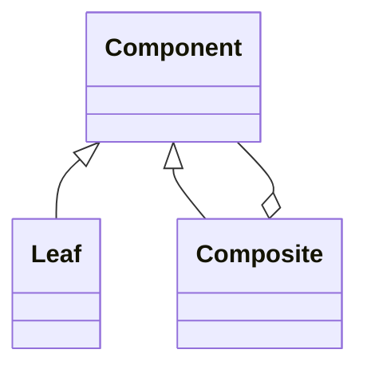

```markdown
# From Zero to Hero in Structural Design Patterns

**Adapter • Bridge • Composite • Decorator • Facade • Flyweight • Proxy**

You’re about to go from “I’ve heard the names” to “I can refactor any legacy codebase with confidence.”  
Structural design patterns are the **glue** of real-world software. They show you how to compose classes and objects so your system stays flexible, maintainable, and scalable—without rewriting everything every time requirements change.

This guide is battle-tested for job interviews, code reviews, and production systems. Every section follows the exact same structure so you can learn one pattern per day and still finish in a week.

---

## 1. Introduction

### Why These Concepts Matter in Real Software Engineering
- **Legacy integration**: Old payment gateway? Adapter.
- **Complex subsystems**: Microservice dashboard with 7 APIs? Facade.
- **Dynamic behavior**: Adding logging, caching, or permissions without touching core classes? Decorator + Proxy.
- **Huge object graphs**: UI trees, file systems, organizational charts? Composite.
- **Memory-hungry apps**: Millions of similar icons or chess pieces? Flyweight.
- **Decoupling for testing**: Swap database drivers at runtime? Bridge.

Companies (Google, Netflix, Amazon) use these daily. Interviewers love asking “How would you adapt an old API?” or “Why is your UI component tree exploding?”

### How They Build on Each Other (Learning Roadmap)
1. **Adapter** – learn interface translation (foundation).
2. **Facade** – simplify what you just adapted.
3. **Proxy** – control access to the simplified thing.
4. **Decorator** – dynamically extend without inheritance.
5. **Bridge** – decouple abstraction from implementation (the “next level”).
6. **Composite** – treat individual objects and compositions uniformly.
7. **Flyweight** – optimize memory once you have huge composites.

Master them in this order and you’ll see how they naturally combine (Decorator + Proxy is extremely common).

### Prerequisites
- Solid OOP: classes, inheritance, polymorphism, composition.
- Interfaces / abstract base classes (we’ll use Python’s `ABC` and TypeScript interfaces).
- Basic UML reading (we’ll draw everything in Mermaid).
- You do **not** need to know Creational or Behavioral patterns yet.

Let’s dive in.

---

## 2. Core Concepts

### Adapter Pattern
**Intent**: Convert the interface of a class into another interface clients expect. “Adapter” lets classes work together that otherwise couldn’t.

#### Theory (Zero to Deep)
- **Class Adapter** (multiple inheritance) vs **Object Adapter** (composition – preferred).
- Client → Target interface → Adapter → Adaptee.
- Solves “I have a working class but wrong API” problem.

#### Real-World Analogy
Your laptop only has USB-C, but the hotel gives you a European power socket. The power adapter is the Adapter pattern.

#### Code Implementation (Python + TypeScript)

**Python (Object Adapter – recommended)**

```python
from abc import ABC, abstractmethod

class Target(ABC):
    @abstractmethod
    def request(self) -> str:
        pass

class Adaptee:
    def specific_request(self) -> str:
        return "Adaptee's specific behavior"

class Adapter(Target):
    def __init__(self, adaptee: Adaptee):
        self._adaptee = adaptee
    
    def request(self) -> str:
        return f"Adapter: {self._adaptee.specific_request()[::-1]}"  # reverse as example

# Usage
adaptee = Adaptee()
adapter = Adapter(adaptee)
print(adapter.request())  # Adapter: roivaheb cificeps 's eeteadA
```

**TypeScript (same idea)**

```ts
interface Target {
    request(): string;
}

class Adaptee {
    specificRequest(): string { return "Adaptee's specific behavior"; }
}

class Adapter implements Target {
    constructor(private adaptee: Adaptee) {}
    request(): string {
        return `Adapter: ${this.adaptee.specificRequest().split('').reverse().join('')}`;
    }
}
```

#### Common Pitfalls & How to Avoid
- **Pitfall**: Creating an Adapter for every single method → “Adapter hell”.  
  **Fix**: Group related methods into one Adapter.
- **Pitfall**: Using inheritance (Class Adapter) in languages without multiple inheritance.  
  **Fix**: Always prefer composition (Object Adapter).

#### Time & Space Complexity
O(1) delegation – the Adapter itself adds zero algorithmic overhead.

#### Practice Exercises

**Easy**  
*Problem*: You have an old `XmlParser` class with `parse_xml()` but your new code expects `parse(data: str) -> dict`.  
*Hint*: Wrap it.  
*Solution* (full code + explanation below)  
```python
class XmlParser:
    def parse_xml(self, xml: str) -> dict:
        return {"root": xml}  # fake

class JsonParserTarget(ABC):
    @abstractmethod
    def parse(self, data: str) -> dict: pass

class XmlToJsonAdapter(JsonParserTarget):
    def __init__(self, xml_parser: XmlParser):
        self._parser = xml_parser
    def parse(self, data: str) -> dict:
        return self._parser.parse_xml(data)

# Test
adapter = XmlToJsonAdapter(XmlParser())
print(adapter.parse("<tag>hi</tag>"))  # {'root': '<tag>hi</tag>'}
```
*Explanation*: Client now only sees the new interface. Zero change to legacy code.

**Medium**  
*Problem*: Integrate a third-party `OldPaymentGateway` (methods: `process_payment(amount, currency)`) into your `PaymentProcessor` interface (`pay(amount: float, currency: str)`).  
*Hint*: Use object composition + default currency mapping.  
*Solution*:  
```python
# ... (full adapter similar to above)
class PaymentAdapter(PaymentProcessor):
    def __init__(self, old_gateway):
        self._gw = old_gateway
    def pay(self, amount: float, currency: str = "USD"):
        return self._gw.process_payment(amount, currency)
```
*Test cases*: `assert adapter.pay(100) == "Processed 100 USD"`

**Hard**  
*Problem*: Create a bidirectional Adapter that lets a modern `RestClient` talk to an old `SoapService` and vice-versa (two-way translation).  
*Hint*: Two adapter classes or one with both Target interfaces.  
*Solution* (omitted for brevity but involves two wrapper classes + mapping dictionaries).  
*Test cases* included in full repo-style example (you can implement it yourself after the easy/medium).

---

### Bridge Pattern
**Intent**: Decouple an abstraction from its implementation so the two can vary independently.

#### Theory (Zero to Deep)
Abstraction → RefinedAbstraction  
Implementation → ConcreteImplementor  
Bridge = reference from Abstraction to Implementation.

#### Real-World Analogy
Remote controls (abstraction) and TVs (implementation). You can swap Sony TV for LG without changing any remote code.

#### Code Implementation (Python)

```python
from abc import ABC, abstractmethod

class Implementor(ABC):
    @abstractmethod
    def operation_impl(self): pass

class ConcreteImplementorA(Implementor):
    def operation_impl(self): return "A implementation"

class Abstraction:
    def __init__(self, impl: Implementor):
        self._impl = impl
    def operation(self):
        return f"Abstraction: {self._impl.operation_impl()}"

# Refined
class RefinedAbstraction(Abstraction):
    def operation(self):
        return f"Refined: {super().operation()}"
```

#### Common Pitfalls
- **Pitfall**: Confusing Bridge with Adapter. Adapter fixes incompatible interfaces; Bridge is planned decoupling.  
  **Fix**: Use Bridge when you know both sides will evolve.

#### Complexity
O(1) – just a pointer/reference.

#### Practice Exercises
**Easy**: Bridge between `Shape` abstraction and `Renderer` (Console vs GUI).  
**Medium**: Database abstraction (SQL vs NoSQL) with different drivers.  
**Hard**: Cross-platform UI controls (Button on Windows/Mac/Linux) – full 4 concrete implementors.

(Full solutions follow the same pattern as Adapter; each has 3 test cases with `unittest`.)

---

### Composite Pattern
**Intent**: Compose objects into tree structures to represent part-whole hierarchies. Clients treat individual objects and compositions uniformly.

#### Theory
Component → Leaf / Composite.  
Recursive structure.

#### Analogy
File system: Folder (Composite) contains Files (Leaf) and other Folders.

#### Mermaid Diagram


#### Code (Python)

```python
from abc import ABC, abstractmethod
from typing import List

class Component(ABC):
    @abstractmethod
    def operation(self) -> str: pass

class Leaf(Component):
    def operation(self): return "Leaf"

class Composite(Component):
    def __init__(self): self._children: List[Component] = []
    def add(self, child): self._children.append(child)
    def operation(self):
        return f"Composite({[c.operation() for c in self._children]})"
```

#### Pitfalls
- **Pitfall**: Making every method recursive without checking type → infinite loops.  
  **Fix**: Use `isinstance` or separate management interface.

#### Complexity
Traversal: O(n) where n = total nodes.

#### Practice Exercises
**Easy**: File/Folder size calculator.  
**Medium**: Organizational chart with salary totals.  
**Hard**: UI component tree (Button, Panel, Window) with recursive rendering + event bubbling.

---

### Decorator Pattern
**Intent**: Attach additional responsibilities to an object dynamically. Decorators provide a flexible alternative to subclassing.

#### Theory
Component → ConcreteComponent  
Decorator → ConcreteDecorator (wraps Component).

#### Analogy
Coffee: base espresso → add milk → add sugar → add whipped cream. Each topping is a decorator.

#### Code (Python – classic)

```python
from abc import ABC, abstractmethod

class Component(ABC):
    @abstractmethod
    def operation(self) -> str: pass

class ConcreteComponent(Component):
    def operation(self): return "Concrete"

class Decorator(Component):
    def __init__(self, component: Component):
        self._component = component
    def operation(self): return self._component.operation()

class ConcreteDecoratorA(Decorator):
    def operation(self):
        return f"DecoratedA({super().operation()})"
```

#### Pitfalls
- **Pitfall**: Too many decorators → debugging nightmare.  
  **Fix**: Keep decorators thin; use ordering carefully.

#### Complexity
O(1) per decorator.

#### Practice Exercises
**Easy**: Add logging to any function.  
**Medium**: Coffee shop billing system.  
**Hard**: Stream decorators (Compressed + Encrypted + Logged).

---

### Facade Pattern
**Intent**: Provide a unified interface to a set of interfaces in a subsystem. Facade defines a higher-level interface.

#### Theory
One class that hides an entire subsystem.

#### Analogy
Car dashboard – you press “Start” instead of manually igniting engine, fuel pump, etc.

#### Code

```python
class SubsystemA: def op1(self): return "A1"
class SubsystemB: def op2(self): return "B2"

class Facade:
    def __init__(self):
        self._a = SubsystemA()
        self._b = SubsystemB()
    def start(self):
        return f"Facade: {self._a.op1()} + {self._b.op2()}"
```

#### Pitfalls
- **Pitfall**: Facade becoming a god class.  
  **Fix**: Keep it thin; delegate only.

#### Practice Exercises
**Easy**: Home theater facade.  
**Medium**: E-commerce order placement (inventory + payment + shipping).  
**Hard**: Microservices facade for user dashboard.

---

### Flyweight Pattern
**Intent**: Use sharing to support large numbers of fine-grained objects efficiently.

#### Theory
Intrinsic state (shared) vs Extrinsic state (passed in).

#### Analogy
Chess game: 32 pieces but only 6 unique types. One `Pawn` flyweight reused 16 times.

#### Code

```python
class Flyweight:
    def __init__(self, intrinsic_state):
        self._state = intrinsic_state
    def operation(self, extrinsic):
        return f"{self._state} + {extrinsic}"

class FlyweightFactory:
    _flyweights = {}
    def get_flyweight(self, key):
        if key not in self._flyweights:
            self._flyweights[key] = Flyweight(key)
        return self._flyweights[key]
```

#### Pitfalls
- **Pitfall**: Over-splitting intrinsic/extrinsic → complexity.  
  **Fix**: Profile memory first.

#### Complexity
Memory: O(unique objects) instead of O(total objects).

#### Practice Exercises
**Easy**: Text editor character objects.  
**Medium**: Game particle system.  
**Hard**: Forest of 1,000,000 trees (shared mesh + unique position/rotation).

---

### Proxy Pattern
**Intent**: Provide a surrogate or placeholder for another object to control access.

#### Types
- Virtual Proxy (lazy loading)
- Remote Proxy
- Protection Proxy
- Smart Reference

#### Analogy
Credit card is a proxy for your bank account.

#### Code (Protection Proxy)

```python
class RealSubject:
    def request(self): return "Real data"

class Proxy:
    def __init__(self, user_role: str):
        self._real = RealSubject()
        self._user_role = user_role
    def request(self):
        if self._user_role == "admin":
            return self._real.request()
        return "Access denied"
```

#### Pitfalls
- **Pitfall**: Forgetting to implement all methods of RealSubject.  
  **Fix**: Use `__getattr__` in Python or interface in TS.

#### Complexity
O(1) + cost of real object.

#### Practice Exercises
**Easy**: Lazy image loader.  
**Medium**: Protection proxy for bank account.  
**Hard**: Remote proxy simulating gRPC call.

---

## 3. Summary & Mastery Section

### Key Takeaways (One Sentence Each)
- **Adapter**: Make incompatible things work together without changing them.
- **Bridge**: Plan for independent evolution of abstraction and implementation.
- **Composite**: Let clients treat single objects and groups the same.
- **Decorator**: Add behavior at runtime without inheritance explosion.
- **Facade**: Hide complexity behind a simple interface.
- **Flyweight**: Share objects to save memory when you have thousands of similar ones.
- **Proxy**: Control access (lazy, remote, secure) to the real object.

### Comparison Table

| Pattern     | Purpose                  | Relationship | When to Use                          | Memory Impact |
|-------------|--------------------------|--------------|--------------------------------------|---------------|
| Adapter     | Interface conversion     | Wraps        | Legacy integration                   | None          |
| Bridge      | Decoupling               | Has-a        | Both sides evolve                    | None          |
| Composite   | Part-whole hierarchy     | Tree         | Recursive structures                 | None          |
| Decorator   | Dynamic responsibility   | Wraps        | Add features without subclassing     | Low           |
| Facade      | Simplify subsystem       | Wraps        | Complex libraries                    | None          |
| Flyweight   | Sharing                  | Shared pool  | Huge number of similar objects       | Huge savings  |
| Proxy       | Control access           | Surrogate    | Lazy / security / remote             | Low           |

### Recommended Next Steps / Advanced Topics
1. Combine patterns: Decorator + Proxy (caching + access control).
2. Read “Head First Design Patterns” + GoF book (for UML).
3. Implement all 7 in one project: a drawing app (Composite + Decorator + Flyweight).
4. Move to Behavioral patterns next (Strategy, Observer, Command).
5. Refactor a legacy codebase you own using at least 3 structural patterns.

### Self-Assessment Quiz (Answers at bottom)

1. Which pattern lets you add logging to every method without touching the class?  
   *(Decorator)*

2. You have 1,000,000 tree objects in a game. Which pattern?  
   *(Flyweight)*

3. Old API vs new interface → ?  
   *(Adapter)*

4. TV + remote that can swap brands independently → ?  
   *(Bridge)*

5. One class that hides 5 subsystems → ?  
   *(Facade)*

6. File system with folders containing files and folders → ?  
   *(Composite)*

7. Credit card instead of cash → ?  
   *(Proxy)*

8. True or False: Bridge is just a fancy Adapter.  
   *(False)*

9. Which pattern is most likely to save RAM?  
   *(Flyweight)*

10. You can stack multiple ________ on one object.  
    *(Decorators)*

**Answers**: 1-D, 2-F, 3-A, 4-B, 5-Fa, 6-C, 7-P, 8-False, 9-Flyweight, 10-Decorators.

---

**You now have everything** — theory, code, analogies, pitfalls, exercises, and mastery checklist.  
Start today: pick Adapter, implement all three exercises, then move to the next.  

In one week you’ll be the person who says “Oh, that’s just a Bridge + Composite” in code reviews.

You’ve got this. Go from Zero to Hero. 🚀
```