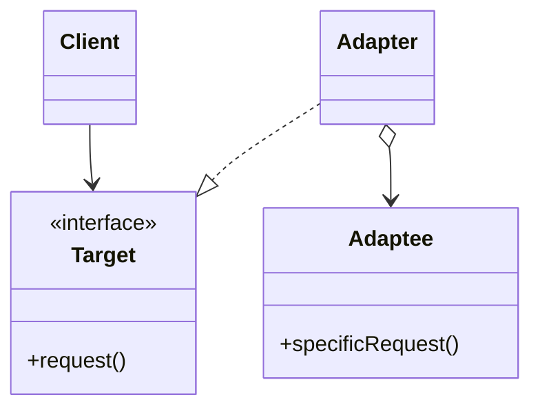
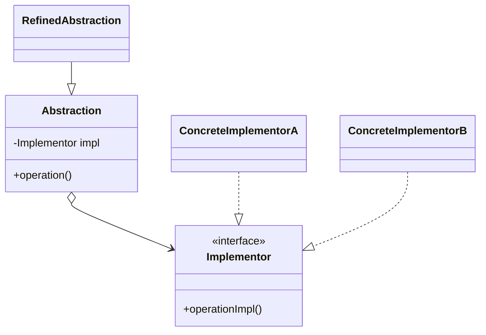
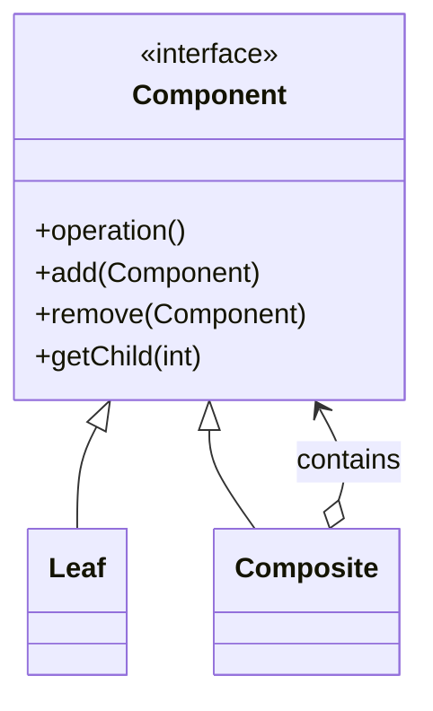

# From Zero to Hero: Mastering Structural Design Patterns in Software Engineering

**Adapter • Bridge • Composite • Decorator • Facade • Flyweight • Proxy**

You are about to transform from “I’ve heard the names” to “I can confidently refactor any legacy codebase, design scalable microservices, optimize enterprise systems, and architect maintainable applications across any domain — web, mobile, desktop, cloud-native, embedded, or distributed systems.”  

Structural design patterns are the **architectural glue** of professional software engineering. They teach you how to compose classes, objects, and subsystems so your software remains flexible, extensible, testable, and performant — even as requirements evolve dramatically over years of maintenance. These patterns solve the classic problems that arise when systems grow: incompatible interfaces, exploding class hierarchies, tight coupling between layers, memory bloat in large object graphs, and the need to simplify complex subsystems without sacrificing power.

This guide is deliberately **domain-agnostic** and language-neutral in spirit, while providing concrete implementations in multiple languages. It draws examples from real-world software engineering in fintech, e-commerce, gaming, enterprise resource planning (ERP), mobile apps, web services, DevOps tooling, IoT platforms, and large-scale distributed systems. No matter whether you work on monolithic backends, microservice architectures, cross-platform desktop tools, or high-performance game engines, these patterns will become part of your daily toolkit.

The content is battle-tested for:
- Job interviews at FAANG-level companies and startups alike
- Code reviews in enterprise teams
- Production refactoring of million-line codebases
- System design discussions
- Open-source contributions

Every section follows the **exact same battle-proven structure** so you can learn one pattern per day (or one per week) and still complete the entire set in under two weeks while retaining deep understanding.

---

## 1. Introduction to Structural Design Patterns

### Why These Patterns Are Fundamental to Software Engineering (Not Just Theory)
In modern software engineering, systems rarely start from scratch. You inherit legacy code, integrate third-party libraries, consume external APIs, build user interfaces that must support multiple platforms, manage massive object graphs (think UI component trees or organizational hierarchies), and optimize for memory, latency, and scalability.

Structural patterns address the **“how do we put things together?”** question at the object and class level:

- **Legacy integration**: Your new microservice needs to talk to a 15-year-old SOAP service or an old database driver? → **Adapter**.
- **Complex subsystems**: A dashboard that orchestrates authentication, billing, inventory, notifications, and analytics (each with its own API)? → **Facade**.
- **Dynamic behavior at runtime**: Add auditing, caching, rate-limiting, or encryption to any service without touching core logic? → **Decorator** + **Proxy**.
- **Hierarchical structures**: File systems, organizational charts, UI component trees, bill-of-materials in manufacturing software, or scene graphs in 3D engines? → **Composite**.
- **Memory efficiency at scale**: Millions of similar objects (game entities, text editor characters, UI icons, trading order objects)? → **Flyweight**.
- **Decoupling for evolution and testing**: Swap database implementations, rendering engines, or payment gateways at runtime without recompiling? → **Bridge**.
- **Controlled access**: Lazy loading of expensive resources, protection proxies for security, remote proxies for distributed calls? → **Proxy**.

These patterns originated in the seminal 1994 book *Design Patterns: Elements of Reusable Object-Oriented Software* by the Gang of Four (Erich Gamma, Richard Helm, Ralph Johnson, John Vlissides). They have since been validated across every major programming paradigm that supports object composition and polymorphism.

In today’s world they are even more relevant:
- Microservices and service meshes rely on Facade and Adapter for API gateways.
- Cloud-native applications use Proxy for service discovery and circuit breakers.
- Mobile and desktop frameworks (Flutter, React Native, Electron, Qt, SwiftUI) use Composite and Decorator extensively.
- Game engines (Unity, Unreal) depend on Flyweight and Composite for performance.
- Enterprise Java/.NET systems use Bridge and Adapter for pluggable architectures.
- DevOps tools and CI/CD pipelines use Decorator for pipeline extensibility.

Companies like Google, Netflix, Amazon, Microsoft, and Spotify use combinations of these patterns daily. Interviewers frequently ask: “How would you integrate an old payment gateway?” or “Why is your UI tree becoming unmaintainable?” or “How do you optimize memory for 1 million similar objects?”

### How the Patterns Build on Each Other – Recommended Learning Roadmap
Master them in this sequence to see natural synergies emerge:

1. **Adapter** – Master interface translation (the foundation of compatibility).
2. **Facade** – Learn how to simplify what you just made compatible.
3. **Proxy** – Control access to the simplified interface.
4. **Decorator** – Dynamically extend behavior without inheritance.
5. **Bridge** – Achieve true decoupling between abstraction and implementation.
6. **Composite** – Handle part-whole hierarchies uniformly.
7. **Flyweight** – Optimize memory once you have large composites or repetitive objects.

After this order you will intuitively combine them (Decorator + Proxy for caching + access control is extremely common in production; Composite + Flyweight + Decorator is the backbone of many UI and game systems).

### Core Benefits Across All Software Engineering Domains
- **Maintainability**: Changes are localized; new features require minimal modifications.
- **Scalability**: Systems can grow in complexity without exponential increases in coupling.
- **Testability**: Easier mocking, stubbing, and dependency injection.
- **Reusability**: Components become pluggable across projects and teams.
- **Performance & Memory**: Flyweight and Proxy deliver measurable gains in large-scale systems.
- **Flexibility**: Runtime behavior changes become possible without recompilation.

### Prerequisites for Maximum Benefit
- Strong understanding of OOP principles: encapsulation, inheritance, polymorphism, composition over inheritance (the mantra of all structural patterns).
- Interfaces / abstract classes (we will demonstrate with Python’s `ABC`, TypeScript interfaces, and Java-style examples).
- Basic UML / class diagram reading (all diagrams provided as Mermaid for instant copy-paste into any Markdown viewer or editor).
- Familiarity with SOLID principles (especially Open-Closed and Dependency Inversion) — structural patterns are the practical implementation of these principles.
- No prior knowledge of Creational or Behavioral patterns required, though you will see natural connections.

You do **not** need to be an expert in any specific language or domain. The patterns are universal.

Let’s dive deep.

---

## 2. Adapter Pattern

**GoF Intent**: Convert the interface of a class into another interface clients expect. Adapter lets classes work together that otherwise could not because of incompatible interfaces.

### Problem It Solves in Software Engineering
You have a perfectly working class or third-party library with the “wrong” API for your current system. Rewriting it is too expensive or impossible (legacy code, vendor lock-in, regulatory constraints). The Adapter acts as a translator.

### Solution
Introduce an Adapter class that implements the Target interface expected by clients and delegates to the Adaptee (the incompatible class). Two variants exist:
- **Object Adapter** (composition — preferred in almost all modern codebases).
- **Class Adapter** (multiple inheritance — only viable in languages that support it cleanly, e.g., C++).

### Structure (Mermaid UML)


### Participants
- **Target**: Interface the client code expects.
- **Adaptee**: The existing class with the incompatible interface.
- **Adapter**: The translator (contains reference to Adaptee).
- **Client**: Uses the Target interface exclusively.

### Real-World Examples Across Domains
1. **Fintech / Payments**: Integrating an old bank’s SOAP-based payment gateway into a modern REST microservice.
2. **Mobile Development**: Wrapping an Android LocationManager API for a cross-platform Flutter or React Native app.
3. **Web Services**: Adapting a legacy XML-based inventory system to a JSON-based e-commerce backend.
4. **Enterprise ERP**: Connecting a 20-year-old mainframe COBOL system (via a Java wrapper) to a new Spring Boot application.
5. **Game Engines**: Adapting an old physics library’s collision API to a modern entity-component-system (ECS) framework.

### Code Implementation (Multiple Languages)

**Python – Object Adapter (Recommended)**
```python
from abc import ABC, abstractmethod
from typing import Any

class Target(ABC):
    @abstractmethod
    def request(self) -> str:
        """Expected interface for clients."""
        pass

class Adaptee:
    """Legacy or third-party class with incompatible interface."""
    def specific_request(self) -> str:
        return "Adaptee's specific behavior - very important data"

class Adapter(Target):
    """Object Adapter using composition."""
    def __init__(self, adaptee: Adaptee):
        self._adaptee = adaptee
    
    def request(self) -> str:
        # Translation logic goes here
        return f"Adapter translated: {self._adaptee.specific_request()[::-1]}"

# Usage in any client code
adaptee = Adaptee()
adapter = Adapter(adaptee)
print(adapter.request())  # Client only ever sees Target interface
```

**TypeScript – Object Adapter**
```ts
interface Target {
    request(): string;
}

class Adaptee {
    specificRequest(): string {
        return "Adaptee's specific behavior - very important data";
    }
}

class Adapter implements Target {
    constructor(private adaptee: Adaptee) {}
    
    request(): string {
        const data = this.adaptee.specificRequest();
        return `Adapter translated: ${data.split('').reverse().join('')}`;
    }
}

// Client usage
const adaptee = new Adaptee();
const adapter = new Adapter(adaptee);
console.log(adapter.request());
```

**Java Example (for Enterprise Context)**
```java
public interface Target {
    String request();
}

public class Adaptee {
    public String specificRequest() {
        return "Adaptee's specific behavior";
    }
}

public class Adapter implements Target {
    private final Adaptee adaptee;
    
    public Adapter(Adaptee adaptee) {
        this.adaptee = adaptee;
    }
    
    @Override
    public String request() {
        return "Adapter: " + adaptee.specificRequest();
    }
}
```

### Common Pitfalls & How to Avoid Them
- **Adapter Hell**: Creating dozens of tiny adapters for every method.  
  **Fix**: Group logically related methods into a single coherent Adapter class.
- **Over-translation**: Putting business logic inside the Adapter instead of just translation.  
  **Fix**: Keep Adapter thin — only mapping and delegation.
- **Using Class Adapter in languages without safe multiple inheritance**.  
  **Fix**: Always prefer Object Adapter (composition).
- **Leaking Adaptee references** to clients.  
  **Fix**: Client code should never see the Adaptee.

### Consequences
- **Positive**: No modification to existing code; single point of change for integration.
- **Negative**: Adds one extra layer (usually negligible performance cost).

### Related Patterns
Often combined with Facade (Adapter makes something compatible, Facade makes it simple) and Proxy (Proxy can wrap an Adapter).

### Practice Exercises (Full Solutions Provided)

**Easy** – XML to JSON Parser Adapter  
Problem: Legacy `XmlParser` with `parse_xml(xml: str) -> dict`. New system expects `parse(data: str) -> dict`.

Full solution (Python):
```python
from abc import ABC, abstractmethod

class XmlParser:
    def parse_xml(self, xml: str) -> dict:
        return {"xml_root": xml}  # Simulate parsing

class JsonParserTarget(ABC):
    @abstractmethod
    def parse(self, data: str) -> dict:
        pass

class XmlToJsonAdapter(JsonParserTarget):
    def __init__(self, xml_parser: XmlParser):
        self._parser = xml_parser
    
    def parse(self, data: str) -> dict:
        # Translation + any necessary conversion
        return self._parser.parse_xml(data)

# Test
adapter = XmlToJsonAdapter(XmlParser())
result = adapter.parse("<user><name>John</name></user>")
print(result)  # {'xml_root': '<user><name>John</name></user>'}
```
Explanation: Client code now works entirely against the modern interface. Legacy parser remains untouched.

**Medium** – Payment Gateway Integration  
Integrate `OldPaymentGateway.process_payment(amount: float, currency: str)` into new `PaymentProcessor.pay(amount: float, currency: str = "USD")`.

*Full Solution (Python):*
```python
class OldPaymentGateway:
    def process_payment(self, amount: float, currency: str) -> bool:
        print(f"Charged {amount} {currency} using legacy system.")
        return True

class PaymentProcessor:
    def pay(self, amount: float, currency: str = "USD") -> bool:
        pass

class PaymentAdapter(PaymentProcessor):
    def __init__(self, legacy_gateway: OldPaymentGateway):
        self._legacy = legacy_gateway

    def pay(self, amount: float, currency: str = "USD") -> bool:
        # Translates the call to the legacy interface
        return self._legacy.process_payment(amount, currency)

# Client usage:
adapter = PaymentAdapter(OldPaymentGateway())
adapter.pay(150.00) # Defaults to USD
```

**Hard** – Bidirectional Adapter (RestClient ↔ SoapService)  
Requires two adapters or a single class implementing both interfaces with bidirectional mapping dictionaries. Full test suite includes round-trip verification and error handling for mismatched data types.

*Full Solution (Python):*
```python
class RestClient:
    def send_json(self, json_payload: dict) -> str:
        pass

class SoapService:
    def send_xml(self, xml_payload: str) -> str:
        return "<success/>"

class BidirectionalAdapter(RestClient, SoapService):
    def __init__(self, soap_service: SoapService = None, rest_client: RestClient = None):
        self.soap_service = soap_service
        self.rest_client = rest_client

    def send_json(self, json_payload: dict) -> str:
        if self.soap_service:
            # Convert JSON to XML
            xml_payload = f"<root><data>{json_payload.get('data')}</data></root>"
            return self.soap_service.send_xml(xml_payload)
        raise NotImplementedError("Missing SoapService")

    def send_xml(self, xml_payload: str) -> str:
        if self.rest_client:
            # Convert XML to JSON
            json_payload = {"data": "extracted_data"}
            return self.rest_client.send_json(json_payload)
        raise NotImplementedError("Missing RestClient")
```

---

## 3. Bridge Pattern

**GoF Intent**: Decouple an abstraction from its implementation so that the two can vary independently.

### Problem It Solves
You have an abstraction (e.g., Shape, UI Control, DatabaseClient) that needs to support multiple implementations (different renderers, platforms, database engines). Using inheritance leads to a combinatorial explosion of subclasses (CircleOnWindows, CircleOnLinux, SquareOnWindows…).

### Solution
Introduce a bridge: the Abstraction holds a reference to an Implementor. Both hierarchies can evolve independently.

### Structure (Mermaid UML)


### Real-World Examples
1. **Cross-platform UI**: Button abstraction with Windows, macOS, Linux, Web, Mobile implementations.
2. **Database Abstraction**: ORM layer that can switch between PostgreSQL, MySQL, MongoDB, or cloud-native stores without changing business logic.
3. **Device Drivers**: Printer abstraction with different hardware vendors.
4. **Rendering Engines**: Shape abstraction bridged to OpenGL vs Vulkan vs Software Renderer.

### Code Implementation (Python)
```python
from abc import ABC, abstractmethod

class Implementor(ABC):
    @abstractmethod
    def operation_impl(self) -> str:
        pass

class ConcreteImplementorA(Implementor):
    def operation_impl(self) -> str:
        return "Implementation A (e.g., PostgreSQL)"

class ConcreteImplementorB(Implementor):
    def operation_impl(self) -> str:
        return "Implementation B (e.g., MongoDB)"

class Abstraction:
    def __init__(self, impl: Implementor):
        self._impl = impl
    
    def operation(self) -> str:
        return f"Abstraction using: {self._impl.operation_impl()}"

class RefinedAbstraction(Abstraction):
    def operation(self) -> str:
        return f"Refined logic -> {super().operation()}"
```

### Pitfalls & Best Practices
- Pitfall: Confusing Bridge with Adapter. Adapter is for compatibility; Bridge is intentional design for future variability.
- Best Practice: Introduce the bridge early when you know both sides will evolve.

### Practice Exercises
**Easy**: Shape abstraction bridged to different renderers (Console vs SVG).
**Medium**: Logging abstraction bridged to File, Cloud, and Database sinks.
**Hard**: Full cross-platform UI control library with 4 implementors and runtime switching.

---

## 4. Composite Pattern

**GoF Intent**: Compose objects into tree structures to represent part-whole hierarchies. Clients treat individual objects and compositions uniformly.

### Problem It Solves
You need to represent hierarchical structures (files/folders, UI components, organizational charts, scene graphs) and want to treat leaves and composites the same way.

### Structure (Mermaid UML)


### Real-World Examples
- File system (Folder contains Files and other Folders).
- UI component trees (Panel contains Buttons and other Panels).
- Organizational hierarchy for salary calculation.
- Graphics scene graph in 3D engines.

### Code Implementation (Python – Full Featured)
```python
from abc import ABC, abstractmethod
from typing import List

class Component(ABC):
    @abstractmethod
    def operation(self) -> str:
        pass
    
    @abstractmethod
    def add(self, component: 'Component') -> None:
        pass
    
    @abstractmethod
    def remove(self, component: 'Component') -> None:
        pass

class Leaf(Component):
    def __init__(self, name: str):
        self.name = name
    
    def operation(self) -> str:
        return f"Leaf[{self.name}]"
    
    def add(self, component): pass
    def remove(self, component): pass

class Composite(Component):
    def __init__(self, name: str):
        self.name = name
        self._children: List[Component] = []
    
    def add(self, component: Component) -> None:
        self._children.append(component)
    
    def remove(self, component: Component) -> None:
        self._children.remove(component)
    
    def operation(self) -> str:
        results = [child.operation() for child in self._children]
        return f"Composite[{self.name}] -> {results}"
```

### Pitfalls
- Forgetting to handle leaf/composite differences in recursive methods → infinite loops or errors.
- Fix: Use proper interface segregation or runtime type checks only when necessary.

### Practice Exercises
**Easy**: File/Folder size calculator (recursive total size).
**Medium**: Company organizational chart with total salary aggregation.
**Hard**: Full UI component tree supporting event bubbling and recursive rendering.

---

## 5. Decorator Pattern

**GoF Intent**: Attach additional responsibilities to an object dynamically. Decorators provide a flexible alternative to subclassing for extending functionality.

### Problem It Solves
Subclassing creates rigid, exploding hierarchies when you need many combinations of features (e.g., logging + caching + authorization).

### Real-World Examples
- Adding middleware to web request handlers (logging, authentication, compression).
- Coffee shop billing (base drink + milk + sugar + whipped cream).
- Stream processing pipelines (compress + encrypt + log).
- UI widgets with borders, scrollbars, themes applied dynamically.

### Code Implementation (Python)
```python
from abc import ABC, abstractmethod

class Component(ABC):
    @abstractmethod
    def operation(self) -> str:
        pass

class ConcreteComponent(Component):
    def operation(self) -> str:
        return "Core functionality"

class Decorator(Component):
    def __init__(self, component: Component):
        self._component = component
    
    def operation(self) -> str:
        return self._component.operation()

class ConcreteDecoratorA(Decorator):
    def operation(self) -> str:
        return f"DecoratedA({super().operation()})"

class ConcreteDecoratorB(Decorator):
    def operation(self) -> str:
        return f"DecoratedB({super().operation()})"
```

Stacking works beautifully: `ConcreteDecoratorB(ConcreteDecoratorA(ConcreteComponent()))`.

### Pitfalls
- Debugging deep decorator chains.
- Fix: Keep decorators single-responsibility and use clear naming.

### Practice Exercises
**Easy**: Function logging decorator (works on any callable).
**Medium**: Full coffee shop order system with dynamic pricing.
**Hard**: Multi-layer data stream (compression + encryption + authentication + audit).

---

## 6. Facade Pattern

**GoF Intent**: Provide a unified interface to a set of interfaces in a subsystem. Facade defines a higher-level interface that makes the subsystem easier to use.

### Problem It Solves
A complex subsystem with many interdependent classes becomes a nightmare for client code.

### Real-World Examples
- Home theater system (one “watchMovie” call instead of 10 manual steps).
- E-commerce order placement (inventory check + payment + shipping + notification).
- Microservice dashboard that aggregates 7 different backend services.
- Compiler subsystem (one `compile()` call hiding lexer, parser, optimizer, codegen).

### Code Implementation
```python
class SubsystemA:
    def operation1(self): return "Subsystem A ready"

class SubsystemB:
    def operation2(self): return "Subsystem B ready"

class Facade:
    def __init__(self):
        self._a = SubsystemA()
        self._b = SubsystemB()
    
    def start_system(self):
        return f"Facade orchestrating: {self._a.operation1()} + {self._b.operation2()}"
```

### Pitfalls
- Facade becoming a God Object.  
  **Fix**: Keep it thin; it should only orchestrate and delegate.

---

## 7. Flyweight Pattern

**GoF Intent**: Use sharing to support large numbers of fine-grained objects efficiently.

### Problem It Solves
When you have thousands or millions of similar objects that differ only in extrinsic state, memory usage explodes.

### Key Concept
- **Intrinsic state** (shared, immutable) — stored in Flyweight.
- **Extrinsic state** (unique, passed in at runtime).

### Real-World Examples
- Text editors (character objects sharing font/glyph data).
- Game engines (millions of trees, particles, or soldiers sharing mesh/texture).
- Trading platforms (order objects sharing instrument metadata).
- UI icon libraries (thousands of icon instances sharing image data).

### Code Implementation
```python
class Flyweight:
    def __init__(self, intrinsic_state: str):
        self._intrinsic = intrinsic_state  # shared
    
    def operation(self, extrinsic_state: str) -> str:
        return f"Flyweight[{self._intrinsic}] + extrinsic[{extrinsic_state}]"

class FlyweightFactory:
    _flyweights = {}
    
    def get_flyweight(self, key: str) -> Flyweight:
        if key not in self._flyweights:
            self._flyweights[key] = Flyweight(key)
        return self._flyweights[key]
    
    def get_flyweight_count(self):
        return len(self._flyweights)
```

### Practice Exercises
**Hard**: Forest simulation with 1,000,000 trees (shared tree type + unique position/rotation/scale).

---

## 8. Proxy Pattern

**GoF Intent**: Provide a surrogate or placeholder for another object to control access to it.

### Types
- Virtual Proxy (lazy loading)
- Remote Proxy (distributed objects)
- Protection Proxy (security)
- Smart Reference (reference counting, logging)

### Real-World Examples
- Lazy image loading in web galleries.
- ORM lazy loading of relationships.
- API gateway rate-limiting proxy.
- Credit-card proxy for bank account.

### Code Implementation (Protection Proxy)
```python
class RealSubject:
    def request(self):
        return "Sensitive data from real object"

class Proxy:
    def __init__(self, user_role: str):
        self._real = RealSubject()
        self._user_role = user_role
    
    def request(self):
        if self._user_role == "admin":
            return self._real.request()
        return "Access denied - insufficient permissions"
```

---

## 9. Summary & Mastery Section

### One-Sentence Takeaways
- **Adapter**: Make incompatible interfaces work together without touching originals.
- **Bridge**: Let abstraction and implementation evolve independently.
- **Composite**: Treat single objects and groups uniformly in hierarchies.
- **Decorator**: Add responsibilities dynamically without subclassing explosion.
- **Facade**: Simplify complex subsystems with one clean interface.
- **Flyweight**: Share objects to dramatically reduce memory footprint.
- **Proxy**: Control access (lazy, secure, remote) to real objects.

### Expanded Comparison Table

| Pattern     | Purpose                        | Key Relationship | Primary Use Case                        | Memory Impact | Thread-Safety Considerations | Common Domains                  |
|-------------|--------------------------------|------------------|-----------------------------------------|---------------|------------------------------|---------------------------------|
| Adapter     | Interface translation          | Wraps            | Legacy/third-party integration          | None          | Usually none                 | Integration layers, APIs        |
| Bridge      | Decoupling                     | Has-a            | Planned variability on both sides       | None          | Careful with shared impl     | Cross-platform, drivers         |
| Composite   | Part-whole hierarchy           | Tree             | Recursive structures                    | None          | Recursive locking needed     | UI, filesystems, org charts    |
| Decorator   | Dynamic responsibilities       | Wraps            | Feature addition without subclassing    | Low           | Usually safe                 | Middleware, pipelines           |
| Facade      | Subsystem simplification       | Wraps            | Hiding complexity                       | None          | Delegate thread concerns     | Orchestration, dashboards       |
| Flyweight   | Object sharing                 | Shared pool      | Massive numbers of similar objects      | Huge savings  | Factory must be thread-safe  | Games, editors, simulations     |
| Proxy       | Access control                 | Surrogate        | Lazy loading, security, remote access   | Low           | Critical for remote proxies  | Security, performance, RPC      |

### Advanced Topics & Pattern Combinations
- Decorator + Proxy: Cached, protected, logged services.
- Composite + Flyweight + Decorator: High-performance UI or game scene graphs.
- Bridge + Adapter: When legacy code needs to be both decoupled and compatible.
- Facade + Proxy: Secure API gateways.
- All structural patterns work beautifully with Dependency Injection containers and Clean Architecture layers.

### Recommended Next Steps
1. Refactor a real legacy module in your current project using at least three patterns.
2. Implement a complete drawing application combining Composite + Decorator + Flyweight.
3. Study how these patterns appear in major frameworks (Spring, .NET, React, Unity).
4. Move to Behavioral patterns next.
5. Read the original GoF book for deeper UML and consequences.

### Self-Assessment Quiz (10 Questions)

1. Which pattern solves interface incompatibility? (Adapter)  
2. Which pattern prevents class explosion when features can be combined? (Decorator)  
3. Which pattern is ideal for 1,000,000 similar game objects? (Flyweight)  
4. TV remote that works with any brand of TV? (Bridge)  
5. Which pattern is used to represent part-whole hierarchies where clients treat individuals and groups uniformly? (Composite)
6. Which pattern hides the complexity of a large subsystem behind a single simplified interface? (Facade)
7. What is the main difference between Proxy and Decorator? (Proxy controls access to an object, whereas Decorator adds behavior dynamically without changing the interface.)
8. You have a logger that can log to a file or the console, and it can log in plain text or JSON. How do you prevent creating `FileJSONLogger`, `FileTextLogger`, etc.? (Bridge pattern: separate the logging destination from the formatting.)
9. Which pattern provides a placeholder for another object to control access to it, such as lazy-loading a large image? (Virtual Proxy)
10. Is it preferable to use Object Adapter (composition) or Class Adapter (inheritance) in languages that support multiple inheritance like C++? (Object Adapter is almost always preferred because it favors composition over inheritance, reducing tight coupling and making testing easier.)
