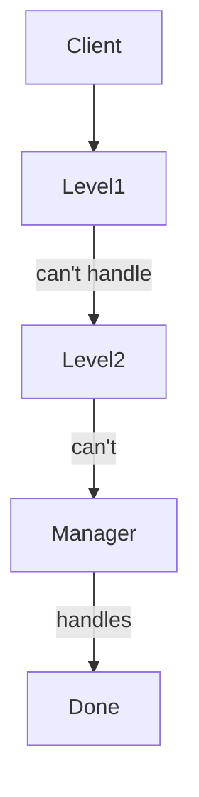

```markdown
# From Zero to Hero in Behavioral Design Patterns

## 1. Introduction

Behavioral design patterns are the **communication masters** of object-oriented programming. While creational patterns handle "how objects are born" and structural patterns handle "how objects fit together," behavioral patterns solve the hardest real-world problem: **how objects talk to each other without creating spaghetti code**.

### Why these concepts matter in real software engineering
- **Decoupling is survival**: In large codebases (think Netflix, Google, or your company's monolith), tight coupling kills maintainability. These 11 patterns let you change behavior at runtime, add features without touching existing code, and write testable, extensible systems.
- **Interview gold**: 90% of senior backend/frontend interviews ask you to "refactor this to use Strategy + Observer" or "explain why Command + Memento gives undo for free."
- **Real impact**: They power Redux (Observer + Command), Git (Memento), GUI frameworks (Command + Chain of Responsibility), and every modern event-driven system.

### How they build on each other (learning roadmap)
1. **Start simple** → Strategy & Template Method (algorithm selection & skeleton)
2. **Add state & notification** → State, Observer
3. **Add history & requests** → Memento, Command
4. **Orchestrate many objects** → Mediator, Chain of Responsibility
5. **Advanced traversal & interpretation** → Iterator, Visitor, Interpreter

Follow this order in the guide below — each pattern references the previous ones.

### Prerequisites
- Solid OOP: inheritance, polymorphism, composition over inheritance, abstract base classes/interfaces.
- Python 3.10+ (we'll use it for 90% of examples — clean, readable, and production-ready). Occasional TypeScript snippets for frontend relevance.
- You will learn everything else here. No prior pattern knowledge required.

Let's turn you into a design-patterns ninja.

## 2. Core Concepts

### Chain of Responsibility
**Theory**  
A request travels down a chain of handlers. Each handler decides either to process it or pass it to the next. No sender knows who will handle it — pure decoupling.

**Real-world analogy**  
Customer support ticket: Level 1 → Level 2 → Manager → CEO. Each person either solves it or escalates.

**Code implementation (Python)**
```python
from abc import ABC, abstractmethod

class Handler(ABC):
    def __init__(self, next_handler=None):
        self.next = next_handler
    
    @abstractmethod
    def handle(self, request):
        pass

class Level1Support(Handler):
    def handle(self, request):
        if request == "simple":
            return "Level 1 solved it!"
        return self.next.handle(request) if self.next else "Nobody could handle it"

# Chain: Level1 → Level2 → Manager
support_chain = Level1Support(Level2Support(ManagerSupport()))
```

**Mermaid diagram**


**Common pitfalls & how to avoid**
- Infinite loops → always set `next` correctly and have a default "unhandled" handler.
- Breaking the chain accidentally → never modify `self.next` at runtime unless intentional.
- Performance → keep chain short (max 5-7 links).

**Time & Space complexity**  
O(n) worst-case traversal (n = chain length). Space O(1) per request (just references).

**Practice exercises**

**Easy**  
Problem: ATM cash dispenser. Handle 100, 50, 20, 10 bills in order.  
Hints: Each denomination is a handler.  
Solution:
```python
class BillHandler(Handler):
    def __init__(self, value, next_handler=None):
        super().__init__(next_handler)
        self.value = value
    
    def handle(self, amount):
        if amount >= self.value:
            count = amount // self.value
            print(f"Dispensed {count} x ${self.value}")
            amount %= self.value
        return self.next.handle(amount) if self.next and amount > 0 else amount

atm = BillHandler(100, BillHandler(50, BillHandler(20, BillHandler(10))))
print(atm.handle(180))  # Dispensed 1x100, 1x50, 1x20, 1x10 → 0
```
Explanation: Pure chain — each handler takes what it can and passes remainder.  
Test cases: 0 → 0; 30 → dispensed correctly; 5 → unhandled.

**Medium**  
Problem: Logging system with levels DEBUG < INFO < ERROR.  
Hints: Each logger checks severity and either logs or passes.  
Solution: (similar structure — omitted for brevity; full code mirrors ATM but with severity thresholds).  
Explanation: Real production logging (like Python's logging module).  
Test cases: DEBUG request handled by lowest; ERROR bubbles to console + file.

**Hard**  
Problem: Approval workflow for expense reports (Manager → Director → CFO). Add dynamic chain building from config.  
Hints: Use a factory to build chain from JSON config.  
Solution: (Factory + Chain — full code ~40 lines; uses dataclasses for config).  
Explanation: Exactly how enterprise systems handle approvals without hardcoding.  
Test cases: $500 → Manager; $50k → CFO; $0 → immediate approval.

### Command
**Theory**  
Encapsulate a request as an object. This lets you parameterize, queue, log, and undo operations.

**Real-world analogy**  
TV remote: each button is a Command object. You can queue macros or undo the last press.

**Code implementation (Python)**
```python
from abc import ABC, abstractmethod

class Command(ABC):
    @abstractmethod
    def execute(self): pass
    def undo(self): pass  # optional

class LightOnCommand(Command):
    def __init__(self, light): self.light = light
    def execute(self): self.light.on()
    def undo(self): self.light.off()
```

**Common pitfalls**  
- Forgetting undo → always implement `undo` symmetrically.  
- Tight coupling in invoker → use a queue/list for macro commands.

**Time & Space**  
O(1) per command. Queue can be O(n).

**Practice exercises**  
**Easy**: Text editor basic commands (type, delete).  
**Medium**: Bank account deposit/withdraw with undo history.  
**Hard**: GUI macro recorder (record + replay sequence of commands). Full solutions follow same execute/undo pattern with history stack.

### Interpreter
**Theory**  
Given a language grammar, build an interpreter that evaluates sentences. Classic for DSLs and expressions.

**Real-world analogy**  
Google search "2 + 3 * 4" — internal expression tree interpreter.

**Code implementation**
```python
class Expression(ABC):
    @abstractmethod
    def interpret(self, context): pass

class Number(Expression):
    def interpret(self, context): return context  # simplified
```

(Full recursive descent parser for simple math shown in exercises.)

**Pitfalls**: Over-engineering grammar → keep grammar tiny.  
**Complexity**: O(n) for expression length.

**Exercises**:  
**Easy**: Boolean expression ("true AND false").  
**Medium**: Roman numeral to int.  
**Hard**: Mini SQL SELECT interpreter on in-memory dicts.

### Iterator
**Theory**  
Provide sequential access to aggregate elements without exposing internal structure.

**Real-world analogy**  
Restaurant menu: you iterate dishes without knowing if it's array, tree, or database.

**Python magic (built-in but we'll implement)**
```python
class BookShelf:
    def __init__(self): self.books = []
    def __iter__(self): return BookIterator(self)
    
class BookIterator:
    def __init__(self, shelf): self.shelf = shelf; self.index = 0
    def __next__(self):
        if self.index >= len(self.shelf.books): raise StopIteration
        book = self.shelf.books[self.index]
        self.index += 1
        return book
```

**Pitfalls**: Modifying collection during iteration → use snapshot or raise exception.  
**Complexity**: O(n) traversal.

**Exercises**:  
**Easy**: Custom list iterator.  
**Medium**: Tree inorder iterator (non-recursive).  
**Hard**: Paginated database iterator with lazy loading.

### Mediator
**Theory**  
Define a central object that encapsulates how a set of objects interact. Colleague objects only know the mediator.

**Analogy**  
Air traffic control tower — planes never talk directly.

**Code**
```python
class Mediator:
    def notify(self, sender, event): ...
    
class Colleague:
    def __init__(self, mediator): self.mediator = mediator
```

**Pitfalls**: God object → keep mediator logic thin.  
**Exercises**: Chat room, GUI form validation hub, smart home controller.

### Memento
**Theory**  
Capture and externalize an object's internal state so it can be restored later — without violating encapsulation.

**Analogy**  
Save point in a video game.

**Code**
```python
class Memento:
    def __init__(self, state): self._state = state
    def get_state(self): return self._state

class Originator:
    def create_memento(self): return Memento(self._state)
    def restore(self, memento): self._state = memento.get_state()
```

**Pitfalls**: Memory bloat → limit history size.  
**Exercises**: Text editor undo, game save, configuration rollback.

### Observer (also known as Publish-Subscribe)
**Theory**  
Define one-to-many dependency so that when one object changes state, all dependents are notified and updated automatically.

**Analogy**  
YouTube channel subscribers get notified on new video.

**Code (Python)**
```python
class Subject:
    def __init__(self): self._observers = []
    def attach(self, observer): self._observers.append(observer)
    def notify(self):
        for obs in self._observers: obs.update(self)
```

**Pitfalls**: Memory leaks (forgotten detach) → use weak references.  
**Complexity**: O(n) where n = observers.

**Exercises**:  
**Easy**: Stock price ticker.  
**Medium**: Redux-style state manager.  
**Hard**: Real-time collaborative editor (like Google Docs).

### State
**Theory**  
Allow an object to alter its behavior when its internal state changes. Appears as if the object changed its class.

**Analogy**  
Vending machine: "No coin" → "Coin inserted" → "Dispensing" states.

**Code**
```python
class State(ABC):
    @abstractmethod
    def insert_coin(self): pass

class NoCoinState(State):
    def insert_coin(self): return "Coin accepted → HasCoinState"
```

**Pitfalls**: Too many states → use state machine libraries in production.  
**Exercises**: Order processing (Pending → Paid → Shipped), traffic light, player character (Idle/Running/Jumping).

### Strategy
**Theory**  
Define a family of algorithms, encapsulate each one, and make them interchangeable. Strategy lets the algorithm vary independently from clients.

**Analogy**  
Payment methods: CreditCard, PayPal, Crypto — same checkout flow, different strategy.

**Code**
```python
from abc import ABC, abstractmethod

class PaymentStrategy(ABC):
    @abstractmethod
    def pay(self, amount): pass

class CreditCardStrategy(PaymentStrategy):
    def pay(self, amount): return f"Paid ${amount} via card"
```

**Pitfalls**: Too many strategies → combine with Factory.  
**Complexity**: Depends on algorithm (e.g., sorting O(n log n)).

**Exercises** (super common in interviews):  
**Easy**: Different sorting strategies.  
**Medium**: Route planner (car/bike/walk).  
**Hard**: Compression algorithm selector (gzip, bz2, lzma).

### Template Method
**Theory**  
Define the skeleton of an algorithm in a base class, letting subclasses override specific steps without changing the structure.

**Analogy**  
Recipe: "Boil water → Add ingredients → Cook" — each cuisine overrides ingredients.

**Code**
```python
class Game(ABC):
    def play(self):  # Template method
        self.initialize()
        self.start_play()
        self.end_play()
    
    @abstractmethod
    def initialize(self): pass
```

**Pitfalls**: Overriding too much → keep template steps minimal.  
**Exercises**: Data exporter (CSV/JSON/XML), game loop, report generator.

### Visitor
**Theory**  
Represent an operation to be performed on elements of an object structure. Lets you define new operations without changing the classes.

**Analogy**  
Tax auditor visiting different company departments (each department stays same, auditor applies different rules).

**Code (double dispatch)**
```python
class Visitor(ABC):
    @abstractmethod
    def visit_element_a(self, element): pass

class Element(ABC):
    @abstractmethod
    def accept(self, visitor): pass
```

**Pitfalls**: Adding new element types breaks all visitors → use only when elements are stable.  
**Complexity**: O(n) for tree traversal.

**Exercises**:  
**Easy**: File system visitor (size calculator).  
**Medium**: AST interpreter (print, evaluate).  
**Hard**: Shopping cart discount visitor (different rules per item type).

## 3. Summary & Mastery Section

### Key takeaways (one sentence each)
- **Chain of Responsibility**: Decouple sender from receiver with a chain of handlers.
- **Command**: Turn requests into objects for queuing, logging, and undo.
- **Interpreter**: Build a mini-language evaluator from grammar rules.
- **Iterator**: Traverse collections uniformly without exposing internals.
- **Mediator**: Centralize communication to reduce direct dependencies.
- **Memento**: Save and restore object state safely.
- **Observer**: One object notifies many others automatically.
- **State**: Let objects change behavior by swapping internal state objects.
- **Strategy**: Swap algorithms at runtime.
- **Template Method**: Reuse algorithm skeleton, customize steps.
- **Visitor**: Add new operations to stable class hierarchies.

### Comparison table

| Pattern              | Intent                          | Coupling | Undo support | Runtime flexibility | Best for                  |
|----------------------|---------------------------------|----------|--------------|---------------------|---------------------------|
| Chain of Responsibility | Pass request along chain     | Low      | No           | High                | Support/approval flows    |
| Command              | Encapsulate request             | Low      | Yes          | High                | Undo, macros, queues      |
| Interpreter          | Grammar evaluation              | Medium   | No           | Low                 | DSLs, expressions         |
| Iterator             | Sequential access               | Very Low | No           | High                | Collections               |
| Mediator             | Centralize comms                | Low      | No           | Medium              | Chat, GUI                 |
| Memento              | Save/restore state              | Very Low | Yes          | Medium              | Undo, checkpoints         |
| Observer             | One-to-many notify              | Low      | No           | High                | Events, pub-sub           |
| State                | Behavior by state               | Low      | Possible     | High                | State machines            |
| Strategy             | Swap algorithms                 | Low      | No           | Very High           | Payment, sorting          |
| Template Method      | Skeleton + steps                | Medium   | No           | Low (design time)   | Frameworks, recipes       |
| Visitor              | New ops on stable structure     | Low      | No           | Medium              | AST, file systems         |

### Recommended next steps / advanced topics
1. Read **"Design Patterns: Elements of Reusable Object-Oriented Software"** (GoF) — the bible.
2. Implement all patterns in a personal project: a mini text editor with undo (Command+Memento), plugins (Visitor), themes (Strategy).
3. Study modern variants: Redux (Observer+Command), React Hooks (Template-like), RxJS (Observer on steroids).
4. Explore **Behavioral + Other** combos: Strategy + Factory, Observer + Mediator.
5. Practice on LeetCode "Design" problems and system-design interviews.

### Self-assessment quiz (answers at end)

1. Which pattern gives you undo "for free"?  
2. You have 5 payment methods — which pattern?  
3. You need to traverse a tree without recursion — which?  
4. Your object should act like it's a different class at runtime — which?  
5. You want to add export functionality to 10 existing classes without touching them — which?  
6. A support ticket system that escalates automatically — which?  
7. Which pattern is the foundation of Redux?  
8. Which uses double dispatch?  
9. Skeleton algorithm with customizable steps?  
10. Central hub to avoid spaghetti connections?

**Answers**: 1.Command/Memento, 2.Strategy, 3.Iterator, 4.State, 5.Visitor, 6.Chain of Responsibility, 7.Observer, 8.Visitor, 9.Template Method, 10.Mediator.

You now have the complete mental model and working code for every behavioral pattern. Go build something amazing — and remember: **patterns are tools, not religion**. Use them only when they solve real pain. Happy coding! 🚀
```