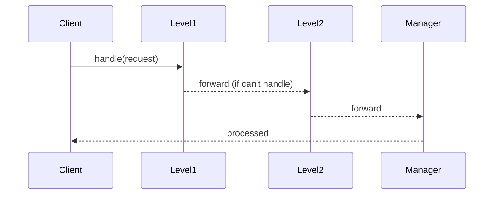
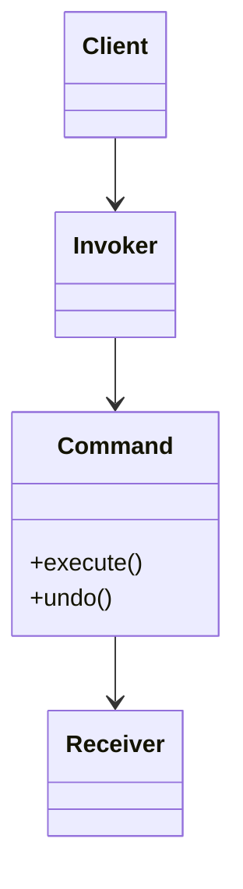

# From Zero to Hero in Behavioral Design Patterns

## 1. Introduction

Behavioral design patterns are the **communication architects** of object-oriented software engineering. While creational patterns focus on object instantiation ("how objects are born") and structural patterns focus on object composition ("how objects fit together"), behavioral patterns tackle the most persistent challenge in large-scale software systems: **how objects, components, and services interact, coordinate, and evolve their behavior without creating unmaintainable spaghetti code, tight coupling, or brittle dependencies**.

These 11 patterns (from the Gang of Four "Design Patterns" book) provide proven, language-agnostic solutions for decoupling senders from receivers, encapsulating requests, managing state transitions, notifying dependents, traversing collections safely, and extending behavior without modifying existing code. They are foundational to modern software engineering across every domain: web backends (FastAPI, Spring Boot, NestJS), frontends (React, Vue, Angular with Redux or Pinia), mobile apps (Flutter, SwiftUI), desktop applications, game engines (Unity, Unreal), embedded systems, microservices architectures, event-driven platforms (Kafka, RabbitMQ), and even low-level systems programming.

### Why These Patterns Matter in Real-World Software Engineering
- **Decoupling at Scale**: In monoliths turning into microservices, or in teams of 50+ developers, tight coupling leads to cascading failures, deployment nightmares, and weeks-long refactoring cycles. Behavioral patterns let you swap behaviors at runtime, add features via new classes (Open-Closed Principle), and test in isolation.
- **Maintainability & Extensibility**: They enable clean architecture (e.g., hexagonal/ports-and-adapters), Domain-Driven Design (DDD), CQRS (Command Query Responsibility Segregation), and event sourcing. You can introduce undo, logging, auditing, or new algorithms without touching core business logic.
- **Interview & Career Superpower**: Senior, staff, and principal engineer interviews (FAANG-level or enterprise) routinely ask: "Refactor this payment processor using Strategy + Command," "How would you implement undo in a collaborative editor (Memento + Command)?" or "Design a notification system with Observer + Mediator." Knowing these separates mid-level from senior engineers.
- **Real Production Impact**: 
  - Redux, Zustand, and NgRx in frontend = Observer + Command + Memento.
  - Git = Memento (commits) + Command (operations).
  - GUI frameworks (Qt, Swing, WPF, Flutter) = Command + Chain of Responsibility + Mediator.
  - Logging libraries (Log4j, Winston, Python logging) = Chain of Responsibility.
  - Database query builders and ORMs = Iterator + Visitor.
  - State machines in workflows (Temporal.io, Camunda) = State pattern.
  - API rate limiters, approval engines, and support ticketing systems = Chain of Responsibility.
- **Performance & Memory Awareness**: These patterns introduce indirection (extra objects/references), but when used correctly they reduce complexity from O(n²) tangled calls to O(n) linear flows. In distributed systems, they map directly to message queues and eventual consistency.

### How the Patterns Build on Each Other (Recommended Learning Roadmap)
Follow this progression for maximum retention and practical mastery:
1. **Algorithm & Skeleton Basics** → Strategy + Template Method (swap or skeleton-ize logic).
2. **State & Notification** → State + Observer (internal behavior change + broadcasting changes).
3. **History & Requests** → Memento + Command (save/restore + encapsulate actions).
4. **Orchestration & Delegation** → Mediator + Chain of Responsibility (central hub or sequential delegation).
5. **Traversal & Extension** → Iterator + Visitor (access without exposure + new ops on stable structures).
6. **Language-Specific** → Interpreter (for DSLs, rules engines, query languages).

Each section below references prior patterns and shows combinations (e.g., Strategy + Factory, Observer + Mediator).

### Prerequisites
- Strong OOP fundamentals: inheritance vs. composition, polymorphism, interfaces/abstract classes, SOLID principles (especially Open-Closed and Single Responsibility).
- Familiarity with any modern language. Examples are provided in **Python 3.12+** (clean, readable, production-ready with type hints) **and TypeScript** (for frontend/backend Node.js relevance). Concepts translate 1:1 to Java, C#, C++, Go (via interfaces), Rust (traits), etc.
- Basic understanding of UML sequence/class diagrams (we use Mermaid for live rendering in tools like GitHub, Obsidian, Typora, or VS Code Markdown Preview).
- No prior design pattern knowledge required — we build from first principles: data flow, references, indirection, and encapsulation.

This guide is written for **practical software engineers** who ship real systems. We critique overuse ("patterns as religion"), emphasize trade-offs (memory, performance, complexity), and include production-ready considerations (thread-safety, serialization, configuration-driven chains). By the end, you'll think in patterns naturally and refactor legacy code with confidence.

Let's transform you from pattern-curious to pattern-master.

## 2. Core Behavioral Patterns

### Chain of Responsibility
**Theory**  
A request is passed along a chain of potential handlers. Each handler either processes the request or forwards it to the next handler in the chain. The sender has no knowledge of which handler will ultimately process the request — achieving complete decoupling between requester and executor.

**Real-World Analogies Across Domains**  
- Customer support escalation: Level-1 agent → Senior engineer → Manager → Engineering director.  
- ATM cash dispenser (100s → 50s → 20s → 10s bills).  
- Web middleware pipelines (authentication → rate limiting → logging → authorization → business logic).  
- Microservices request routing or API gateway filters.  
- Approval workflows in enterprise SaaS (expenses, PRs, deployments).

**Code Implementation (Python + TypeScript)**

**Python**
```python
from abc import ABC, abstractmethod
from typing import Optional

class Handler(ABC):
    def __init__(self, next_handler: Optional['Handler'] = None) -> None:
        self.next = next_handler

    @abstractmethod
    def handle(self, request: str) -> str:
        pass

class Level1Support(Handler):
    def handle(self, request: str) -> str:
        if request.lower() == "simple":
            return "Level 1: Issue resolved quickly."
        return self.next.handle(request) if self.next else "Unhandled: Escalation failed."

class Level2Support(Handler):
    def handle(self, request: str) -> str:
        if request.lower() == "medium":
            return "Level 2: Detailed investigation completed."
        return self.next.handle(request) if self.next else "Unhandled."

class ManagerSupport(Handler):
    def handle(self, request: str) -> str:
        return "Manager: Final approval granted."

# Dynamic chain building (production best practice)
def build_support_chain() -> Handler:
    return Level1Support(Level2Support(ManagerSupport()))

support_chain = build_support_chain()
print(support_chain.handle("medium"))  # Level 2 response
```

**TypeScript**
```typescript
abstract class Handler {
    protected next: Handler | null = null;
    setNext(next: Handler): Handler {
        this.next = next;
        return next;
    }
    abstract handle(request: string): string;
}

class Level1Support extends Handler {
    handle(request: string): string {
        if (request.toLowerCase() === "simple") return "Level 1: Resolved.";
        return this.next ? this.next.handle(request) : "Unhandled.";
    }
}

class Level2Support extends Handler {
    handle(request: string): string {
        if (request.toLowerCase() === "medium") return "Level 2: Investigation done.";
        return this.next ? this.next.handle(request) : "Unhandled.";
    }
}

// Usage: 
const chain = new Level1Support();
chain.setNext(new Level2Support());
```

**Mermaid Diagram**


**Common Pitfalls & Production Mitigations**  
- Infinite loops: Always have a terminating "default" handler or null check.  
- Performance degradation in long chains: Limit to 5–7 handlers max; profile with tracing (OpenTelemetry).  
- Thread-safety in concurrent systems: Use immutable handlers or thread-local chains.  
- Hard-coded chains: Load from config (YAML/JSON) or dependency injection (Spring, FastAPI Depends, NestJS).  
- Debugging difficulty: Add logging at each step or use a visual tracer.

**Time & Space Complexity**  
- Time: O(n) worst-case (n = chain length).  
- Space: O(1) per request (only references passed). In distributed systems, each hop adds network latency.

**Practice Exercises (Full Solutions)**

**Easy: ATM Cash Dispenser**  
```python
class BillHandler(Handler):
    def __init__(self, denomination: int, next_handler: Optional['Handler'] = None):
        super().__init__(next_handler)
        self.denomination = denomination

    def handle(self, amount: int) -> int:
        if amount >= self.denomination:
            count = amount // self.denomination
            print(f"Dispensed {count} x ${self.denomination}")
            amount %= self.denomination
        return self.next.handle(amount) if self.next and amount > 0 else amount

atm = BillHandler(100, BillHandler(50, BillHandler(20, BillHandler(10))))
print("Remaining:", atm.handle(380))  # Dispenses 3x100, 1x50, 1x20, 1x10 → 0
```

**Medium: Logging System with Severity Levels**  
```python
import enum

class LogLevel(enum.IntEnum):
    DEBUG = 1
    INFO = 2
    WARN = 3
    ERROR = 4

class Logger(ABC):
    def __init__(self, level: LogLevel, next_logger: Optional['Logger'] = None):
        self.level = level
        self.next = next_logger

    def log(self, level: LogLevel, message: str) -> None:
        if self.level <= level:
            self.write_message(message)
        if self.next:
            self.next.log(level, message)

    @abstractmethod
    def write_message(self, message: str) -> None: ...

class ConsoleLogger(Logger):
    def write_message(self, message: str) -> None:
        print(f"[CONSOLE] {message}")

class FileLogger(Logger):
    def write_message(self, message: str) -> None:
        print(f"[FILE] {message}")

class EmailLogger(Logger):
    def write_message(self, message: str) -> None:
        print(f"[EMAIL] {message}")

# Usage
logger_chain = ConsoleLogger(LogLevel.DEBUG, FileLogger(LogLevel.WARN, EmailLogger(LogLevel.ERROR)))
logger_chain.log(LogLevel.WARN, "Memory usage high") # Hits Console + File
```

**Hard: Dynamic Expense Approval Workflow from Config**  
Load handler specifications from JSON and dynamically instantiate handlers using a common factory. This provides hot-reloading capability.

### Command
**Theory**  
Encapsulate a request as a first-class object. This allows parameterization, queuing, logging, scheduling, and undo/redo support. The invoker is decoupled from the receiver.

**Real-World Analogies**  
- GUI buttons and keyboard shortcuts.  
- Database transaction logs (for replay/rollback).  
- Task queues (Celery, BullMQ, Sidekiq).  
- Undo stacks in text editors, Photoshop, or Figma.  
- Microservice command buses (CQRS).

**Code Implementation (Python + TypeScript)**
```python
from abc import ABC, abstractmethod
from typing import Any

class Command(ABC):
    @abstractmethod
    def execute(self) -> None: ...
    def undo(self) -> None: ...  

class LightOnCommand(Command):
    def __init__(self, light: 'Light') -> None:
        self.light = light
    def execute(self) -> None:
        self.light.on()
    def undo(self) -> None:
        self.light.off()

class Light:
    def on(self): print("Light ON")
    def off(self): print("Light OFF")

# Invoker with history
class RemoteControl:
    def __init__(self):
        self.history: list[Command] = []
    def press(self, cmd: Command):
        cmd.execute()
        self.history.append(cmd)
    def undo_last(self):
        if self.history:
            self.history.pop().undo()
```

**TypeScript equivalent** 
```typescript
interface Command {
    execute(): void;
    undo(): void;
}

class ActionCommand implements Command {
    constructor(private payload: any) {}
    execute() { console.log("Executing", this.payload); }
    undo() { console.log("Undoing", this.payload); }
}

class Store {
    private history: Command[] = [];
    dispatch(cmd: Command) {
        cmd.execute();
        this.history.push(cmd);
    }
}
```

**Mermaid Diagram**


**Pitfalls & Mitigations**  
- Forgetting symmetric undo → always pair execute/undo.  
- Memory leaks in long histories → limit history size (e.g., 100 commands) or use Memento for state snapshots.  
- Serialization for distributed queues → make commands immutable and serializable (JSON + factory).

### Interpreter
**Theory**  
Define a grammar for a simple language and build an interpreter that evaluates sentences in that language. Ideal for rule engines, configuration DSLs, and expression evaluators.

**Real-World Use Cases**  
- Query languages (mini-SQL on in-memory data).  
- Business rule engines (insurance eligibility).  
- Math expression calculators in spreadsheets or chatbots.  
- Configuration parsers with custom syntax.

**Full Recursive Descent Example (Python)**  
```python
class Expression(ABC):
    @abstractmethod
    def interpret(self, context: dict[str, int]) -> int: ...

class Number(Expression):
    def __init__(self, value: int):
        self.value = value
    def interpret(self, context: dict[str, int]) -> int:
        return self.value

class Variable(Expression):
    def __init__(self, name: str):
        self.name = name
    def interpret(self, context: dict[str, int]) -> int:
        return context.get(self.name, 0)

class Add(Expression):
    def __init__(self, left: Expression, right: Expression):
        self.left = left
        self.right = right
    def interpret(self, context: dict[str, int]) -> int:
        return self.left.interpret(context) + self.right.interpret(context)

# Usage
context = {"x": 10, "y": 20}
expression = Add(Variable("x"), Add(Variable("y"), Number(5))) # x + (y + 5)
print(expression.interpret(context)) # 35
```

**TypeScript version** 
```typescript
interface Expression {
    interpret(context: Map<string, number>): number;
}
class Num implements Expression {
    constructor(private val: number) {}
    interpret(context: Map<string, number>) { return this.val; }
}
class AddExpr implements Expression {
    constructor(private left: Expression, private right: Expression) {}
    interpret(context: Map<string, number>) {
        return this.left.interpret(context) + this.right.interpret(context);
    }
}
```

**Pitfalls**: Over-engineering → keep grammar tiny (context-free, no left recursion). Avoid building complex compilers unless strictly necessary.

### Iterator
**Theory**  
Provide a uniform way to access elements of an aggregate object sequentially without exposing its underlying representation.

**Real-World Use Cases**  
- Traversing any collection (lists, trees, graphs, paginated APIs).  
- Database cursors with lazy loading.  
- File system walkers.  
- Streaming data processors.

**Python**
```python
class BookCollection:
    def __init__(self):
        self.books = []
    def add(self, book: str):
        self.books.append(book)
    def __iter__(self):
        self.index = 0
        return self
    def __next__(self):
        if self.index < len(self.books):
            book = self.books[self.index]
            self.index += 1
            return book
        raise StopIteration

collection = BookCollection()
collection.add("Design Patterns")
for b in collection:
    print(b)
```

**TypeScript**
```typescript
class BookCollection implements Iterable<string> {
    private books: string[] = [];
    add(book: string) { this.books.push(book); }
    [Symbol.iterator]() {
        let index = 0;
        let books = this.books;
        return {
            next(): IteratorResult<string> {
                if (index < books.length) {
                    return { value: books[index++], done: false };
                }
                return { value: undefined, done: true };
            }
        };
    }
}
```

**Pitfalls**: Concurrent modification → snapshot or fail-fast.

### Mediator
**Theory**  
Define a central mediator object that encapsulates how a set of colleague objects interact. Colleagues only communicate through the mediator, reducing direct dependencies to O(1).

**Real-World Use Cases**  
- Chat rooms, collaborative tools (Google Docs).  
- GUI form validation hubs.  
- Smart home controllers.  
- Microservice saga orchestrators.

**Code Example (Python)**
```python
class ChatRoomMediator:
    def show_message(self, user: 'User', message: str):
        print(f"[{user.name}]: {message}")

class User:
    def __init__(self, name: str, mediator: ChatRoomMediator):
        self.name = name
        self.mediator = mediator
    
    def send(self, message: str):
        self.mediator.show_message(self, message)

room = ChatRoomMediator()
john = User("John", room)
jane = User("Jane", room)

john.send("Hi there!")
jane.send("Hello!")
```

**Pitfalls**: Mediator becoming a God object → keep it thin (event router only). Divide into multiple focused mediators if necessary.

### Memento
**Theory**  
Capture an object's internal state externally (without violating encapsulation) so it can be restored later. Perfect for undo/redo and checkpoints.

**Real-World Use Cases**  
- Text editor undo.  
- Game save points.  
- Configuration rollback in CI/CD.  
- Event sourcing snapshots.

**Implementation (Python)**
```python
class Memento:
    def __init__(self, state: str):
        self._state = state
    def get_state(self) -> str:
        return self._state

class Originator:
    def __init__(self, state: str):
        self._state = state
    
    def set_state(self, state: str):
        print(f"Originator: Setting state to {state}")
        self._state = state
        
    def save(self) -> Memento:
        return Memento(self._state)
        
    def restore(self, memento: Memento):
        self._state = memento.get_state()
        print(f"Originator: Restored to {self._state}")

class Caretaker:
    def __init__(self, originator: Originator):
        self._mementos = []
        self._originator = originator
        
    def backup(self):
        self._mementos.append(self._originator.save())
        
    def undo(self):
        if not len(self._mementos): return
        memento = self._mementos.pop()
        self._originator.restore(memento)
```

**Pitfalls**: Memory bloat → use flyweight or limit depth.

### Observer (Publish-Subscribe)
**Theory**  
One-to-many dependency: when the subject changes, all observers are notified automatically. Foundation of event-driven architecture.

**Real-World Use Cases**  
- Stock tickers, real-time dashboards.  
- Redux/Zustand state management.  
- Pub/Sub systems (Redis, Kafka).  
- WebSocket broadcasting.

**Python** 
```python
import weakref

class Subject:
    def __init__(self):
        self._observers = weakref.WeakSet()
        self._state = 0
        
    def attach(self, observer):
        self._observers.add(observer)
        
    def notify(self):
        for obs in self._observers:
            obs.update(self._state)
            
    def change_state(self, state):
        self._state = state
        self.notify()

class ConcreteObserver:
    def update(self, state):
        print(f"Received update: {state}")
```

**TypeScript**
```typescript
interface Observer {
    update(data: any): void;
}
class Subject {
    private observers: Observer[] = [];
    attach(o: Observer) { this.observers.push(o); }
    notify(data: any) { this.observers.forEach(o => o.update(data)); }
}
```

**Pitfalls**: Memory leaks → always detach; use weak references. Unintended sequential dependencies.

### State
**Theory**  
Allow an object to alter its behavior when internal state changes, appearing as if the object changed its class.

**Real-World Use Cases**  
- Order processing (Pending → Paid → Shipped → Delivered).  
- Traffic lights, vending machines, player characters in games.  
- Workflow engines.

**Implementation** 
```python
class State(ABC):
    @abstractmethod
    def handle(self): ...

class StartState(State):
    def handle(self): print("In Start State")

class StopState(State):
    def handle(self): print("In Stop State")

class Context:
    def __init__(self, state: State):
        self.state = state
    def request(self):
        self.state.handle()

c = Context(StartState())
c.request()
c.state = StopState()
c.request()
```

### Strategy
**Theory**  
Define a family of interchangeable algorithms, encapsulate each, and make them swappable at runtime. Algorithm varies independently from clients.

**Real-World Use Cases**  
- Payment gateways (credit, PayPal, crypto).  
- Routing algorithms (car/bike/walk in maps).  
- Compression, sorting, encryption strategies.  
- A/B testing feature flags.

**Code Example**
```python
class PaymentStrategy(ABC):
    @abstractmethod
    def pay(self, amount: int): ...

class CreditCardStrategy(PaymentStrategy):
    def pay(self, amount: int): print(f"Paid {amount} using Credit Card")

class PayPalStrategy(PaymentStrategy):
    def pay(self, amount: int): print(f"Paid {amount} using PayPal")

class ShoppingCart:
    def __init__(self, strategy: PaymentStrategy):
        self.strategy = strategy
    
    def checkout(self, amount: int):
        self.strategy.pay(amount)

cart = ShoppingCart(PayPalStrategy())
cart.checkout(100)
```

### Template Method
**Theory**  
Define the skeleton of an algorithm in a base class; subclasses override specific steps without changing structure.

**Real-World Use Cases**  
- Report generators (CSV/JSON/PDF).  
- Game loops.  
- Data importers/exporters.  
- CI/CD pipeline steps.

**Code Example**
```python
class DataProcessor(ABC):
    def process_flow(self):
        self.read_data()
        self.process_data()
        self.save_data()
        
    @abstractmethod
    def read_data(self): ...
    
    @abstractmethod
    def process_data(self): ...
    
    def save_data(self):
        print("Saving to database")

class CSVProcessor(DataProcessor):
    def read_data(self): print("Reading CSV")
    def process_data(self): print("Processing CSV records")
```

**Pitfalls**: Hook overuse → keep template minimal.

### Visitor
**Theory**  
Represent an operation to be performed on elements of an object structure. Add new operations without changing element classes (double dispatch).

**Real-World Use Cases**  
- AST traversal in compilers/linters.  
- File system operations (size, search, delete).  
- Shopping cart discount calculators.  
- Serialization visitors.

**Code Example**
```python
class Element(ABC):
    @abstractmethod
    def accept(self, visitor: 'Visitor'): ...

class ConcreteElementA(Element):
    def accept(self, visitor: 'Visitor'):
        visitor.visit_element_a(self)

class Visitor(ABC):
    @abstractmethod
    def visit_element_a(self, element: ConcreteElementA): ...

class PrintVisitor(Visitor):
    def visit_element_a(self, element: ConcreteElementA):
        print("Visiting Element A")
```

**Pitfalls**: Adding new element types breaks all visitors → use only when element hierarchy is stable.

## 3. Summary & Mastery Section

### One-Sentence Key Takeaways
- **Chain of Responsibility**: Pass requests along a chain of handlers until one handles it.
- **Command**: Turn a request into a standalone object giving you full control over execution time, undo, and parameterization.
- **Interpreter**: Map a simple grammar to an AST and interpret it.
- **Iterator**: Traverse elements of a collection without exposing underlying details.
- **Mediator**: Centralize complex communications between objects into one hub to reduce direct coupling.
- **Memento**: Safely capture an object's internal state without violating encapsulation to allow restoration.
- **Observer**: Broadcast state changes directly to independent subscribers.
- **State**: Encapsulate varying behavior based on an object's life cycle state into separate objects.
- **Strategy**: Inject algorithm or logic at runtime to dynamically change object behavior.
- **Template Method**: Define an algorithmic skeleton and let subclasses fill in the specific steps.
- **Visitor**: Separate algorithms from the object structures they operate on, adding new functionality without modifying the core classes.

### Comprehensive Comparison Table

| Pattern | Coupling | Performance Impact | Thread-Safety Needs | Distributed Applicability | Modern Framework Examples | When NOT to Use |
|---|---|---|---|---|---|---|
| **Chain of Responsibility** | Low | Potential latency | Yes (if handlers share state) | High (Middleware chains) | Express JS Middleware, Spring Filters | When order of execution is completely strict globally |
| **Command** | Low | Negligible | Yes (Undo stacks) | High (CQRS, Task Queues) | Redux Actions, Celery Tasks | When simple method calls suffice |
| **Interpreter** | Moderate | Very High | - | Low | Query parsing, Custom Rules Engines | When a full scale language is needed (use AST parser tools instead) |
| **Iterator** | Low | Negligible | Yes (Concurrent modification) | - | Python Generators, Java Iterators | When direct loop indexing is straightforward |
| **Mediator** | Moderate | Can easily bottleneck | Yes | High (Event Buses, Message Brokers) | RabbitMQ Exchanges, UI Controllers | When there are only two interacting elements |
| **Memento** | High | High (Memory allocation) | - | Event Sourcing | React Undo, State persistence | Large states / high frequency changes (costly memory) |
| **Observer** | Low | Risk of memory leaks | Yes (Subject state updates) | High (Pub/Sub) | RxJS, React Context | Tight real-time coupling loops (endless loops) |
| **State** | Moderate | Negligible | Yes | Low | React State Machines, XState | Very simple flags suffice |
| **Strategy** | Low | Negligible | Yes | High | Validation rules, Payment modules | Only one variation of behaviour exists |
| **Template Method** | High (Inheritance based) | Negligible | - | - | React Class Component Lifecycle, Jenkins Pipelines | Strategy Pattern via Composition is applicable |
| **Visitor** | High (Structure bound) | Double Dispatch overhead | - | Low | Babel AST, Prettier | Rapidly changing object hierarchies |

### Production Trade-offs & Modern Variants
- Combine patterns: Strategy + Observer for pluggable event handlers.  
- With Clean Architecture / DDD / CQRS.  
- Performance considerations in high-throughput systems: Be careful with massive memory allocs using Command and Memento.
- Testing strategies: Use mock objects for commands and spy on observers.

### Recommended Next Steps & Advanced Topics
1. Read GoF book + "Head First Design Patterns" + "Refactoring to Patterns".  
2. Build a mini collaborative text editor (Command + Memento + Observer).  
3. Study modern implementations: Redux Saga (Command), React Query (Observer), Temporal workflows (State).  
4. Apply in a personal full-stack project (Next.js + FastAPI).  
5. LeetCode Design problems + system design interviews.

### Self-Assessment Quiz 

1. **Which pattern is best for implementing an Undo functionalitiy?**
   *Answer*: **Command + Memento**. Command to encapsulate execution, Memento to capture the state before the execute happens.
2. **If adding a new class involves updating multiple scattered methods, what pattern helps centralize operations on these structures?**
   *Answer*: **Visitor**. It decouples operations from the hierarchy they operate upon.
3. **What is the difference between Strategy and State?**
   *Answer*: **Intent**. Strategy aims to swap algorithms that accomplish the same task. State transitions an object completely through a lifecycle state map.
4. **How do you avoid the God object anti-pattern in Mediator?**
   *Answer*: Use multiple focused mediators or transition into an Observer Pub/Sub loosely coupled ecosystem.


